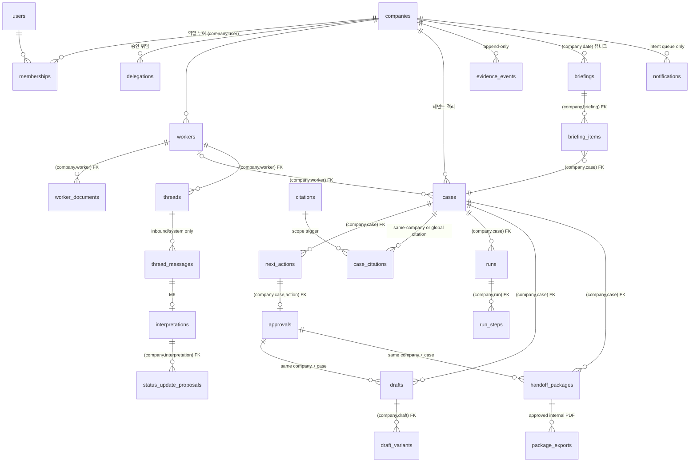

# DB_SCHEMA — 외고반장 서비스 DB 설계 (2026-07-12)

> 지위: ROADMAP "백엔드 접속점"(mockApi → FastAPI 교체)의 **데이터 계약 정본**. 프론트가 이미 확정한 계약(`src/types.ts`)과 스펙(reference/specs 1·2·3·7단계, 통합설계, 블루프린트 §3)을 서버 스키마로 내린 것이다.
> 전신: `legacy/docs/DB_SCHEMA.md` + `legacy/backend/app/models/*`(42테이블). 레거시는 §11 처분표·§12 결함 교정표로 승계·폐기를 명시했고, 이 문서가 신규 정본이다.
> 원칙 충돌 시 우선순위: GOTCHAS·rules/safety(가드레일) > `src/types.ts`(프론트 계약) > 이 문서 > 레거시 문서.

## 0. 설계 원칙

1. **역할 분리(4+1)가 스키마 경계다.**
   ```txt
   RAG(Chroma)  = 공식 근거 원문·임베딩 — service DB 밖. DB에는 citation 메타데이터만 미러링
   SQL/DB       = 현재 사업장·근로자·케이스·승인 상태의 유일한 정본(source of truth)
   Rule Base    = D-day·충돌·누락 계산 — 결과는 파생값, 원칙적으로 저장하지 않음(§6)
   LLM          = 초안·요약 생성 — 산출물만 저장, 판단 확정값 저장 금지
   Human Approval = approvals 테이블이 유일한 관문. 스키마 자체가 발송을 차단(§5)
   ```
2. **테넌트 우선.** 테넌트 소속 테이블은 `company_id`가 **NOT NULL + 인덱스 선두**다. 레거시처럼 nullable로 두지 않는다(§12-9). 전역 참조 테이블(document_requirements, 공용 citations)만 예외이며 표에 명시한다.
3. **판단 기록은 append-only.** `evidence_events`는 INSERT만 가능하다 — 앱 계층 규율이 아니라 **DB 트리거로 강제**한다(§5.2). 정정도 새 이벤트로 남긴다.
4. **MVP 외부 실행은 저장 경로부터 만들지 않는다.** `notifications`는 `queued|held|suppressed` 의도 큐일 뿐이고, `thread_messages`는 `inbound|system`만 허용한다. 발송 시각·전달 상태·외부 링크 테이블은 없으며, 실제 delivery-outbox/adapter는 별도 승인 마일스톤의 migration으로만 도입한다.
5. **파생값은 저장하지 않는다.** dDay·근거 완성도·누락 서류 수·KPI·파이프라인 집계·linkedCaseCount는 전부 조회 시 계산(§6). 저장하는 것은 계산의 **입력**(만료일·서류 상태·근거 연결)뿐이다.
6. **PII는 세 겹으로 다룬다(§7).** ① 등록번호·여권번호 원문은 어떤 테이블에도 넣지 않는다(마스킹 값만). ② 근로자 원문 메시지·초안 전문은 그것을 표시하는 테이블(thread_messages, drafts)에만 있고, evidence·로그·패키지 JSON으로 절대 복사되지 않는다. ③ 운영 식별에는 `worker_id`만 쓴다.
7. **이관 뒤에는 migration이 단일 진실원이다.** 런타임 `ALTER TABLE`·산재한 `create_all()`은 금지한다(레거시 최대 결함, §12-1). 이 설계 PR에서는 `db/schema.sql`이 실행 정본이며, backend를 도입할 때는 이 계약을 Alembic revision + 모델 + 테스트로 같은 PR에서 이식한다.

## 1. 엔진·전환 전략

| 단계 | 엔진 | 규약 |
|---|---|---|
| MVP(백엔드 접속점) | SQLite (`backend/data/oegobanjang.sqlite3`) | WAL 모드, FK 강제(`PRAGMA foreign_keys=ON`), 부분 유니크 인덱스 사용(SQLite 지원) |
| 파일럿 이후 | PostgreSQL 15+ | 같은 SQLAlchemy 모델. JSON→JSONB, TIMESTAMPTZ 네이티브, RLS(행 수준 보안)로 테넌트 격리 이중화 |

- 이 PR의 실행 가능한 설계 정본은 `db/schema.sql`이고, 이 문서의 타입은 논리 타입이다: `uuid`(TEXT 저장), `text`, `int`, `bool`, `date`, `timestamptz`, `json`(SQLite=TEXT+DB CHECK, PG=JSONB). 실제 SQLAlchemy/Alembic 이식은 이 DDL의 FK·CHECK·trigger 계약을 그대로 옮기는 별도 migration에서 한다.
- Chroma(벡터 저장소)는 이 문서 범위 밖. service DB와의 접점은 `citations` 한 테이블(§4.4)뿐이다.
- **실행 산출물(DBeaver 킷)**: `db/schema.sql`(DDL) · `db/seed_demo.sql`(데모 시드) · `db/validate.cjs`(테넌트 교차 INSERT/UPDATE·승인·외부 실행 차단을 포함한 145항목 회귀 검증) — 사용법은 `db/README.md`. 스키마 변경은 이 문서와 DDL을 **같은 PR에서** 함께 갱신하고 검증을 다시 통과시킨다.
- **백엔드 이식 상태:** `backend/`에는 P1 18테이블과 승인 decide API가 구현돼 있지만, 이 안전성 보강 DDL과는 아직 동등하지 않다. 이번 PR은 설계 DDL·시드·검증 범위이므로 해당 Alembic/SQLAlchemy 모델·API를 수정하지 않는다. 따라서 현재 backend migration/API를 이 문서·`db/schema.sql`의 동등 구현으로 간주하거나 배포하면 안 되며, 후속 migration에서 같은 제약을 이식해야 한다(`backend/README.md`).

## 2. 공통 규약

### 2.1 PR #5 DB 안전성 보강 계약 (2026-07-13)

이 절은 아래 상세 테이블 설명 중 이전 설계와 충돌하는 항목보다 우선한다. 설계 DDL(`db/schema.sql`)이 현재 MVP의 실행 가능한 정본이며, 실제 backend 이관은 별도 승인된 migration에서 같은 FK·CHECK·trigger 계약을 이식한다.

1. **테넌트 격리:** 모든 테넌트 부모는 `UNIQUE(company_id, id)`를 갖고, 자식은 `(company_id, parent_id)` 복합 FK를 사용한다. approval은 `(company_id, case_id, action_id)`로 action에 묶이며, draft/package approval도 회사·케이스를 함께 참조한다.
2. **사용자 참조:** `users.id` 단독 참조 대신 같은 회사 `memberships(company_id, user_id)`를 사용한다. active 상태와 owner/manager/expert 역할은 trigger로 확인한다. membership을 나중에 removed 처리해도 과거 승인·Evidence의 역사 기록은 바꾸지 않는다.
3. **근거 범위:** case에는 전역 citation 또는 같은 회사 citation만 연결할 수 있다. 전역 document requirement에는 전역 citation만 허용한다. `v_global_usable_citations`만 전역 조회용이며, 사내 근거는 `company_id` 바인딩 query를 통해서만 조회한다.
4. **MVP 외부 실행 차단:** notification은 `queued|held|suppressed` 의도 큐이고 sent/delivered/failed 상태와 timestamp가 없다. thread message는 `inbound|system`만 허용한다. `package_links`, 외부 delivery, `notification_sent` evidence는 없다.
5. **승인 상태:** approval은 `pending`으로만 생성되고 `approved|rejected`로 한 번만 전이한다. terminal decision은 수정·삭제할 수 없다. 결정자·PIN/biometric·결정 시각을 강제하며 rejected에는 non-empty reason이 필요하다.
6. **승인 결과 동기화:** pending approval이 approved/rejected가 되면 연결된 draft/handoff package도 같은 terminal 상태로 DB trigger가 동기화한다. approval의 company/case/action target은 생성 뒤 변경할 수 없다.
7. **내부 PDF만:** package export는 승인된 handoff package의 `pdf`만 허용하며 `external_delivery_performed=0`만 저장할 수 있다.
8. **SQLite 연결:** FK 강제는 연결별이다. 모든 연결은 `PRAGMA foreign_keys=ON`을 적용하고 활성 상태를 확인해야 한다.

| 항목 | 규약 |
|---|---|
| PK | `id` — UUIDv7(시간순 정렬 가능) 문자열. 레거시의 uuid4/자연키/외부공급 혼재를 단일화 |
| 표시 코드 | 사람용 번호는 별도 컬럼: `cases.case_code`("case_002"), `evidence_events.event_no`(#4789), 런 표시 번호(§9). 라우팅·FK에는 쓰지 않는다 |
| 시간 | `timestamptz`(ISO8601, UTC 저장·표시 시 회사 timezone). **날짜·시각을 자유 문자열로 저장 금지**(§12-6) — 만료일 등 날짜는 `date` |
| enum | TEXT + `CHECK` 제약. 값은 `src/types.ts` 리터럴과 글자 단위로 동일 |
| JSON | 계약이 굳은 구조화 데이터만(체크리스트, compliance 검사 등). 도메인 상태를 payload blob에 은닉 금지(§12-8) |
| 감사 시각 | 모든 테이블 `created_at NOT NULL`; 수명 있는 테이블은 `updated_at NOT NULL`(onupdate). append-only 테이블은 `updated_at` 없음(의도적) |
| soft delete | 없음. 삭제는 hard delete + 삭제 사실을 evidence로 남김(근로자 삭제 등). evidence 자체는 삭제 불가 |
| FK | 논리적 관계는 전부 실제 FK로 선언(§12-4·5). 테넌트 부모의 `UNIQUE(company_id,id)`와 자식의 `(company_id,parent_id)` 복합 FK로 `same company`를 **DB가 강제**한다. 전역 citation처럼 FK만으로 표현할 수 없는 예외는 trigger로 강제한다. |
| 인덱스 | 테넌트 테이블은 `(company_id, …)` 복합 인덱스가 기본. 주요 조회 경로(§4 각 표)마다 명시 |
| 네이밍 | 테이블 snake_case 복수형, GLOSSARY 영문 명칭 사용. `payload`/`metadata_json` 같은 무의미 명명 금지 |

## 3. ERD



## 4. 테이블 정의

표 규약: **볼드 컬럼** = NOT NULL. `CHECK(…)`는 enum 제약. FK는 `→테이블.컬럼`.

### 4.1 테넌트·계정

#### companies — 사업장(테넌트 루트)
| 컬럼 | 타입 | 제약 | 설명 |
|---|---|---|---|
| **id** | uuid | PK | |
| **name** | text | | 사업장명 (O3) |
| business_number | text | | 사업자등록번호 — 선택, 패키지 생성 시 재요청(O3) |
| industry / region | text | | E-9 허용 업종 select 기반 |
| **worker_count_band** | text | CHECK(`lt5,5_20,20_50,gt50`) | 근로자 수 구간 — approval_policy 기본값 결정 |
| **timezone** | text | default `Asia/Seoul` | 다이제스트·D-day 기준 |
| **briefing_time** | text | default `08:30` | 회사 단위 브리핑 시각(N10) |
| **approval_policy** | text | CHECK(`owner_only,manager_allowed`) | 기본: 20인 미만=owner_only (7단계 §2) |
| **autonomy_level** | text | CHECK(`L1,L2,L3`), default `L2` | 자율성 사다리(9단계 P1-6). L3 세부는 autonomy_grants(§4.13) |
| **onboarding_step** | text | CHECK(`O1,O2,O3,O4,O5,done`) | 이탈 후 재진입 재개 지점(3단계 §6) |
| onboarding_path | text | CHECK(`ocr,manual,csv,agency`) | O4 선택 경로 |
| **case_seq / evidence_seq** | int | default 0 | 표시 번호 발급 카운터(§9). 트랜잭션 내 증가 |
| **created_at / updated_at** | timestamptz | | |

#### users — 사용자(휴대폰 로그인)
| 컬럼 | 타입 | 제약 | 설명 |
|---|---|---|---|
| **id** | uuid | PK | |
| **phone** | text | UNIQUE | 로그인 식별자(O1). PII — 마스킹 표시 규칙 §7 |
| **name** | text | | "김담당" — evidence actor 표시에 사용 |
| email | text | | 선택 보강 |
| pin_hash | text | | 승인 본인확인 PIN(7단계 §4). 해시만 |
| **biometric_registered** | bool | default false | 기기 생체 등록 여부(실 검증은 기기 측) |
| **terms_agreed_at** | timestamptz | | 약관·개인정보 동의(근로자 정보 행정 목적 사용 고지 포함) |
| **created_at / updated_at** | timestamptz | | |

#### memberships — 회사↔사용자 역할 (테넌트 단위 부여)
| 컬럼 | 타입 | 제약 | 설명 |
|---|---|---|---|
| **id** | uuid | PK | |
| **company_id** | uuid | →companies.id | |
| user_id | uuid | →users.id | 초대 수락 전엔 NULL 가능 |
| **role** | text | CHECK(`owner,manager,viewer,expert`) | 7단계 §1. `src/types.ts`의 `Role`(owner/manager)은 이 중 앱 로그인 역할 부분집합 — 4.2에서 확장 예정 |
| **status** | text | CHECK(`invited,active,removed`) | |
| invite_phone | text | | 문자 초대 대상 |
| invite_token / invite_expires_at | text / timestamptz | token UNIQUE | 초대 링크, 만료 7일(3단계 §6) |
| invited_by | uuid | `(company_id,user_id)` →memberships | 쓰기 시 active inviter 필요 |
| **created_at / updated_at** | timestamptz | | |

- UNIQUE(company_id, user_id) (user_id NOT NULL인 행). `owner` 복수 허용(공동대표 — 7단계 §3.3).
- 역할 변경·초대·제거는 전부 evidence(`role_granted/role_changed/member_invited/member_removed`).

#### delegations — 승인 위임 (7단계 §3.1) — P3
| 컬럼 | 타입 | 제약 | 설명 |
|---|---|---|---|
| **id** | uuid | PK | |
| **company_id** | uuid | →companies.id, idx | |
| **delegator_user_id** | uuid | `(company_id,user_id)` →memberships | 위임자(owner, active) |
| **delegate_user_id** | uuid | `(company_id,user_id)` →memberships | 수임자(active) |
| **scope** | text | CHECK(`approval`) | MVP는 승인/반려 권한만 |
| **starts_at / ends_at** | timestamptz | | 기간 옵션 |
| revoked_at | timestamptz | | 해제 시각 |
| **created_at** | timestamptz | | |

- 부여·해제는 evidence(`delegation_granted/delegation_revoked`). 위임 중에도 owner에게 N01 병행 발송(앱 규칙).
- 자동 에스컬레이션(48h/72h)은 **위임 레코드가 있을 때만** 수임자 이관, 없으면 케이스 `blocked`(7단계 §3.2) — 스케줄러가 이 테이블을 조회.

### 4.2 근로자·서류

#### workers — 근로자 (케이스에 연결되는 프로필, 결정 D2)
| 컬럼 | 타입 | 제약 | 설명 |
|---|---|---|---|
| **id** | uuid | PK | |
| **company_id** | uuid | →companies.id, idx | NOT NULL — 레거시 nullable 교정 |
| **display_name** | text | | "Nguyen Van A" — 디자인 표기 전체 이름 |
| **nationality** | text | | 무채색 운영 정보로만 사용(차별 금지 — 정렬·색상 키 금지) |
| team | text | | "제조1팀" — 블루프린트 §3 |
| **visa_type** | text | default `E-9` | 체류자격 |
| **stay_expires_at** | date | | 체류만료일 — "D-day 계산의 유일한 필수 재료"(3단계 §1.2) |
| contract_ends_at | date | | 계약종료일 — 있으면 충돌 감지 활성 |
| contact_channel | text | | zalo/sms/kakao… |
| preferred_language | text | CHECK(`ko,vi,id,en`) | 국적에서 기본값 유도 |
| registration_no_masked | text | | `900101-*******` — **원문 컬럼 없음**(§7). OCR/CSV 입력 시 즉시 마스킹 후 파기 |
| **source** | text | CHECK(`manual,ocr,csv,agency`) | O4 입력 경로 |
| **status** | text | CHECK(`active,inactive,left`), default `active` | |
| **created_at / updated_at** | timestamptz | | |

- 중복 등록 감지: UNIQUE 대신 서비스 계층 확인 시트(같은 이름+만료일 → idempotency 확인, 3단계 §6). 동명이인 허용이 필요해 DB 유니크로 강제하지 않는다.
- 성실도·이탈·평가 계열 컬럼은 **스키마 차원 금지**(GOTCHAS §1).

#### worker_documents — 서류 상태
| 컬럼 | 타입 | 제약 | 설명 |
|---|---|---|---|
| **id** | uuid | PK | |
| **company_id** | uuid | →companies.id, idx | |
| **worker_id** | uuid | `(company_id,worker_id)` →workers, idx | |
| **doc_type** | text | | "표준근로계약서", "여권 사본" … |
| **status** | text | CHECK(`missing,requested,received,expiring,company_check,pending`) | 정본 4값(1단계 M2) + 프론트 확장 2값(`expiring,pending` — M0.5에서 v3 라벨 보존용으로 추가된 것을 계약으로 승격) |
| due_date | date | | 제출 기한 — 누락 severity 계산 입력 |
| expires_at | date | | 서류 자체 만료(건강검진 등). **date 타입** — 레거시 문자열 교정 |
| file_ref | text | | 암호화 저장소 키(§7). 경로 원문 아님 |
| submitted_at / reviewed_at | timestamptz | | |
| **created_at / updated_at** | timestamptz | | |

- UNIQUE(worker_id, doc_type) — 레거시 중복 허용 교정(§12-12).
- `readinessPercent`·`missingDocCount`는 이 테이블에서 파생(§6). 저장하지 않는다.

#### document_requirements — 필수 서류 정의 (전역 참조 — company_id 없음)
| 컬럼 | 타입 | 제약 | 설명 |
|---|---|---|---|
| **id** | uuid | PK | |
| **case_type** | text | | §4.3 cases.case_type과 동일 enum |
| **visa_type** | text | | |
| **required_doc** | text | | |
| **required** | bool | default true | |
| citation_id | text | →citations.id + global-scope trigger | 전역 official citation만 "왜 필요한지" 근거로 연결(RAG 경계 원칙) |
| **created_at / updated_at** | timestamptz | | |

- UNIQUE(case_type, visa_type, required_doc) (§12-12 교정).

#### worker_intake_files — O4-A 촬영 원본 (P3, 온보딩 마일스톤)
| 컬럼 | 타입 | 제약 | 설명 |
|---|---|---|---|
| **id** | uuid | PK | |
| **company_id** | uuid | →companies.id, idx | |
| worker_id | uuid | `(company_id,worker_id)` →workers | OCR 확정 전 NULL |
| **storage_key** | text | | **암호화 저장소** 키(O4-A). DB에 이미지·OCR 원문 저장 금지 |
| ocr_fields_masked | json | | 추출 필드(마스킹 적용) + 신뢰도 플래그 |
| **status** | text | CHECK(`uploaded,ocr_done,confirmed,failed`) | OCR 3회 실패→수기 전환(3단계) |
| **created_at** | timestamptz | | |

### 4.3 케이스 코어

#### cases — 케이스 (업무·요청 단위, 브리핑 카드와 1:1 — 결정 D2)
| 컬럼 | 타입 | 제약 | 설명 |
|---|---|---|---|
| **id** | uuid | PK | 프론트 `caseId`. 목업의 슬러그('nguyen')는 데모 한정 — 실 라우팅 키는 이 id |
| **company_id** | uuid | →companies.id, idx | |
| **case_code** | text | | "case_002" — 회사별 발급(§9). UNIQUE(company_id, case_code) |
| worker_id | uuid | `(company_id,worker_id)` →workers, idx | 채용·회사 단위 케이스는 NULL |
| **case_type** | text | CHECK(`visa_expiry,missing_document,contract_visa_conflict,reporting_deadline,quota_review,hiring,onboarding,other`) | M7 유형 필터(체류만료/서류/계약/채용/신고)와 매핑 |
| **title** | text | | 업무 단위 명칭(근로자명 미포함 — 블루프린트 §3) |
| summary | text | | 케이스 시트 요약 1문장(마스킹 적용) |
| **severity** | text | CHECK(`CRITICAL,HIGH,MEDIUM,LOW`) | Rule Engine 산출(재계산 시 갱신). LLM 판단 아님 |
| **state** | text | CHECK(`draft,risk_review,approval_pending,returned,human_approved,completed,blocked`) | 전이 화이트리스트는 §5.1 |
| agent_stage | text | CHECK(`detected,collecting,drafted,awaiting_approval,executed`) | 파이프라인 축(상태와 별개). 있으면 스테퍼·집계에서 우선(2.5.4b 결정) |
| due_date | date | | D-day 앵커(체류만료·신고 기한·서류 기한). **dDay는 저장하지 않음**(§6) |
| assignee_user_id | uuid | `(company_id,user_id)` →memberships | 담당(§3a 담당 컬럼, 쓰기 시 active membership) |
| **approval_required** | bool | | |
| **prepared_by** | text | CHECK(`agent,rule`) | 프로액티브 런 준비 카드는 `agent` |
| prepared_run_id | uuid | `(company_id,run_id)` →runs | "런 #4788 보기" 링크 원천 |
| parent_case_id | uuid | `(company_id,case_id)` →cases | 런 체이닝(9단계 P0-2) |
| guard_note | text | | high risk 경고문(예: batbayar) — Rule Engine 산출 |
| checked_items | json | | AI 확인 항목 스냅샷 `[{label,value}]` (M2 AICheckedBlock, 마스킹 적용) |
| next_wake_at | timestamptz | | 오케스트레이터 — 시각 조건 |
| next_wake_condition | text | | "응답 없으면 D-28에 리마인드 판단" (이벤트 조건 서술) |
| **created_at / updated_at** | timestamptz | | |

- **케이스 재사용 규칙**(레거시 PRD §15 승계 — 열린 케이스 중복 생성 방지):
  ```sql
  CREATE UNIQUE INDEX ux_cases_reuse ON cases (company_id, worker_id, case_type, due_date)
  WHERE state IN ('draft','risk_review','approval_pending','returned');
  ```
  (worker_id/due_date NULL 행은 유니크 대상에서 빠짐 — 해당 유형은 서비스 계층 중복 확인.)
- 조회 인덱스: (company_id, state), (company_id, severity, due_date) — M7 deterministic 정렬(severity→dDay→유형→id) 지원.
- `scheduled`는 케이스 **상태가 아니다**(스펙 1단계 §0.2 배지에 등장하나 전이도엔 없음 — 검수 판정). M7의 "예정" 그룹은 `next_actions.state='scheduled'` 보유 여부에서 파생한다.

#### next_actions — 다음 행동 (케이스에 붙는 실행 후보)
| 컬럼 | 타입 | 제약 | 설명 |
|---|---|---|---|
| **id** | uuid | PK | 프론트 `actionId` |
| **company_id** | uuid | →companies.id, idx | |
| **case_id** | uuid | `(company_id,case_id)` →cases, idx | |
| **kind** | text | CHECK(`approve,draft,detail,thread,package,confirm`) | 프론트 내비게이션 계약(NextActionKind) |
| **action_type** | text | CHECK(`request_document,create_handoff,send_message,confirm_status,export_package,complete_case,other`) | 도메인 행동(레거시 PRD NextAction.action_type 승계·확장) |
| **label** | text | | "보내기 승인" 등 — 데이터 구동 CTA |
| **state** | text | CHECK(`ready,locked,scheduled,waiting`) | `locked`는 서비스가 게이트 평가로 유지(citation-0·compliance 실패 시 강등 — §5.3) |
| **requires_approval** | bool | | |
| slot | text | CHECK(`primary,secondary`) | 카드 CTA 슬롯. UNIQUE(case_id, slot) (NULL 제외). M2.6 이후 카드 CTA가 "검토" 1개가 되어도 액션 레지스트리는 유지 |
| scheduled_at | timestamptz | | `scheduled` 상태의 도래 시각 — N13 발생 소스 |
| **created_at / updated_at** | timestamptz | | |

#### approvals — 승인 (외부 발송의 유일한 관문)
| 컬럼 | 타입 | 제약 | 설명 |
|---|---|---|---|
| **id** | uuid | PK | |
| **company_id** | uuid | →companies.id, idx | `case_id`·`action_id`와 함께 복합 FK의 선두 키. 테넌트 드리프트를 DB가 차단 |
| **case_id** | uuid | `(company_id,case_id)` →cases | |
| **action_id** | uuid | `(company_id,case_id,action_id)` →next_actions | 1 NextAction : 1 pending Approval(MVP). 다른 케이스·회사의 action 연결 불가 |
| **status** | text | CHECK(`pending,approved,rejected`) | pending으로만 생성하고 한 번만 terminal decision으로 전이. 프론트 `locked`는 저장값이 아닌 파생 표시 |
| idempotency_key | text | UNIQUE, nullable | 중복 승인 차단(GOTCHAS §2). pending 요청에는 NULL을 허용하고, decide 시점에 키를 채운다. NULL은 UNIQUE 충돌 대상이 아니며, 같은 결정 키 재호출은 first-decision-wins로 처리한다. |
| **requested_by_actor** | text | CHECK(`agent,rule,user`) | |
| requested_by_user_id | uuid | `(company_id,user_id)` →memberships | actor=user일 때. 쓰기 시 active membership 필요 |
| decided_by_user_id | uuid | `(company_id,user_id)` →memberships | 결정자. 쓰기 시 active owner 또는 low-risk manager 정책 필요 |
| on_behalf_of_user_id | uuid | `(company_id,user_id)` →memberships | 대리 승인 시 위임자(7단계 §5) — 쓰기 시 active membership 필요 |
| identity_method | text | CHECK(`pin,biometric`) | 승인 본인확인 수단(7단계 §4) — 세션만으로 승인 불가 |
| checklist | json | | M2.6 §2c 필수 4항목 `[{key,label,checked,checked_at}]`. 4/4 전 승인 불가(§5.3) |
| reason | text | rejected면 non-empty 필수 | 반려 사유 — evidence에는 마스킹 요약만 남김 |
| **requested_at** | timestamptz | | |
| decided_at | timestamptz | | |
| **created_at** | timestamptz | | |

```sql
-- 액션당 살아있는 승인 요청은 1건
CREATE UNIQUE INDEX ux_approvals_one_pending ON approvals (action_id) WHERE status = 'pending';
```
- **일괄 승인 금지는 스키마+API 계약**: 승인은 반드시 approval id 1건 단위 엔드포인트만 존재. batch 컬럼·batch 테이블을 만들지 않는다(GOTCHAS §3, PC §3a 각주 비준).
- **상태 머신은 DB가 강제한다:** pending은 결정자·본인확인·사유·결정시각이 모두 NULL이고, approved/rejected에는 결정자·PIN/biometric·결정시각이 필수다. rejected에는 사유가 필요하며 terminal decision은 변경·삭제할 수 없다. 회사·케이스·액션 target도 생성 뒤 불변이다.
- 승인 = 검토 결정이며 **외부 실행이 아니다**. approved/rejected가 되면 연결된 draft/handoff package의 terminal 상태만 trigger로 동기화하며, 실제 발송·전달을 기록하는 경로는 없다.

### 4.4 근거 (RAG ↔ service DB 접점)

#### citations — 근거 라이브러리 (중앙 스토어, 블루프린트 §3)
| 컬럼 | 타입 | 제약 | 설명 |
|---|---|---|---|
| **id** | text | PK | `cit_001` 형식 표시 코드 = PK(전역 시퀀스). 프론트 `Citation.id`와 동일 값 |
| company_id | uuid | →companies.id | **NULL = 전역 공식 근거**, 값 있음 = 해당 회사 내부 근거. global `internal`은 CHECK로 금지 |
| **grade** | text | CHECK(`A,B,C,E,F`) | A 법령 / B 공식 / C 통계(정의만 유지) / E 내부 / **F 합성 — 근거 사용 불가**(§5.3) |
| **status** | text | CHECK(`official,review_needed,stale,internal`) | §3c 상태 칩. `stale`은 N20 알림 대상 |
| **title / source** | text | | "출입국관리법 제25조" 등 |
| source_url | text | | 공식 출처 URL |
| effective_date | date | | 시행일 |
| **ingest_at** | timestamptz | | 수집 시각 — source_snapshot_hash 입력(§4.9) |
| chroma_collection / chroma_document_id | text | | Chroma 청크 포인터(메타데이터 미러링만 — 임베딩·원문은 Chroma) |
| **created_at / updated_at** | timestamptz | | 프론트 `updatedAt` |

#### case_citations — 케이스↔근거 연결
| 컬럼 | 타입 | 제약 | 설명 |
|---|---|---|---|
| **company_id** | uuid | →companies.id | 복합 PK·케이스 tenant key |
| **case_id** | uuid | `(company_id,case_id)` →cases | 복합 PK(company_id, case_id, citation_id) |
| **citation_id** | text | →citations.id + scope trigger | global 또는 같은 회사 citation만 허용 |
| **added_by_actor** | text | CHECK(`agent,rule,user`) | |
| added_by_run_id | uuid | `(company_id,run_id)` →runs | 에이전트가 수집한 근거 추적 |
| **created_at** | timestamptz | | |

- `v_global_usable_citations`은 global citation만 제공한다. 사내 citation은 반드시 `WHERE company_id = :company_id`를 바인딩한 조회로만 제공하며, 전 회사를 가로지르는 `v_usable_citations`는 만들지 않는다.
- `usableCitations` = `grade != 'F'` 필터 — 승인 게이트 판정은 반드시 이 필터를 거친다(GOTCHAS §3). `linkedCaseCount`·KPI는 `(company_id,citation_id)` 단위 파생(§6).

### 4.5 판단 기록

#### evidence_events — append-only 감사 스트림 (M8·§2d·§3c의 정본)
| 컬럼 | 타입 | 제약 | 설명 |
|---|---|---|---|
| **id** | uuid | PK | |
| **company_id** | uuid | →companies.id, idx | |
| **event_no** | int | | 회사별 단조 증가(§9). 표시 "#4789". UNIQUE(company_id, event_no) |
| **type** | text | CHECK — 아래 목록 | |
| **at** | timestamptz | idx(company_id, at) | 발생 시각(주입 가능 — 테스트 결정성) |
| case_id | uuid | `(company_id,case_id)` →cases, idx | |
| action_id | uuid | `(company_id,case_id,action_id)` →next_actions | |
| approval_id | uuid | `(company_id,case_id,approval_id)` →approvals | |
| run_id | uuid | `(company_id,run_id)` →runs | 런 단위 접기(M8 "런 #4788 · 6개 이벤트") |
| **actor_type** | text | CHECK(`system,user,agent,approver`) | |
| actor_user_id | uuid | `(company_id,user_id)` →memberships | 사람 이벤트는 active membership만 기록(rules/safety) |
| actor_display | text | | "김담당 (본인 확인 완료)" / "시스템" — 마스킹된 표시 문자열 |
| **summary** | text | | PII 마스킹된 한 줄 요약만. **원문 전문 금지** |
| input_hash / output_hash | text | | `sha256:…` — 원문 대신 해시(프론트 `hash` = input_hash) |
| hash_algorithm | text | default `sha256` | |
| trace_id / request_id | text | request_id idx | 재현·상관관계. 레거시의 request_id 인덱스 누락 교정(§12-11) |
| payload_ref | text | | 외부 보관 원본 포인터(선택) |
| **created_at** | timestamptz | | |

**type 값** — 프론트 11종(`src/types.ts EvidenceType`)이 코어이며 스키마는 상위집합을 허용한다:
```txt
코어(프론트 계약): intent_classified, plan_created, tool_executed, rag_retrieved,
  risk_flagged, approval_requested, approval_decided, review_started,
  checklist_completed, exported, final_response_generated
확장(스펙 요구 — 화면 붙는 마일스톤에 프론트 타입에도 추가):
  briefing_emitted, worker_reply_received, worker_reply_summarized,
  status_update_confirmed, handoff_generated,
  delegation_granted, delegation_revoked, role_granted, role_changed,
  member_invited, member_removed, approval_escalated, autonomy_changed, worker_deleted
```

- append-only DB 강제(§5.2 트리거). 컬럼에 원문 PII 필드 자체가 없다 — 스키마가 rules/safety를 집행.
- 상태 변경 쓰기와 evidence append는 **같은 트랜잭션**(레거시 PRD Transaction rule 승계): Case·NextAction·Approval·EvidenceEvent가 함께 커밋되거나 함께 실패.

### 4.6 에이전트 런

#### runs — 에이전트 런 (툴콜링 루프 1회)
| 컬럼 | 타입 | 제약 | 설명 |
|---|---|---|---|
| **id** | uuid | PK | |
| **company_id** | uuid | →companies.id, idx | |
| case_id | uuid | `(company_id,case_id)` →cases, idx | 커맨드 런 초기엔 NULL 가능(결과에서 케이스 연결) |
| **started_by** | text | CHECK(`user,event`) | 프로액티브 런 = `event`(9단계 P0-1) |
| trigger_event | text | | "D-30 진입" 등 시작 이벤트 서술 |
| started_by_user_id | uuid | `(company_id,user_id)` →memberships | started_by=user일 때, 쓰기 시 active membership 필요 |
| **agent_name** | text | | "Visa Document Agent" — 핸드오프 시 스텝에 기록, 여기는 시작 에이전트 |
| **autonomy** | text | CHECK(`low,medium,high`) | MVP는 medium 고정(승인 필요) |
| **status** | text | CHECK(`queued,running,waiting_question,waiting_approval,completed,failed,cancelled`) | 서버 측 런 상태 보존(M9 offline: 재연결 시 이어서) |
| goal_text | text | | 사용자 명령(M9 UserGoalBubble) — 저장 전 PII 스크럽 |
| question | json | | interrupt QuestionCard `{question, options[], blocking}` |
| result_summary | text | | ResultBlock 요약(마스킹) |
| **anchor_event_no** | int | | 이 런의 판단 기록 번호(§9). "런 1건 = 판단 기록 # 1건"(M9) — 시작 시 발급한 evidence event의 event_no 사본 |
| parent_run_id | uuid | `(company_id,run_id)` →runs | 런 체이닝 |
| priority_hint | text | | 동시 런 큐 정렬 입력(severity×D-day) — 큐 순서 자체는 파생 |
| started_at / ended_at | timestamptz | | |
| **created_at / updated_at** | timestamptz | | |

- **프론트 `RunConfig.mode` 매핑(저장하지 않음 — 파생)**: `approval` = 승인 플로우에서 pending approval에 연결된 런 / `command` = `started_by='user'` 실행 중 런 / `replay` = `status='completed'` 런의 읽기 전용 재생(`readOnly:true`).
- 프로액티브 런 도구 화이트리스트(읽기+초안, 종착점=승인 요청)는 도구 레지스트리 계층 규율 — DB는 `started_by='event'`와 guardrail 스텝으로 추적.

#### run_steps — 런 스텝 (스트리밍 타임라인의 정본)
| 컬럼 | 타입 | 제약 | 설명 |
|---|---|---|---|
| **id** | uuid | PK | |
| **company_id** | uuid | →companies.id | |
| **run_id** | uuid | `(company_id,run_id)` →runs, idx | |
| **seq** | int | UNIQUE(run_id, seq) | 표시 순서 |
| **kind** | text | CHECK(`thinking,tool_call,guardrail,handoff,replan`) | 공식 5종(GLOSSARY). `wait` 같은 로컬 확장 금지(1.5 결정 승계) |
| **label** | text | | 한국어 표시 라벨 |
| detail | text | | 마스킹된 상세 |
| tool_name | text | | kind=tool_call |
| tool_status | text | CHECK(`running,done,failed,blocked`) | |
| handoff_from / handoff_to | text | | kind=handoff |
| payload_hash | text | | 입출력 해시(원문 미저장) |
| **created_at** | timestamptz | | |

- 가드레일 스텝은 **숨기지 않고 저장**(UI가 경고 톤으로 노출 — 신뢰 자산).

### 4.7 초안·소통

#### drafts — 메시지 초안 (M3)
| 컬럼 | 타입 | 제약 | 설명 |
|---|---|---|---|
| **id** | uuid | PK | 프론트 `draftKey` |
| **company_id** | uuid | →companies.id, idx | 모든 parent 참조의 tenant key |
| **case_id** | uuid | `(company_id,case_id)` →cases, idx | |
| thread_id | uuid | `(company_id,thread_id)` →threads | system 메시지 맥락 연결용 |
| created_by_run_id | uuid | `(company_id,run_id)` →runs | 생성 런 추적 |
| **channel** | text | | Zalo/SMS/카카오 |
| **purpose** | text | | "체류 연장 서류 요청" |
| **status** | text | CHECK(`draft,revision_requested,pending_approval,approved,rejected,superseded`) | 수정 요청(M3 RevisionSheet) → 재생성 런 → 새 variant, 구본 `superseded` |
| approval_id | uuid | `(company_id,case_id,approval_id)` →approvals | send_message action 승인과 같은 회사·케이스여야 함 |
| compliance_checks | json | | `[{label,passed}]` — "개인정보 사용 목적 포함" 등. 하나라도 false → 승인 locked(§5.3) |
| expected_scenarios | json | | `[{type: positive|question|delayed, label, description}]` |
| **created_at / updated_at** | timestamptz | | |

- `pending_approval`·`approved`·`rejected`는 같은 회사·케이스의 `send_message` approval과 정확히 맞아야 한다. approval이 결정되면 trigger가 초안 상태를 동기화한다. `sent_at`은 MVP 스키마에 존재하지 않는다.

#### draft_variants — 초안 언어 변형
| 컬럼 | 타입 | 제약 | 설명 |
|---|---|---|---|
| **id** | uuid | PK | |
| **company_id** | uuid | →companies.id | |
| **draft_id** | uuid | `(company_id,draft_id)` →drafts, idx | |
| **lang** | text | CHECK(`ko,vi,id,en`) | 스펙 우선순위: vi 1순위, id 2순위(레거시 AI_OS §7). 프론트 현행은 ko/vi/en |
| **text** | text | | 전문 저장 — PII 접근 규칙 §7 적용, evidence로 복사 금지 |
| **is_revised** | bool | default false | 수정 요청 반영본 |
| **created_at** | timestamptz | | |

#### threads — 컨택 스레드 (근로자 단위 — 탭별 §3.1)
| 컬럼 | 타입 | 제약 | 설명 |
|---|---|---|---|
| **id** | uuid | PK | 딥링크 `thread/{threadId}` |
| **company_id** | uuid | →companies.id, idx | |
| **worker_id** | uuid | `(company_id,worker_id)` →workers | UNIQUE(company_id, worker_id) — MVP는 근로자당 1스레드 |
| **channel** | text | | |
| last_message_at | timestamptz | | 목록 정렬 |
| **created_at / updated_at** | timestamptz | | |

- 목록 상태 배지(응답 도착>승인 대기>초안)는 파생(§6). 발송 완료 상태는 MVP에서 없다.

#### thread_messages — 스레드 메시지
| 컬럼 | 타입 | 제약 | 설명 |
|---|---|---|---|
| **id** | uuid | PK | |
| **thread_id** | uuid | `(company_id,thread_id)` →threads, idx | |
| **company_id** | uuid | →companies.id, idx | |
| **direction** | text | CHECK(`inbound,system`) | system = 승인·생성 이력용 내부 캡션. outbound는 MVP에서 금지 |
| draft_id | uuid | `(company_id,draft_id)` →drafts | system 맥락 참조(선택) |
| lang | text | | |
| body_original | text | | **원문 전문(PII)** — 스레드 상세에서만 노출, 목록 미리보기·evidence 복사 금지(§7) |
| body_ko | text | | 한국어 번역/원문 |
| received_at | timestamptz | | inbound 수신 시각. `sent_at`은 존재하지 않음 |
| **created_at** | timestamptz | | |

#### interpretations — 응답 해석 (M6)
| 컬럼 | 타입 | 제약 | 설명 |
|---|---|---|---|
| **id** | uuid | PK | |
| **company_id** | uuid | →companies.id, idx | |
| **thread_message_id** | uuid | `(company_id,thread_message_id)` →thread_messages | 해석 대상 inbound 메시지 |
| case_id | uuid | `(company_id,case_id)` →cases | |
| **summary_ko** | text | | 한국어 요약(마스킹) |
| **confidence** | text | CHECK(`high,low`) | low면 원문 확인 유도 |
| **status** | text | CHECK(`proposed,confirmed,discarded`) | 담당자 확인 전 어떤 상태도 확정 반영 금지 — 프론트 `isFinal:false`는 이 테이블의 성격 자체라 컬럼으로 두지 않음(항상 false) |
| confirmed_by_user_id | uuid | `(company_id,user_id)` →memberships | 쓰기 시 active membership 필요 |
| confirmed_at | timestamptz | | 확인 시 evidence(`status_update_confirmed`) + 제안 적용 |
| **created_at** | timestamptz | | |

#### status_update_proposals — 상태 업데이트 제안 (해석의 개별 항목)
| 컬럼 | 타입 | 제약 | 설명 |
|---|---|---|---|
| **id** | uuid | PK | |
| **company_id** | uuid | →companies.id | |
| **interpretation_id** | uuid | `(company_id,interpretation_id)` →interpretations, idx | |
| **target_type / target_key** | text | | 예: worker_document / "여권 사본" |
| **from_value / to_value** | text | | "missing" → "received" |
| **status** | text | CHECK(`proposed,confirmed,rejected`) | 확인된 항목만 실제 테이블(worker_documents 등)에 반영 |
| **created_at** | timestamptz | | |

### 4.8 행정사 패키지

#### handoff_packages — 전문가 전달 패키지 (전달 준비까지만, 제출 없음)
| 컬럼 | 타입 | 제약 | 설명 |
|---|---|---|---|
| **id** | uuid | PK | 딥링크 `package/{id}` |
| **company_id** | uuid | →companies.id, idx | 모든 parent 참조의 tenant key |
| **case_id** | uuid | `(company_id,case_id)` →cases, idx | 2.4 대상: Batbayar 케이스 |
| **package_type** | text | CHECK(`expert_review,pre_entry`) | 행정사 검토 / 입국 전 패키지(레거시 candidate_pre_entry_packages 통합) |
| **masked_payload** | json | | **allowlist 필드만**(레거시 Decision 005 승계): 케이스 요약·masked_worker_id·visa_type·만료일·서류 요약·citation ids. 원문 PII·국적·worker 원문 id 금지 |
| included_items | json | | 포함 항목 토글 상태(2.4 화면) |
| **status** | text | CHECK(`draft,pending_approval,approved,rejected,exported`) | 내보내기도 승인 게이트 통과 후에만 |
| approval_id | uuid | `(company_id,case_id,approval_id)` →approvals | create_handoff action 승인과 같은 회사·케이스여야 함 |
| **created_at / updated_at** | timestamptz | | |

- `pending_approval`·`approved`·`rejected`·`exported`는 같은 회사·케이스의 `create_handoff` approval에만 연결된다. 승인 결정은 trigger가 상태를 동기화하며, package 자체에는 외부 전달 시각·링크가 없다.

#### package_exports — 내보내기 산출물 (evidence `exported`와 쌍)
| 컬럼 | 타입 | 제약 | 설명 |
|---|---|---|---|
| **id** | uuid | PK | 표시 번호 `export_00NN`은 회사별 발급(§9) |
| **package_id** | uuid | `(company_id,package_id)` →handoff_packages, idx | |
| **company_id** | uuid | →companies.id | |
| **format** | text | CHECK(`pdf`) | 승인된 패키지의 내부 PDF 산출물만 |
| **content_hash** | text | | 산출물 해시만 저장(원문 없음 — §3c 내보내기 테스트 계약) |
| **exported_by_user_id** | uuid | `(company_id,user_id)` →memberships | 쓰기 시 active membership 필요 |
| **external_delivery_performed** | bool | default false, **CHECK (= false)** | MVP 외부 전송 없음 — 어댑터 도입 시 해제 |
| **created_at** | timestamptz | | |

- `package_exports` INSERT는 approved handoff package에만 허용된다. PDF 생성은 내부 산출물이며 외부 전달·메일·링크 발급을 기록하는 테이블과 evidence type은 MVP에 없다.

### 4.9 브리핑

#### briefings — 일일 브리핑 실행 (레거시 PRD §11 계약 승계)
| 컬럼 | 타입 | 제약 | 설명 |
|---|---|---|---|
| **id** | uuid | PK | |
| **company_id** | uuid | →companies.id | UNIQUE(company_id, briefing_date) — 같은 날 재실행은 갱신 |
| **briefing_date** | date | | 회사 timezone 기준 |
| **generated_at** | timestamptz | | |
| **source_snapshot_hash** | text | | sha256 — **non-PII 운영 필드만으로 계산**(company_id·date·worker ids·만료일·서류 상태·citation ids+ingest_at). 같으면 재실행 시 동일 결과 반환, 다르면 같은 행 갱신 |
| **rerun_count** | int | default 0 | |
| last_refreshed_at | timestamptz | | |
| **created_at / updated_at** | timestamptz | | |

- 온보딩 O5의 첫 브리핑은 스케줄러를 기다리지 않고 **동기 생성**(3단계) — 같은 테이블에 기록, evidence `briefing_emitted`.
- 레거시 `daily_briefing_source_*` 쉐도 테이블 21종은 **폐기**: 브리핑은 정본 테이블(workers·worker_documents·cases·citations)을 직접 읽는다(§11).

#### briefing_items — 브리핑 카드 구성
| 컬럼 | 타입 | 제약 | 설명 |
|---|---|---|---|
| **id** | uuid | PK | |
| **company_id** | uuid | →companies.id | |
| **briefing_id** | uuid | `(company_id,briefing_id)` →briefings, idx | |
| **case_id** | uuid | `(company_id,case_id)` →cases | UNIQUE(company_id, briefing_id, case_id) |
| **rank** | int | | 발행 시점 정렬 스냅샷(hero=1). 이후 상태 변화는 케이스에서 파생 |
| **created_at** | timestamptz | | |

### 4.10 알림 — P3 (M4·알림톡 어댑터 마일스톤)

#### notifications — 알림 전송 의도 큐 (2단계 카탈로그 N01~N22)
| 컬럼 | 타입 | 제약 | 설명 |
|---|---|---|---|
| **id** | uuid | PK | |
| **company_id** | uuid | →companies.id, idx | |
| **recipient_user_id** | uuid | `(company_id,user_id)` →memberships | 쓰기 시 active membership 필요 |
| **type** | text | CHECK(`N01…N07,N10…N14,N20,N21,N22`) | 카탈로그 코드 |
| **priority** | text | CHECK(`P1,P2,P3`) | 즉시/다이제스트/주간 |
| **title / body** | text | | **마스킹 적용**(여권번호 등 알림 노출 금지 — 2단계 §5.3) |
| **deeplink_path** | text | | `case/{id}/approve` 등 — §3 딥링크 계약과 1:1 |
| notification_key | text | UNIQUE | 알림톡 `nk` 파라미터 |
| **dedupe_key** | text | | `{case_id}:{type}:{threshold}` — UNIQUE(company_id, dedupe_key). "D-30은 1회만" idempotency(2단계 §5.2) |
| **channel** | text | CHECK(`push,alimtalk,email`) | |
| **status** | text | CHECK(`queued,held,suppressed`) | 전송 의도만 표현. `sent`·`delivered`·`failed` 상태는 MVP에 없음 |
| scheduled_for | timestamptz | | 큐 처리 후보 시각. 발송·전달 timestamp는 존재하지 않음 |
| case_id / run_id | uuid | `(company_id,…)` FK | |
| **created_at** | timestamptz | | |

- 일일 상한(P1 5건/일)·쿨다운(24h)·48h 재알림은 이 큐 위의 향후 스케줄러 규칙이다. MVP에는 실제 발송이나 `notification_sent` evidence가 없다.
- N05b(프로액티브 런 완료)는 **개별 푸시 금지** — 카드 상태로만(스키마가 아니라 발송 규칙이지만 계약으로 명기).

### 4.11 온보딩·수집 — P3

#### csv_imports — CSV 일괄 등록 (ROADMAP 4.4)
| 컬럼 | 타입 | 제약 | 설명 |
|---|---|---|---|
| **id** | uuid | PK | |
| **company_id** | uuid | →companies.id, idx | |
| **uploaded_by_user_id** | uuid | `(company_id,user_id)` →memberships | 쓰기 시 active membership 필요 |
| **filename** | text | | 원본 파일은 스캔 후 폐기(저장 안 함) — 결과만 보존 |
| **row_count / ok_count / error_count** | int | | **정수 타입** — 레거시 String 카운트 교정(§12-7) |
| error_rows | json | | `[{row, reason}]` — 헤더 누락·중복 사번 등. PII 원문 제외 |
| **status** | text | CHECK(`validating,failed,applied`) | |
| **created_at** | timestamptz | | |

### 4.12 에이전틱 확장 — P3 (M3 이후)

#### autonomy_grants — 자율성 L3 승급 (9단계 P1-6)
| 컬럼 | 타입 | 제약 | 설명 |
|---|---|---|---|
| **id** | uuid | PK | |
| **company_id** | uuid | →companies.id | UNIQUE(company_id, case_type) |
| **case_type** | text | | 유형별 승급("같은 유형 승인 20회 + 수정률 5% 미만") |
| **level** | text | CHECK(`L1,L2,L3`) | mid/high risk 유형은 앱 규칙으로 영구 L2 이하(승급 API가 거부) |
| **consented_by_user_id** | uuid | `(company_id,user_id)` →memberships | active owner 명시 동의 필수 |
| **consented_at** | timestamptz | | |
| revoked_at | timestamptz | | 수정률 급등 시 자동 강등 — evidence `autonomy_changed` |
| **created_at** | timestamptz | | |

#### agent_notes — 에이전트 운영 메모 (9단계 P2-7, "AI가 기억하는 것" 화면)
| 컬럼 | 타입 | 제약 | 설명 |
|---|---|---|---|
| **id** | uuid | PK | |
| **company_id** | uuid | →companies.id, idx | |
| **subject_type / subject_id** | text / uuid | CHECK(`worker,company,expert`) + type-specific trigger | worker는 같은 회사 worker, company는 자기 company_id, expert는 같은 회사 active expert membership만 허용 |
| **category** | text | CHECK(`response_pattern,deadline_practice,format_preference,channel_preference`) | **화이트리스트** — 성실도·성격·이탈 추정 카테고리는 스키마 차원 금지(GOTCHAS §1) |
| **note** | text | | 관찰 사실만("오후 응답률 높음") |
| **created_at / updated_at** | timestamptz | | |

- 사용자 열람·**삭제 가능**(hard delete) — append-only 원칙의 명시적 예외(evidence가 아니라 보조 메모이기 때문).

#### stat_snapshots — 집계 스냅샷 (선택적 파생 캐시)
| 컬럼 | 타입 | 제약 | 설명 |
|---|---|---|---|
| **id** | uuid | PK | |
| **company_id** | uuid | →companies.id | UNIQUE(company_id, snapshot_date) |
| **snapshot_date** | date | | |
| **counts** | json | | 파이프라인 5단·KPI 4종 등 — §2a 주간 추이 7점 시계열용. **재계산 가능해야 함**(정본 아님, 유실 허용) |
| **created_at** | timestamptz | | |

## 5. 상태머신·가드레일의 스키마 표현

### 5.1 상태 전이 화이트리스트 (DB trigger + evidence 동반)

`src/stores/caseStore.ts`의 `CASE_TRANSITIONS`와 동일 — 서버가 정본이 되어도 표는 불변:
```txt
Case.state:
  draft            → risk_review
  risk_review      → approval_pending | blocked
  approval_pending → human_approved | returned | blocked
  returned         → approval_pending            (반려 왕복은 이 쌍만)
  human_approved   → completed | blocked
  completed / blocked → (종착)

NextAction.state:  locked ↔ ready → scheduled | waiting  (locked는 게이트 평가 결과)
Approval.status:   pending → approved | rejected  (재결정 금지)
```
- `cases`와 `approvals`의 허용 전이는 DB trigger가 먼저 차단한다. 전이 API는 이를 사용자 오류로 변환하고, 전이 성공 시 같은 트랜잭션에서 evidence를 append한다.
- `risk_review → completed` 직행은 없다 — confirm 계열 액션은 전이 없이 evidence만 남긴다(프론트 1.3 결정 승계).

### 5.2 append-only 트리거 (evidence_events)

```sql
CREATE TRIGGER evidence_events_no_update BEFORE UPDATE ON evidence_events
BEGIN SELECT RAISE(ABORT, 'evidence_events is append-only'); END;
CREATE TRIGGER evidence_events_no_delete BEFORE DELETE ON evidence_events
BEGIN SELECT RAISE(ABORT, 'evidence_events is append-only'); END;
```
(PostgreSQL 전환 시 동일 의미의 트리거 + 테이블 권한에서 UPDATE/DELETE 회수. ORM repository에도 update/delete 메서드를 만들지 않는다 — 프론트 evidenceStore와 같은 규율.)

### 5.3 승인 게이트 (DB 핵심 불변식 + 서비스 정책)

승인 결정에서 DB가 먼저 강제하는 불변식:
1. approval은 `requires_approval=1`인 같은 회사·케이스 action에만 생성되고, `pending`으로만 시작한다.
2. pending은 결정자·본인확인·결정시각·사유가 모두 NULL이다. approved/rejected에는 결정자·PIN/biometric·결정시각이 필수이고 rejected에는 non-empty reason이 필수다.
3. terminal decision은 수정·삭제할 수 없고, approval target(company/case/action)도 생성 뒤 바꿀 수 없다.
4. 결정자는 같은 회사의 active owner이거나 `approval_policy='manager_allowed'`인 LOW 케이스의 active manager여야 한다.
5. `send_message`, `create_handoff`, `export_package`, `complete_case` action은 CHECK로 `requires_approval=1`이 강제된다.
6. 연결된 draft/handoff package는 matching approval의 상태와 action type을 trigger로 확인하고 terminal 상태를 동기화한다.

다음은 별도의 서비스 정책 게이트이며 DB 제약으로 가장하지 않는다: usable citation ≥ 1, draft compliance 체크, 체크리스트 완료, high-risk 업무 분기, 멱등 API 응답 및 evidence append. 이 정책들은 같은 트랜잭션에서 평가·기록한다.

반려 `decide(rejected)`: `reason` 필수 → 케이스 `approval_pending → returned` 전이 + evidence(`approval_decided`, summary에 사유 마스킹 요약).

### 5.4 발송·제출의 구조적 차단 (MVP)

| 지점 | 스키마 장치 |
|---|---|
| 메시지 발송 | `thread_messages.direction`에 outbound가 없고, 발송 시각·전송 대장·adapter 테이블이 없음 |
| 패키지 전달 | 외부 링크·전달 시각·delivery record 테이블이 없음 |
| 외부 전송 산출물 | `package_exports.external_delivery_performed CHECK = false` |
| 정부 포털 제출 | 해당 컬럼·테이블 자체를 만들지 않음 |
| 일괄 승인 | batch 테이블·컬럼 없음 + 승인 API는 단건 전용 |

어댑터 마일스톤에서 별도 migration으로 `delivery_outbox`와 필요한 delivery 상태를 설계한다 — 그 전까지 스키마가 곧 가드레일이다.

## 6. 파생값 정책 (저장하지 않는 것)

| 파생값 | 계산 | 입력 |
|---|---|---|
| `dDay` | `calcDday(due_date, 기준일)` — 기준일은 요청 시각(회사 timezone) 또는 브리핑 날짜 주입 | cases.due_date |
| D-day 톤/라벨 | dDay에서 파생(≤0 critical, ≤30 high, ≤90 medium) | 〃 |
| `missingDocCount` | count(worker_documents WHERE status='missing') | worker_documents |
| `readinessPercent` | 확보/필수 비율 | worker_documents ⋈ document_requirements |
| `evidenceCompleteness` | 케이스 필요 근거 대비 연결 비율(0~100) | case_citations, document_requirements |
| `linkedCaseCount` | count(case_citations by `(company_id,citation_id)`) | case_citations |
| 근거 KPI 4종·라이브러리 통계 | citationStore 셀렉터와 동일 정의를 SQL 뷰로 | citations, case_citations |
| 파이프라인 5단 집계 | group by `coalesce(agent_stage, 상태 파생)` — `caseStage.ts` 파생 규칙과 동일 | cases |
| M7 그룹(승인 대기/즉시/확인/예정/완료) | state·severity·next_actions.state='scheduled'에서 파생 | cases, next_actions |
| 스레드 상태 배지 | 최신 메시지·초안·승인 상태 우선순위(응답 도착>승인 대기>초안) | thread_messages, drafts |
| 브리핑 통계 로우 | 당일 케이스 집계 | cases |
| 주간 추이 7점 | stat_snapshots(파생 캐시, 재계산 가능) | cases·evidence_events |

원칙: 파생값을 컬럼으로 승격하려면 (a) 조회 비용 근거, (b) 재계산 절차, (c) 갱신 트리거 지점을 이 문서에 먼저 추가한다. 목업의 `dDay` 하드코딩(fixtures)은 데모 한정이며 서버 계약이 아니다.

## 7. PII·보안·보존

**저장 금지(어느 테이블에도 컬럼을 만들지 않는다):** 외국인등록번호 원문, 여권번호 원문, 생년월일 전체, OCR 원문 텍스트, 서류 파일 본문, API key/token.

**마스킹 포맷(레거시 SECURITY_GUARDRAILS §3 승계 — 저장·로그·알림 공통):**
```txt
외국인등록번호: 900101-1234567 → 900101-*******   (화면은 ***-******* 전체 마스킹 — maskId)
여권번호:      M12345678     → M1234****
전화번호:      010-1234-5678 → 010-****-5678
```

**전문(원문) 저장이 허용되는 유일한 곳과 조건:**
| 데이터 | 테이블 | 조건 |
|---|---|---|
| 근로자 응답 원문 | thread_messages.body_original | 스레드 상세 화면 전용. 목록 미리보기·evidence summary·패키지 payload·알림 본문으로 복사 금지 |
| 초안 전문 | draft_variants.text | 동일 |
| 촬영 원본 | DB 밖 암호화 스토리지(worker_intake_files.storage_key 포인터만) | |

**계층 규칙:** 운영 조회·LLM 입력·evidence에는 `worker_id`/마스킹 표시명만. `masked_payload`(패키지)는 allowlist 직렬화만 허용 — denylist가 아니라 **allowlist**(레거시 Decision 005).

**접근:** viewer는 M8 열람 가능(마스킹 차등은 미결 §13). MVP에는 expert 외부 링크 열람 경로가 없고, 테넌트 경계 위반은 404(7단계 §1).

**보존(retention) — 결정 필요(§13):** 레거시 문서 전반에 보존 기간 규정이 없다. 제안 기본값: thread_messages 원문·draft_variants 전문은 근로자 비활성(퇴사/이직) 처리 후 1년 뒤 파기 배치, evidence_events는 영구(원문이 없으므로), worker_intake_files는 OCR 확정 후 90일. **법무 확인 전 구현 금지** — 컬럼이 아니라 배치 정책이므로 스키마는 지금 확정 가능.

**근로자 삭제:** SQLite 복합 FK는 `ON DELETE SET NULL`로 tenant key까지 NULL이 될 수 없으므로, worker 삭제 전 trigger가 같은 회사 case의 `worker_id`만 NULL로 만든다. threads/thread_messages/worker_documents/intake_files는 CASCADE 삭제, evidence는 불변(마스킹 요약만 있으므로 안전) + `worker_deleted` 이벤트 append.

## 8. 프론트 계약 매핑 (`src/types.ts` ↔ 스키마)

| 프론트 | 원천 | 비고 |
|---|---|---|
| `CaseCard.caseId` | cases.id | 목업 슬러그는 데모 한정 |
| `.caseCode` | cases.case_code | |
| `.title / .severity / .state / .agentStage` | cases 동명 컬럼 | 리터럴 동일 |
| `.workerRef{displayName,nationality,team}` | workers | `maskLevel:'masked'`는 API 직렬화 상수(마스킹 완료 응답 표식) |
| `.dDay` | 파생 §6 | 응답 시 계산해 내려줌 |
| `.stayExpiryDate` | workers.stay_expires_at | "2026.08.09" 포맷은 표시 계층 |
| `.missingDocCount / .evidenceCompleteness` | 파생 §6 | |
| `.assignee` | users.name via cases.assignee_user_id | |
| `.approvalRequired` | cases.approval_required | |
| `.primaryAction / .secondaryAction` | next_actions (slot) | M2.6에서 카드 CTA 1개가 돼도 계약 유지 |
| `.preparedBy / .preparedRunRef` | cases.prepared_by / runs.anchor_event_no(`'#'+`) | |
| `NextActionRef.*` | next_actions | actionId=id |
| `Approval{actionId,status,idempotencyKey,reason}` | approvals | 저장 상태는 `pending|approved|rejected`; `locked`는 게이트 파생 표시(§5.3) |
| `EvidenceEvent{id,type,at,caseId,actionId,hash,summary,actor,evidenceRef}` | evidence_events | hash=input_hash, evidenceRef=`'#'+event_no`, actor=actor_display |
| `Citation / CitationRecord` | citations (+case_citations) | id=PK("cit_001"), updatedAt=updated_at |
| `RunConfig{runKey,caseId,mode,title,agent,evidenceRef,autonomyLabel,question,steps,readOnly}` | runs + run_steps | mode·readOnly·autonomyLabel은 파생(§4.6 매핑표) |
| `RunStep{kind,label,detail}` | run_steps | |
| `DraftFixture{draftKey,caseId,title,channel,langs,revisedText}` | drafts + draft_variants | revisedText = is_revised 변형 |
| `CaseSheet{summary,checkedItems,docs,readinessPercent,citations,activity,nextWake}` | cases.summary/.checked_items + worker_documents + case_citations + runs + cases.next_wake_* | activity = 케이스의 runs 타임라인 |
| `CaseDocStatus`(6값) | worker_documents.status | 프론트 확장 2값을 계약으로 승격(§4.2) |
| `Role`(manager/owner) | memberships.role 부분집합 | 4역할 전체는 4.2(M4)에서 프론트 확장 |
| 브리핑 5상태·통계 | briefings + 파생 | offline은 클라이언트 캐시 |

## 9. 번호·식별 체계

| 표시 | 발급 | 규칙 |
|---|---|---|
| `#4789` (판단 기록) | companies.evidence_seq 트랜잭션 증가 → evidence_events.event_no | 회사별 단조 증가, UNIQUE(company_id, event_no). 전 도메인이 한 번호대 공유(디자인 #4783~#4797 세계관) |
| 런 번호 `#4788` | 런 시작 evidence의 event_no를 runs.anchor_event_no로 복사 | "런 1건 = 판단 기록 # 1건"(M9). preparedRunRef·재생 딥링크가 이 번호 사용 |
| `case_002` | companies.case_seq → `'case_' + zero-pad(3)` | UNIQUE(company_id, case_code) |
| `cit_001` | 전역 시퀀스(citations는 전역 라이브러리) | PK 자체 |
| `export_0031` | package_exports 회사별 표시 번호(evidence summary에 기록) | |
| idempotency_key | 클라이언트 생성(UUID) — 승인 결정 요청 시 발급 | pending에는 NULL, 결정 재시도 안전 |

## 10. 마일스톤 도입 계획

| 단계 | 테이블 | 대응 로드맵 |
|---|---|---|
| **P1 코어** (백엔드 접속점 최초 스키마) | companies, users, memberships, workers, worker_documents, document_requirements, cases, next_actions, approvals, citations, case_citations, evidence_events, runs, run_steps, drafts, draft_variants, briefings, briefing_items | 현행 화면 전체 + M2.6(체크리스트·returned·2d 이력) + 2.5.5(근거 라이브러리·감사 로그) + 2.5.6(집계는 파생 뷰) |
| **P2 소통·패키지** | threads, thread_messages, interpretations, status_update_proposals, handoff_packages, package_exports | ROADMAP 2.2(M6), 2.4(행정사 패키지), M8 심화 |
| **P3 계정 심화·알림·에이전틱** | delegations, notifications, csv_imports, worker_intake_files, autonomy_grants, agent_notes, stat_snapshots | M4(온보딩·권한·PIN·CSV), M3(프로액티브·자율성), 알림톡 어댑터 |

P1 안에서도 프론트가 아직 안 읽는 컬럼(checklist 등)은 nullable로 먼저 깔린다 — 화면 태스크가 붙을 때 계약이 이미 준비돼 있도록(블루프린트가 모델을 화면보다 먼저 확장한 것과 같은 원칙).

## 11. 레거시 스키마 처분표 (42 테이블 → 신규)

| 레거시 | 처분 | 신규 대응 |
|---|---|---|
| approvals | **재설계** | approvals — 다형 (target_type,target_id) 제거, action_id FK·company_id NOT NULL·체크리스트·본인확인·대리 승인 추가 |
| companies / users / workers / worker_documents / document_requirements | **승계+교정** | 동명 테이블 — 날짜 문자열→date, company_id NOT NULL, 유니크 제약 추가, users는 휴대폰 로그인 모델로 |
| candidates | **보류** | 채용 트랙은 cases(case_type='hiring')로 표현. 후보자 마스터가 필요해지는 시점(레거시 hiring 화면 부활)에 별도 설계 |
| contact_messages | **분해** | drafts+draft_variants(초안) / thread_messages(발송·수신 이력) — 초안과 대화 이력의 이중 역할 분리 |
| contact_threads / contact_thread_messages / contact_attachments | **승계+교정** | threads / thread_messages — FK 실선언, company_id NOT NULL, 근로자당 1스레드 유니크. attachments는 P2에서 필요 시 |
| status_update_candidates | **승계** | interpretations + status_update_proposals — 해석(요약·confidence)과 개별 제안 분리 |
| evidence_logs | **재설계** | evidence_events — event_no 번호 체계, actor 구조화, 해시 2종, append-only 트리거, request_id 인덱스 |
| handoff_package_drafts / candidate_pre_entry_packages | **통합** | handoff_packages(package_type로 구분) + exports/links 분리 |
| agent_runtime_state_snapshots | **폐기** | runs/run_steps가 이력 보존(요청당 1행 PK 문제 해소). LLM 체크포인트는 LangGraph checkpointer 저장소 몫(서비스 DB 밖) |
| langchain_agent_checkpoints | **폐기** | 〃 |
| approval_actions / agent_checkpoints / delivery_outbox | **보류** | 발송 어댑터 마일스톤에서 outbox 패턴으로 재도입(§5.4) |
| runtime_metrics | **폐기** | 관측은 로그·APM 계층. 제품 KPI는 파생 뷰+stat_snapshots |
| daily_briefing_* 21종 | **폐기** | briefings+briefing_items 2개로. source_* 쉐도 테이블은 정본 테이블 직접 조회로 대체, scheduler_run_history는 운영 로그로 |

## 12. 레거시 결함 → 교정 (신규 설계가 지키는 20계명)

| # | 레거시 결함 | 이 설계의 교정 |
|---|---|---|
| 1 | 런타임 ALTER TABLE·산재 create_all | Alembic 단일 진실원(§0-7) |
| 2 | 마이그레이션·env.py 누락 모델 4종 | 모델=마이그레이션=문서 동시 갱신 규칙 |
| 3 | 부분 보정 결함(workers.email 등) | 〃 |
| 4 | ORM relationship 전무 | 모든 논리 관계 FK 선언 + relationship 정의 |
| 5 | FK 비일관(문자열 ID 조인) | §2 공통 규약 |
| 6 | 날짜를 String(40)으로 | date/timestamptz 강제 |
| 7 | 숫자를 String으로 | int 강제(csv_imports 등) |
| 8 | JSON=Text blob에 도메인 상태 은닉 | JSON은 계약 굳은 구조만(§2), 도메인 상태는 컬럼 |
| 9 | company_id nullable/부재 | 테넌트 테이블 NOT NULL+인덱스, 예외는 표에 명시 |
| 10 | runtime_metrics 스코프 공백 | 테이블 자체 폐기 |
| 11 | evidence request_id 인덱스 누락 | (company_id,at)·request_id 인덱스 명시 |
| 12 | 업무 유니크 부재(중복 서류·요건·브리핑) | UNIQUE(worker_id,doc_type)·(case_type,visa_type,required_doc)·(company_id,briefing_date) |
| 13 | PII 평문+원문/마스킹 병존(raw_name 등) | 원문 컬럼 자체 부재, 전문 저장은 §7 두 곳으로 한정 |
| 14 | contact 이중 모델 무연결 공존 | drafts/threads 분해+FK 연결 |
| 15 | ID 길이·전략 난립 | UUIDv7 단일+표시 코드 분리(§2·§9) |
| 16 | 다형 approvals 인덱스 부재 | 다형 제거(action_id FK)+company_id 직접 보유 |
| 17 | Base 이중 정의 | 단일 DeclarativeBase 규약 |
| 18 | sys.modules 이중 임포트 해킹·extend_existing | 단일 패키지 경로, extend_existing 금지 |
| 19 | 마이그레이션 번호 충돌·no-op 병합 | 선형 리비전 유지, 브랜치 시 즉시 병합 리비전 |
| 20 | 감사·운영 상태 혼재(snapshot PK=request_id) | evidence(감사)와 runs(운영 상태) 분리, 각자 이력 보존 |

## 13. 결정 기록 (2026-07-12 — 백엔드 스캐폴드 착수 시 확정)

> 이 절은 원래 "미결 사항" 8건을 나열했다. 아래는 그것들을 다시 검토한 결과다 — **기계적·저위험 판단은 이 자리에서 확정**했고(엔지니어링 재량 범위), **법무·오너 승인이 필요한 것은 임의로 확정하지 않고** 권장 기본값과 함께 "제안"으로 명시해 남겼다. 제안 항목을 결정으로 승격하려면 이 문서를 실제로 고쳐야 한다(암묵적 승인 금지).

1. **보존 정책 — 제안, 미확정 (법무·오너 확인 필요).** §7의 제안 기본값(스레드 원문·초안 전문은 근로자 비활성 후 1년 파기, `evidence_events`는 영구 보존, `worker_intake_files`는 OCR 확정 후 90일)을 그대로 유지한다 — 이 시점에 확정 짓지 않는다. 스키마 자체에는 영향 없음(보존은 배치 정책이지 컬럼 제약이 아니다).
2. **`ApprovalStatus`의 `cancelled` — 결정: MVP에서 제거.** 승인 상태는 `pending|approved|rejected`만 저장한다. pending 요청 철회나 재결정은 감사 가능한 단방향 상태 머신을 흐리므로 지원하지 않으며, 케이스 `blocked`와 별도로 보관하지 않는다. 프론트 타입과 chip tone에서도 제거했다.
3. **viewer의 M8 마스킹 차등 — 결정: 스키마 변경 불필요.** `evidence_events`는 이미 원문 없이 마스킹된 `summary`/해시만 저장하므로, viewer에게 더 강한 마스킹을 적용해도 저장 데이터 자체는 동일하다. 실제 접근 제어(viewer에게 특정 필드를 숨길지)는 API 응답 필터링 계층의 몫으로 남는다 — 7단계 §7의 제품 정책 자체는 여전히 미결이지만, 스키마는 그 결정이 어느 쪽으로 나든 수용 가능하다.
4. **케이스 유형별 승인 정책 세분화 — 결정: MVP는 단일 컬럼 유지, 세분화 테이블은 만들지 않는다(YAGNI).** `companies.approval_policy` 단일 컬럼으로 시작(§4.1). 실제로 유형별 분기(체류=owner 전용, 리마인드=manager 허용 등)가 필요해지는 시점(파일럿 피드백)에 `(company_id, case_type)` 승인 정책 테이블로 승격한다 — 지금 만들면 어떤 화면도 쓰지 않는 뼈대만 남는다.
5. **행정사 패키지 산출물 포맷 — 결정: MVP는 내부 PDF만.** `package_exports.format`은 `pdf`만 허용하며 approved package에만 만들 수 있다. link/email/외부 전달은 delivery-outbox/adapter 마일스톤의 별도 migration으로 미룬다.
6. **M1 승인 완료 카드 익일 처리 — 결정: 추가 컬럼·테이블 불필요, 일별 재발행이 자연히 해소한다.** `briefings`/`briefing_items`는 `(company_id, briefing_date)` 유니크라 매일 새 스냅샷을 만든다(§4.9). 완료된 케이스(`cases.state='completed'`)는 다음 날 브리핑 생성 쿼리가 열린 상태만 대상으로 하는 한 자연히 제외되므로, 익일 처리 정책은 브리핑 생성 SQL의 WHERE 절 하나로 해결된다 — 별도 "당일까지만 유지" 플래그가 필요 없다.
7. **근로자 0명 계정 알림 mute — 결정: 실제 delivery 마일스톤으로 이연.** 현재 `notifications`는 전송 의도 큐일 뿐 외부 발송 상태·adapter가 없다. mute 정책은 delivery-outbox를 도입할 때 재검토한다.
8. **표시 번호 시작값 — 결정: 신규 테넌트는 #0001부터.** `companies.case_seq`/`evidence_seq`의 SQLAlchemy 모델 기본값을 `0`으로 구현했다(`backend/app/models/company.py`) — 새 테넌트는 `case_001`/`#0001`부터 발급된다. 데모 세계관(#4783~#4797)은 `db/seed_demo.sql`에서 시드로만 주입하고, 실제 회사 레코드의 카운터도 그 최고값 이상으로 맞춰 다음 발급과 충돌하지 않게 한다.
