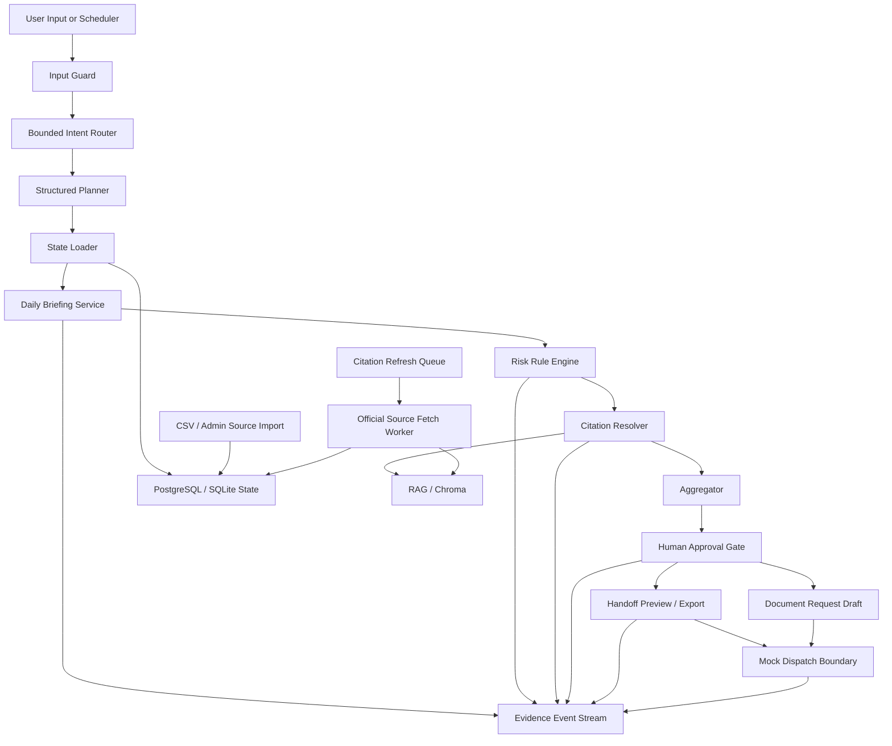

# 외고반장 E-9 운영 리스크 Daily Briefing MVP PRD

작성일: 2026-05-08
문서 목적: 기존 외국인 고용 Agentic OS 기획, RAG/데이터소스 설계, 현재 Daily Briefing MVP 방향을 하나의 제품 요구사항 문서로 통합한다.

---

## 1. 제품 한 줄 정의

외고반장은 E-9 외국인 고용 담당자가 매일 놓치기 쉬운 체류만료, 계약종료, 누락서류, 신고기한, 쿼터 검토, 근거 부족 리스크를 먼저 감지하고, 담당자 승인 가능한 액션과 Evidence Log까지 생성하는 운영 리스크 관리 MVP다.

---

## 2. 배경과 문제 정의

외국인 고용 사업장의 담당자는 체류만료, 계약종료, 고용변동 신고, 제출 서류, 다국어 소통, 행정사 전달 준비를 여러 시스템과 문서 사이에서 직접 관리한다.

이 업무는 단순한 편의 문제가 아니다. 놓치면 과태료, 불법고용 리스크, 체류 문제, 행정사 보완 요청, 근로자와의 소통 지연으로 이어질 수 있다.

기존 기획의 큰 방향은 외국인 고용 Agentic OS였다. 사용자가 목적을 말하면 AI가 신규 인력 요청, 다국어 컨택, 비자·서류 점검, 사람 승인, 행정사 전달 패키지까지 경로를 짜주는 구조다.

다만 MVP에서는 전체 Agentic OS를 한 번에 만들지 않는다. 가장 자주 발생하고 돈 낼 이유가 선명한 문제부터 좁힌다.

MVP의 문제 정의는 다음과 같다.

> 외국인 고용 담당자는 오늘 당장 확인해야 할 체류·계약·서류·신고·근거 리스크를 매일 놓치기 쉽다.

따라서 MVP는 “AI가 외국인 고용을 다 해준다”가 아니라, “놓치면 사고가 되는 운영 리스크를 매일 먼저 정리해준다”에 집중한다.

---

## 3. 제품 포지션

### 3.1 이 제품이 아닌 것

- 외국인 채용 추천 AI가 아니다.
- 비자 자동 신청 서비스가 아니다.
- 행정사·노무사를 대체하는 법률 자문 서비스가 아니다.
- 근로자 감시, 이탈 예측, 성실도 평가 서비스가 아니다.

### 3.2 이 제품인 것

외국인 고용 사업장이 놓치면 큰일 나는 체류·계약·서류·신고·소통 업무를 AI가 케이스 단위로 정리하고, 공식 근거와 함께 담당자 승인 가능한 액션으로 넘기는 운영 에이전트다.

기존 기획의 Agentic OS는 장기 비전이다. Daily Briefing MVP는 그 비전의 첫 번째 제품화 슬라이스다.

```text
장기 비전:
외국인 고용 Agentic OS

MVP:
E-9 운영 리스크 Daily Briefing

핵심 경험:
매일 아침 오늘 위험한 케이스를 먼저 보여주고,
근거와 승인 가능한 다음 행동까지 정리한다.
```

---

## 4. 목표 사용자

- E-9 외국인 근로자를 고용 중인 제조업 사업장 담당자
- 외국인 고용 관련 인사·총무 담당자
- 사업장과 협업하는 행정사·노무사
- 운영 이력, 승인 이력, 근거 문서를 확인해야 하는 관리자 또는 감사 담당자

초기 타깃은 직접 SaaS를 능숙하게 쓰는 대기업 HR팀보다, 반복 업무와 행정사 커뮤니케이션 부담이 큰 중소 제조업 사업장이다.

---

## 5. 사용자 문제와 Jobs To Be Done

| 사용자 상황 | 사용자가 원하는 일 | MVP가 제공해야 할 결과 |
|---|---|---|
| 매일 외국인 직원 상태를 확인해야 함 | 오늘 급한 케이스만 먼저 보고 싶다 | 위험 브리핑, severity, D-day, 근거, 추천 액션 |
| 체류만료가 다가옴 | 누가 위험하고 어떤 서류가 필요한지 알고 싶다 | visa_expiry case, missing documents, citation |
| 계약종료일과 체류만료일이 다름 | 충돌 여부를 빨리 확인하고 싶다 | contract_visa_conflict case, expert review flag |
| 고용변동 신고기한이 있음 | 신고기한 누락을 피하고 싶다 | reporting_deadline case, due date, HIGH/CRITICAL |
| 행정사에게 넘겨야 함 | 다시 물어보지 않게 패키지를 정리하고 싶다 | handoff preview/export, citation list, EvidenceEvent |
| 서류 요청을 해야 함 | 외국인 근로자에게 보낼 요청 초안이 필요하다 | request_document action, 다국어 메시지 draft, approval pending |

---

## 6. MVP 핵심 사용자 흐름

### 6.1 Daily Briefing Flow

```text
1. 관리자가 회사, 근로자, 서류, citation source 데이터를 입력한다.
2. 담당자가 오늘 위험 브리핑 생성을 누르거나 scheduler가 실행한다.
3. 시스템이 기준일과 회사 timezone을 확정한다.
4. DB에서 회사, 근로자, 서류, 케이스, citation source 상태를 로드한다.
5. rule engine이 체류만료, 계약종료, 누락서류, 신고기한, 쿼터 검토를 계산한다.
6. 각 위험 항목에 severity, D-day, citation, NextAction을 붙인다.
7. request_document, create_handoff 같은 액션은 approval pending으로 생성한다.
8. 담당자가 승인하면 handoff preview/export 또는 mock dispatch 경로까지 진행한다.
9. 모든 판단과 액션은 EvidenceEvent로 append된다.
```

### 6.2 Natural Language Flow

```text
사용자:
"이번 달 급한 외국인 직원만 정리해줘."

Input Guard
→ Bounded Intent Router
→ Structured Planner
→ State Loader
→ Daily Briefing Service
→ Risk Aggregation
→ Human Approval
→ Evidence Log
```

자연어 요청은 커버하되, LLM이 직접 도구를 마음대로 실행하지 않는다. Planner는 plan_steps, required_context, blocked_actions, approval_required 같은 구조화된 계획만 만든다. 실제 계산과 상태 변경은 deterministic service가 담당한다.

---

## 7. MVP 기능 범위

이 기능들은 각각 따로 존재하는 체크리스트가 아니다. Daily Briefing MVP는 아래 운영 루프를 끝까지 닫기 위해 필요한 최소 기능 묶음이다.

```text
Daily Briefing 생성
→ Risk Rule Engine으로 위험 계산
→ DB state와 citation으로 근거 연결
→ Case / NextAction / Approval로 업무화
→ Handoff Preview로 산출물 생성
→ EvidenceEvent로 판단 이력 저장
→ Scheduler / Admin / Metrics로 운영화
→ Natural Language Planner로 진입점 확장
```

즉, MVP의 기능 범위는 “많은 기능을 붙인 것”이 아니라, 외국인 고용 리스크를 감지하고, 근거를 붙이고, 승인 가능한 업무로 바꾸고, 나중에 설명 가능하게 남기는 최소 운영 루프다.

### 7.1 P0 기능

| 기능 | 설명 | 사용자 가치 |
|---|---|---|
| Daily Briefing 생성 | company_id와 date 기준으로 오늘 확인해야 할 외국인 고용 리스크를 한 번에 생성한다. | 담당자가 매일 어디부터 봐야 할지 바로 알 수 있다. |
| Risk Rule Engine | 체류만료 D-day, 계약종료, 누락서류, 신고기한, 쿼터 상태를 rule 기반으로 계산한다. | AI 추측이 아니라 재현 가능한 기준으로 위험도를 판단한다. |
| DB-backed source/state 저장 | 회사, 근로자, 서류, 케이스, 승인, 근거 이력을 DB에 저장한다. | 서버가 재시작돼도 브리핑과 승인 이력이 사라지지 않는다. |
| Case / NextAction / Approval / EvidenceEvent 모델 | 위험 항목은 Case, 해야 할 일은 NextAction, 승인 상태는 Approval, 판단 기록은 EvidenceEvent로 분리한다. | 업무 상태와 감사 기록이 섞이지 않고 추적 가능하다. |
| Tenant scope | company scope 밖의 case/action/evidence 조회와 승인을 막는다. | 다른 회사의 근로자·승인·근거 데이터가 노출되지 않는다. |
| Handoff Preview 및 export history | 행정사에게 전달할 내용을 내부 검토용 초안으로 만들고 export 이력을 남긴다. | 담당자가 바로 검토 가능한 패키지를 얻고, 나중에 무엇을 만들었는지 확인할 수 있다. |
| Citation Summary | 각 risk item에 근거 문서 요약과 source metadata를 붙인다. | “왜 이 판단을 했는지”를 화면에서 바로 확인할 수 있다. |
| CSV Source Import | company, worker, document, citation source 데이터를 CSV로 입력한다. | 운영자가 seed/mock이 아니라 실제 운영 데이터를 넣을 수 있다. |
| Admin Dashboard | source summary, briefing history, scheduler status, metrics, citation 상태를 본다. | 파일럿 운영 중 데이터 품질과 사용 흐름을 관리할 수 있다. |
| Scheduler | 회사별 daily briefing을 정해진 시간에 실행할 수 있다. | 담당자가 누르기 전에 매일 아침 위험 목록이 준비된다. |

### 7.2 P1 기능

| 기능 | 설명 | 사용자 가치 |
|---|---|---|
| Citation viewer, validation, refresh queue | 근거 문서를 보여주고, 오래됐거나 부족한 citation을 표시하며 재수집 대기열에 넣는다. | 근거 품질을 관리하고 “공식 근거 없는 판단”을 줄일 수 있다. |
| 공식 source URL fetch/parse/reindex worker | feature flag 뒤에서 승인된 source URL을 가져와 HTML/text/PDF를 파싱하고 RAG index에 다시 반영한다. | 근거 문서를 수동으로만 관리하지 않고 업데이트 경로를 갖게 된다. |
| Document request draft | 누락서류 요청 메시지 초안을 만든다. 실제 발송은 하지 않는다. | 담당자가 외국인 근로자에게 보낼 요청문을 빠르게 검토할 수 있다. |
| mock_webhook 기반 외부 전달 경로 검증 | 실제 전송 없이 승인 이후 외부 전달 흐름과 audit trail만 검증한다. | 위험한 실전송 없이 integration 구조를 안전하게 테스트할 수 있다. |
| Pilot metrics | approval rate, revision rate, export count, missing evidence count를 계산한다. | 파일럿에서 실제로 시간이 줄고 있는지, 어떤 기능이 쓰이는지 측정할 수 있다. |

### 7.3 P2 기능

| 기능 | 설명 | 사용자 가치 |
|---|---|---|
| 자연어 요청을 structured plan으로 바꾸는 planner | “이번 달 급한 직원만 봐줘” 같은 요청을 intent, plan_steps, required_context, blocked_actions로 구조화한다. | 사용자가 메뉴를 몰라도 자연어로 Daily Briefing 흐름에 진입할 수 있다. |
| Production citation hardening | allowlist, inactive review, diff approval, quality gate를 붙인다. | 공식 근거 갱신이 자동화되어도 품질 사고를 줄일 수 있다. |
| Provider adapter | Kakao, SMTP, 행정사 전달 adapter를 승인 기반으로 붙인다. | 검증된 내부 패키지를 실제 업무 채널로 확장할 수 있다. |
| 운영 Auth/RBAC | mock header/JWT scope에서 실제 로그인과 회사 권한 모델로 전환한다. | 운영 환경에서 사용자별 권한과 회사별 접근을 안전하게 통제한다. |
| Metrics snapshot | 일/주/月 리포트용 metrics snapshot을 저장한다. | 파일럿 성과를 주기적으로 보고하고 BM 검증에 사용할 수 있다. |

---

## 8. 지원 케이스와 우선순위

### 8.1 P0 Core Cases

| 케이스 | 우선순위 | 이유 |
|---|---:|---|
| Daily Risk Briefing | 1 | 매일 쓸 이유를 만드는 대표 화면이다. |
| Visa Expiry Case | 2 | 체류만료는 가장 직관적이고 위험도가 높은 운영 리스크다. |
| Document Gap Case | 3 | 서류 누락은 반복 업무 절감 효과가 크다. |
| Handoff Draft Case | 4 | 행정사와 협업할 때 실제 산출물 가치가 크다. |
| Evidence / Audit Review | 5 | AI 판단을 신뢰하게 만드는 근거 재현 기능이다. |

### 8.2 P1 Expansion Cases

| 케이스 | 우선순위 | 이유 |
|---|---:|---|
| Contract-Visa Conflict | 6 | 단순 알림보다 한 단계 높은 운영 판단을 제공한다. |
| Reporting Deadline | 7 | 고용변동 신고 누락 리스크를 줄인다. |
| Quota Review | 8 | 신규 채용 준비 때 검토 필요 상태를 알려준다. 단, 가능 여부 확정은 하지 않는다. |
| Multilingual Contact Draft | 9 | request_document action에서 파생되는 메시지 초안 기능이다. |

### 8.3 Guarded / Later Cases

| 케이스 | 처리 원칙 |
|---|---|
| Recruitment Readiness | 후보 추천이 아니라 신규 고용 준비상태 점검으로 제한한다. |
| Candidate Document Readiness | 후보자 매칭 점수 없이 서류 준비상태만 확인한다. |

---

## 9. Risk Severity Rules

모든 D-day 계산은 briefing input의 date를 기준으로 한다. date가 없으면 company timezone 기준 today를 사용한다.

| 리스크 | CRITICAL | HIGH | MEDIUM | LOW |
|---|---|---|---|---|
| visa_expiry | 이미 만료 | D-30 이하 | D-31~D-60 | D-61~D-90 |
| contract_expiry | 이미 종료 | D-30 이하 | D-31~D-60 | D-61~D-90 |
| missing_document | 필수서류 due_date 지남 | 필수서류 due_date D-7 이하 | 필수서류 due_date 없음 | 선택서류 누락 |
| reporting_deadline | 신고기한 지남 | D-3 이하 | D-4~D-7 | D-8 이상 |
| quota_review | 현재 인원 >= quota_limit | 신규 요청 시 quota 초과 가능 | 잔여 1명 이하 | 정보 확인 필요 |
| citation | 공식 근거 없음 | missing_evidence=true | stale_evidence=true | 참고 가능 |

정렬 기준은 severity, D-day, risk_type priority, subject_id 순으로 deterministic하게 처리한다.

---

## 10. 데이터와 RAG 요구사항

### 10.1 핵심 원칙

```text
RAG = 공식 근거와 절차를 찾는 곳
SQL/DB = 현재 직원·후보자 상태를 저장하는 곳
Rule Base = 날짜 계산과 true/false 판단을 하는 곳
LLM = 자연어 구조화, 요약, 메시지 생성, 설명을 하는 곳
Human Approval = 발송·제출·전달 전 최종 승인 지점
```

직원명, 외국인등록번호, 여권번호, 체류만료일, 계약종료일, 보유 서류 여부, 발송 기록, 승인 기록은 RAG에 넣지 않는다. 이는 DB에서 정확히 읽어야 하는 운영 상태다.

RAG는 법령, 절차, 서식, 메시지 템플릿, 안전자료, 승인된 내부 체크리스트의 근거를 제공한다.

### 10.2 MVP RAG Index

| Index | 목적 | 주요 데이터 |
|---|---|---|
| Official Procedure & Regulation RAG | 법령, 고용허가제 절차, 체류 절차, 서식 안내 검색 | 국가법령정보센터, EPS, 고용24, 한국산업인력공단, 정부24, HiKorea |
| Document & Case Template RAG | 서류 체크리스트와 행정사 패키지 근거 제공 | 고용변동 신고서, 체류기간 연장 서류, 고용허가 준비서류, 내부 체크리스트 |
| Communication & Safety Template RAG | 다국어 요청 메시지와 안전/생활 안내 근거 제공 | KOSHA, 다국어 안전표지, 상담센터 안내, 자체 메시지 템플릿 |

### 10.3 최소 수집 데이터셋

| 범주 | 최소 데이터 |
|---|---|
| 법령/서식 | 출입국관리법, 출입국관리법 시행령/시행규칙, 외국인근로자고용법, 시행령/시행규칙, 고용변동 신고서, 사업장 정보변동 신고서 |
| 절차 | EPS 고용허가제 소개, 사업주 고용절차, 고용/취업절차, 허용업종 안내, 고용허가 신청 안내, 체류기간 연장 민원 안내 |
| 안전/다국어 | KOSHA 외국인 안전교육, 다국어 안전표지, 외국인력상담센터 안내 |
| 통계 | E-9 국적별·지역별·업종별 근무현황, 외국인 고용 사업장 현황 |
| 내부 mock | 샘플 사업장, 직원 CSV, 후보자 CSV, 케이스, 메시지 템플릿, handoff 템플릿, document_requirements.csv |

### 10.4 Evidence Grade

| 등급 | 의미 | 답변 근거 사용 |
|---|---|---|
| A | 법령/정부 공식 문서 | 가능 |
| B | 공공기관/공식 절차 안내 | 가능 |
| C | 공공데이터/통계 | 시장 설명용 |
| D | 센터 상담사례/참고자료 | 참고용 |
| E | 내부 승인 템플릿 | 가능, 단 내부 기준으로 표시 |
| F | 합성 데이터 | 데모/평가용, 근거 사용 금지 |

---

## 11. Core Data Contracts

### 11.1 DailyBriefingResult

```json
{
  "briefing_run_id": "brf_company_001_2026-05-08",
  "company_id": "company_001",
  "date": "2026-05-08",
  "generated_at": "2026-05-08T08:00:00+09:00",
  "timezone": "Asia/Seoul",
  "items": [],
  "risk_summary": {},
  "recommended_actions": [],
  "citation_summaries": [],
  "evidence_event_ids": [],
  "approval_required": true,
  "source_snapshot_hash": "sha256:...",
  "rerun_count": 0,
  "last_refreshed_at": "2026-05-08T08:00:00+09:00"
}
```

### 11.2 Relation Rule

- One Case can have multiple NextActions.
- One NextAction has one Approval in MVP.
- One DailyBriefingItem references one Case and multiple NextActions.
- `DailyBriefingItem.next_action_ids` references actions included in top-level `recommended_actions`.

### 11.3 NextAction

```json
{
  "action_id": "action_001",
  "case_id": "case_001",
  "action_type": "request_document",
  "label": "누락 서류 요청 메시지 초안 생성",
  "status": "pending_approval",
  "approval_required": true,
  "blocked_until_approved": true,
  "evidence_required": true,
  "citation_ids": ["cit_001"]
}
```

### 11.4 EvidenceEvent

```json
{
  "event_id": "evt_001",
  "event_version": "v1",
  "trace_id": "trace_001",
  "case_id": "case_001",
  "request_id": "req_001",
  "event_type": "risk_flagged",
  "actor_type": "system",
  "node_name": "daily_briefing_service",
  "summary": "worker_001 visa expiry flagged as HIGH",
  "citation_ids": ["cit_001"],
  "redacted_input_hash": "sha256:...",
  "redacted_output_hash": "sha256:...",
  "hash_algorithm": "sha256",
  "payload_ref": null,
  "created_at": "2026-05-08T08:00:00+09:00"
}
```

---

## 12. Architecture



---

## 13. Safety Guardrails

반드시 금지한다.

- AI 단독 비자 가능/불가능 판정
- AI 단독 법률·노무 자문
- 정부 포털 자동 제출
- 승인 없는 메시지 발송
- 승인 없는 행정사/노무사 패키지 전달
- 후보자 추천 점수, 성실도 판단, 이탈 가능성 예측
- 국적별 선호 또는 차별적 추천
- 근로자 SNS, 단톡방, 외부 커뮤니티 감시
- Evidence Log에 원문 PII 저장

승인이 필요한 작업은 모두 `approval_required=true`로 반환한다.

---

## 14. Non-goals

MVP에서 하지 않는다.

- 실제 정부 API 제출
- 실제 카카오/SMTP/행정사 전송
- 운영용 SSO/RBAC 완성
- LLM 기반 자유 planner를 통한 자동 tool loop
- 완전 자동 citation refresh 운영
- 법률 자문성 판단
- 근로자 평가 또는 후보자 추천

---

## 15. Acceptance Criteria

- 특정 company_id/date 입력 시 DailyBriefingResult가 생성된다.
- date가 없으면 company timezone 기준 today를 사용한다.
- D-30 이하 체류만료자는 HIGH로 표시된다.
- 이미 만료된 체류/계약/신고기한은 CRITICAL로 표시된다.
- 누락서류가 있는 근로자는 missing_document risk item을 만든다.
- 모든 recommended_actions는 승인 전 `approval_required=true`다.
- approval pending 없이는 외부 전달 boundary가 실행되지 않는다.
- 실제 메시지 발송, 행정사 전달, 정부 제출은 실행되지 않는다.
- 같은 company_id/date 재실행 시 중복 case/action이 생기지 않는다.
- source_snapshot_hash가 바뀌면 같은 briefing_run_id로 갱신된다.
- tenant scope 밖의 case/action/evidence는 조회하거나 승인할 수 없다.
- citation이 없으면 missing_evidence=true로 표시한다.
- EvidenceEvent가 최소 1개 이상 생성된다.
- backend tests와 frontend build가 통과한다.

---

## 16. Success Metrics

| 지표 | 의미 |
|---|---|
| Briefing Generation Success Rate | 회사별 briefing 생성 성공률 |
| Proactive Risk Detection Rate | 사용자가 묻기 전에 리스크를 탐지한 비율 |
| HIGH/CRITICAL Precision | 실제 담당자가 중요하다고 판단한 위험 항목 비율 |
| Action Approval Rate | 생성된 NextAction 중 승인된 비율 |
| Revision Request Rate | 담당자가 수정 요청한 비율 |
| Handoff Export Usage | handoff preview/export가 실제로 사용된 횟수 |
| Missing Evidence Rate | citation 부족 또는 stale evidence 비율 |
| Time Saved Per Case | 기존 수작업 대비 케이스당 절감 시간 |
| Evidence Completeness | 판단 근거, 승인 이력, 실행 이력이 빠짐없이 남은 비율 |

North Star Metric:

> 월간 리스크 케이스 중 외고반장이 사전 감지하고, 담당자 승인 가능한 행정 패키지까지 생성한 비율

---

## 17. Roadmap

### Sprint 1: Thin Slice

Daily Briefing, visa_expiry, missing_document, NextAction, approval pending, EvidenceEvent, Handoff Preview를 끝까지 연결한다.

### Sprint 2: 운영 데이터와 Scheduler

CSV/Admin source import, scheduler 운영화, citation validation, briefing history를 보강한다.

### Sprint 3: Admin과 Pilot Metrics

Admin dashboard, citation admin view, pilot metrics, dashboard badge, briefing run history를 강화한다.

### Sprint 4: 품질 관리와 자연어 Workflow

structured planner, citation refresh queue, official source fetch worker, RAG reindex, source quality review를 붙인다.

### Sprint 5: Production Hardening

운영 auth/RBAC, citation allowlist, inactive review, diff approval, provider audit, observability를 보강한다.

### Sprint 6: Controlled Integrations

Kakao, SMTP, 행정사 전달 adapter를 승인 기반으로 제한적으로 붙인다. 정부 포털 자동 제출은 계속 금지한다.

---

## 18. 데모 시나리오

```text
1. company_with_5_workers를 선택한다.
2. 오늘 위험 브리핑 생성 버튼을 누른다.
3. worker_visa_expiring_d30이 HIGH로 표시된다.
4. worker_visa_expired가 CRITICAL로 표시된다.
5. worker_missing_required_documents가 missing_document로 표시된다.
6. contract_visa_conflict와 reporting_deadline이 있으면 함께 표시된다.
7. 각 item에서 citation summary를 확인한다.
8. request_document/create_handoff action이 approval pending으로 생성된다.
9. 담당자가 approve를 누른다.
10. Handoff preview/export를 확인한다.
11. mock dispatch는 실제 전송 없이 audit trail만 남긴다.
12. Evidence Log에서 risk_flagged, approval_requested, handoff_generated 이벤트를 확인한다.
13. 같은 날짜로 다시 실행해도 중복 action이 생기지 않는다.
```

---

## 19. 발표용 설명

외고반장은 외국인 고용 담당자가 매일 놓치기 쉬운 체류만료, 계약종료, 누락서류, 고용변동 신고 리스크를 먼저 감지하고, 공식 근거와 함께 행정사 검토용 패키지까지 생성하는 E-9 운영 리스크 관리 MVP입니다.

AI는 최종 판단이나 자동 제출을 하지 않습니다. 담당자가 승인 가능한 상태로 업무를 정리하고, 모든 판단 근거와 승인 이력을 Evidence Log로 남깁니다.

---

## 20. Source Inputs

이 PRD는 아래 기획을 통합해 작성했다.

- 외국인 고용 Agentic OS 최종 MVP 기획
- 외국인 고용 Agentic OS RAG 설계 및 데이터 소스 수집 계획
- 데이터 소스 상세 문서
- Daily Briefing thin slice 구현 방향
