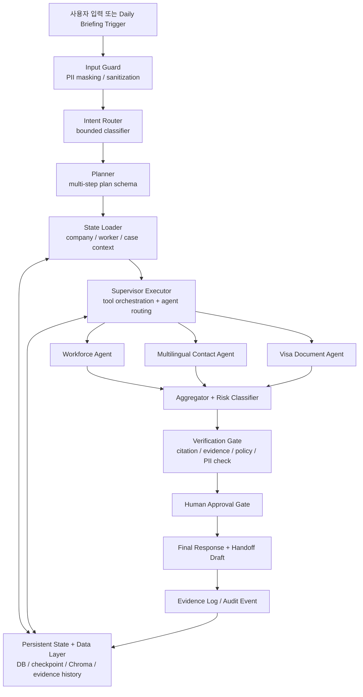

# 외고반장 E-9 운영 리스크 MVP 고도화 통합 정리

## 0. 문서 목적

이 문서는 오늘 논의한 외고반장 고도화 방향을 하나로 통합한 정리본이다.

핵심은 외고반장을 “AI가 외국인 고용 업무를 대행하는 서비스”로 만드는 것이 아니라, **E-9 외국인 고용 담당자가 매일 놓치기 쉬운 운영 리스크를 먼저 감지하고, 공식 근거와 함께 승인 가능한 업무 패키지로 정리하는 MVP**로 만드는 것이다.

즉, 외고반장의 초기 경쟁력은 거대한 Agentic OS 자체가 아니라 다음 흐름에 있다.

```text
회사 선택
→ 오늘 위험 브리핑 생성
→ 체류만료 / 누락서류 / 계약 리스크 탐지
→ 근거 citation 표시
→ request_document / create_handoff 액션 생성
→ approval pending
→ EvidenceEvent 저장
→ Handoff preview 확인
→ 같은 날짜 재실행 시 중복 없음
```

이 문서는 다음 내용을 통합한다.

- 제품 포지셔닝
- 아키텍처 방향
- 케이스 분류
- Thin Slice 구현 계획
- Core Contract
- Risk Rule
- Evidence / Approval 설계
- Sprint별 로드맵
- Out of Scope
- 성공 지표
- 다음 단계

---

## 1. 최종 제품 포지셔닝

### 1.1 외고반장이 아닌 것

외고반장은 다음을 하지 않는다.

- AI가 외국인 고용 가능 여부를 확정하지 않는다.
- AI가 비자 가능 여부를 확정하지 않는다.
- AI가 법률/노무 자문을 대체하지 않는다.
- AI가 정부 포털에 자동 제출하지 않는다.
- AI가 담당자 승인 없이 메시지를 발송하지 않는다.
- AI가 특정 후보를 자동 추천하지 않는다.
- AI가 국적 선호, 성실도, 인성, 채용 적합성을 판단하지 않는다.
- AI가 행정사/노무사 검토를 대체하지 않는다.

### 1.2 외고반장이 해야 하는 것

외고반장의 MVP는 다음을 한다.

- 매일 또는 사용자가 요청할 때 외국인 고용 리스크를 정리한다.
- 체류만료 D-day를 계산한다.
- 이미 만료된 항목을 CRITICAL로 표시한다.
- 누락서류를 찾아낸다.
- 공식 또는 내부 근거 citation을 표시한다.
- 담당자가 승인할 수 있는 NextAction을 만든다.
- 승인 전에는 외부 실행을 하지 않는다.
- 행정사 검토용 Handoff preview를 만든다.
- 모든 판단과 실행 후보를 EvidenceEvent로 남긴다.

### 1.3 한 줄 포지셔닝

> 외고반장은 E-9 외국인 고용 담당자가 매일 놓치기 쉬운 체류만료, 누락서류, 계약/신고 리스크를 먼저 감지하고, 근거와 승인 가능한 액션으로 정리해주는 운영 리스크 관리 MVP다.

---

## 2. 핵심 판단: Agentic OS보다 운영 MVP가 먼저다

초기에는 “Agentic OS”라는 큰 그림보다 **Daily Briefing 기반 운영 MVP**가 더 중요하다.

좋은 방향은 다음이다.

```text
현재 workflow 유지
→ Daily Briefing thin slice
→ Risk Rule
→ Case / NextAction
→ Action-level Approval
→ EvidenceEvent
→ Handoff Preview
→ UI
→ 이후 자연어 workflow / scheduler / 외부 연동
```

피해야 할 방향은 다음이다.

```text
Router를 ReAct로 교체
→ CrewAI식 Multi-Agent를 새로 붙임
→ Long-term Memory부터 도입
→ Scheduler부터 구현
→ External Tool Calling 먼저 연결
```

외고반장에서는 “똑똑한 Router”보다 다음이 더 중요하다.

```text
안전한 Router
+ 강한 Planner
+ 신뢰 가능한 State Loader
+ deterministic Risk Rule
+ Aggregator / Risk Classifier
+ Human Approval
+ EvidenceEvent
```

---

## 3. 최종 아키텍처 방향

### 3.1 유지할 현재 흐름

현재 LangGraph 흐름은 유지한다.

```text
intent_router
→ planner
→ state_loader
→ executor
→ aggregator
→ approval_gate
→ final_response
```

구조 교체가 아니라, 이 흐름 위에 MVP 기능을 얹는다.

### 3.2 권장 아키텍처



### 3.3 각 계층의 역할

| 계층 | 역할 |
|---|---|
| Input Guard | 개인정보 마스킹, 입력 정제, 위험 입력 차단 |
| Intent Router | 안전한 업무 분류만 수행하는 bounded classifier |
| Planner | 복합 요청을 구조화된 PlanStep으로 분해 |
| State Loader | 회사, 근로자, 케이스, 문서 상태 로드 |
| Executor | Agent와 Tool 호출을 조율하는 오케스트레이터 |
| Domain Agents | 인력확보, 다국어 컨택, 비자·서류 업무 수행 |
| Aggregator / Risk | 결과 취합, 위험도, 승인 필요 여부 판단 |
| Verification Gate | citation, PII, forbidden action, evidence 검증 |
| Human Approval | 승인 전 외부 실행 차단 |
| EvidenceEvent | 단계별 append-only audit event 저장 |
| Persistent State | workflow state, case, action, approval, evidence 저장 |

---

## 4. 오늘 확정한 설계 원칙

### 4.1 Router는 ReAct로 바꾸지 않는다

Router는 다음만 한다.

- 채용 관련 요청인지 분류
- 비자/서류 관련 요청인지 분류
- 다국어 컨택 요청인지 분류
- 행정사 패키지 요청인지 분류
- 법률 확답/자동 제출/국적 선호/성실도 판단 요청 차단

Router는 도구 호출이나 긴 추론을 하지 않는다.  
ReAct/tool loop는 Planner, Executor, Domain Agent 내부에서 제한적으로 사용한다.

### 4.2 State Loader는 반드시 유지한다

State Loader는 Planner 뒤, Executor 앞에 둔다.

```text
intent_router
→ planner
→ state_loader
→ executor
```

State Loader는 다음을 로드한다.

- company
- worker
- document status
- case
- approval
- citation
- evidence history
- relevant DB snapshot

### 4.3 Memory보다 Persistent State가 먼저다

Long-term LLM Memory는 MVP 범위 밖이다.

먼저 필요한 것은 다음이다.

- case_id 기준 workflow 상태 저장
- approval 상태 저장
- evidence event 저장
- daily briefing 재실행 가능성
- source_snapshot_hash 기반 idempotency

### 4.4 Scheduler보다 service function이 먼저다

Daily Briefing은 처음부터 scheduler로 만들지 않는다.

먼저 다음 함수를 만든다.

```python
run_daily_briefing(company_id: str, date: date | None) -> DailyBriefingResult
```

이 함수가 안정화된 뒤에 scheduler를 붙인다.

### 4.5 Evidence Log는 마지막 저장소가 아니라 event stream이다

EvidenceEvent는 최종 결과만 저장하지 않는다.

단계별 이벤트를 append-only로 남긴다.

예시:

```text
input_received
state_loaded
risk_flagged
approval_requested
handoff_preview_generated
approval_approved
```

Sprint 2 이후에는 다음 이벤트를 확장한다.

```text
plan_created
rag_retrieved
agent_executed
verification_passed
final_response_generated
```

### 4.6 PII는 lookup과 log/LLM 입력을 분리한다

PII를 무조건 빨리 지우면 worker lookup이 깨질 수 있다.

원칙은 다음이다.

```text
운영용 식별값
→ State Loader 전까지 lookup에 사용

LLM 입력 / Evidence Log
→ worker_id 또는 masked name만 사용
```

EvidenceEvent에는 다음을 저장하지 않는다.

- 원문 이름
- 전화번호
- 여권번호
- 외국인등록번호
- worker reply 전문
- message body 전문
- document body 전문

---

## 5. 케이스 구조

### 5.1 케이스와 액션을 분리한다

핵심 구분은 다음이다.

```text
Case = 리스크/업무 단위
NextAction = 승인 가능한 실행 후보 단위
```

예시:

```text
Visa Expiry Case
→ request_document NextAction
→ create_handoff NextAction
→ ask_admin_review NextAction
```

### 5.2 P0 Core Cases

| 케이스 | 설명 |
|---|---|
| Daily Risk Briefing Case | 회사 기준 오늘 위험 업무 목록 생성 |
| Visa Expiry Case | 체류만료 D-day, expired, 필요서류, next action 생성 |
| Contract-Visa Conflict Case | 계약 종료일과 체류만료일 충돌 검토 |
| Document Gap Case | 직원별 누락서류와 요청 액션 생성 |
| Handoff Draft Case | 행정사 검토용 내부 preview/draft 생성 |
| Evidence/Audit Review Case | trace, rule, citation, approval history 조회 |

### 5.3 P1 Action / Support Cases

| 케이스/액션 | 설명 |
|---|---|
| Multilingual Contact Draft Action | 독립 case보다 request_document NextAction으로 우선 구현 |
| Recruitment Readiness / Quota Review Case | 고용 가능 확정이 아니라 쿼터/절차 검토 필요 상태만 표시 |

### 5.4 P2 Guarded Case

| 케이스 | 설명 |
|---|---|
| Candidate Document Readiness Case | 후보 추천/점수화 없이 서류 준비상태만 점검 |

### 5.5 Sprint 1에서 구현할 케이스

Sprint 1에서는 딱 두 개만 구현한다.

```text
visa_expiry
missing_document
```

Sprint 1에서 구현할 NextAction도 두 개만 둔다.

```text
request_document
create_handoff
```

---

## 6. Sprint 1 Thin Slice 최종 구현 계획

## 6.1 Sprint 1 목표

Sprint 1의 목표는 외고반장 전체 Agentic OS가 아니라 **Daily Briefing 기반 E-9 운영 리스크 thin slice**를 구현하는 것이다.

핵심 데모 흐름:

```text
회사 선택
→ 오늘 위험 브리핑 생성
→ D-30 체류만료자 HIGH
→ 만료자 CRITICAL
→ 누락서류 표시
→ citation 표시
→ request_document/create_handoff 액션 생성
→ approval pending
→ EvidenceEvent 저장
→ Handoff preview 보기
→ 같은 날짜 재실행 시 중복 없음
```

Sprint 1은 두 부분으로 나눈다.

```text
Sprint 1A: Backend Thin Slice
Sprint 1B: Product Thin Slice
```

---

## 7. Core Contracts

### 7.1 Relation Rule

```text
One Case can have multiple NextActions.
One NextAction has one Approval in Sprint 1.
One DailyBriefingItem can reference one Case and multiple NextActions.
DailyBriefingItem.next_action_ids references actions included in top-level recommended_actions.
UI should join items[].next_action_ids with recommended_actions[].action_id.
```

### 7.2 Case

```text
case_id: str
company_id: str
worker_id: str | None
risk_type: visa_expiry | missing_document
status: open | in_review | approval_pending | resolved | blocked
due_date: str | None
risk_level: CRITICAL | HIGH | MEDIUM | LOW
created_at: str
updated_at: str
```

### 7.3 Approval

```text
approval_id: str
case_id: str
action_id: str
status: pending | approved | rejected | revision_requested
approver_id: str | None
rejection_reason: str | None
revision_reason: str | None
created_at: str
updated_at: str
```

Sprint 1에서는 `pending → approved`만 구현한다.

### 7.4 DailyBriefingResult

```text
briefing_run_id: str
company_id: str
date: str
generated_at: str
timezone: str
source_snapshot_hash: str
rerun_count: int
last_refreshed_at: str
items: list[DailyBriefingItem]
risk_summary: RiskSummary
recommended_actions: list[NextAction]
citation_summaries: list[CitationSummary]
evidence_event_ids: list[str]
approval_required: bool
```

`briefing_run_id` 포맷:

```text
brf_{slug_company_id}_{YYYY-MM-DD}
```

company_id가 slug-safe하지 않으면 다음을 사용한다.

```text
brf_{sha256(company_id + ":" + date)[:16]}
```

### 7.5 DailyBriefingItem

```text
item_id: str
case_id: str | None
subject_type: worker | company | case
subject_id: str
risk_type: visa_expiry | missing_document
severity: CRITICAL | HIGH | MEDIUM | LOW
d_day: int | None
expired: bool
days_overdue: int | None
missing_documents: list[str]
citation_ids: list[str]
next_action_ids: list[str]
```

### 7.6 RiskSummary

```text
total_count: int
critical_count: int
high_count: int
medium_count: int
low_count: int
by_risk_type: dict[str, int]
```

### 7.7 NextAction

```text
action_id: str
action_type: request_document | create_handoff
status: pending_approval | approved | blocked | completed | cancelled
subject_id: str
label: str
approval_required: bool
blocked_until_approved: bool
evidence_required: bool
citation_ids: list[str]
approved_at: str | None
```

Sprint 1에서는 `pending_approval → approved`만 구현한다.

`completed`는 실제 외부 실행이 생기는 후속 sprint에서 사용한다.

### 7.8 CitationSummary

```text
citation_id: str
title: str
source_type: official | internal | synthetic
source: str
ingest_at: str
```

Sprint 1에서는 `citation_summaries`를 DailyBriefing response에 embed한다.

```text
GET /api/v1/citations/{citation_id}
```

위 API는 Sprint 2로 미룬다.

### 7.9 EvidenceEvent v1

```text
event_id: str
event_version: v1
trace_id: str
case_id: str | None
request_id: str | None
event_type: input_received | state_loaded | risk_flagged | approval_requested | handoff_preview_generated | approval_approved
actor_type: system | user | agent | approver
node_name: str
summary: str
citation_ids: list[str]
redacted_input_hash: str | None
redacted_output_hash: str | None
hash_algorithm: sha256
payload_ref: str | None
created_at: str
```

---

## 8. Example API Response

### 8.1 POST /api/v1/daily-briefings/run

```json
{
  "briefing_run_id": "brf_company_001_2026-05-08",
  "company_id": "company_001",
  "date": "2026-05-08",
  "generated_at": "2026-05-08T08:00:00+09:00",
  "timezone": "Asia/Seoul",
  "source_snapshot_hash": "sha256:6f1d...",
  "rerun_count": 1,
  "last_refreshed_at": "2026-05-08T08:00:00+09:00",
  "risk_summary": {
    "total_count": 2,
    "critical_count": 1,
    "high_count": 1,
    "medium_count": 0,
    "low_count": 0,
    "by_risk_type": {
      "visa_expiry": 1,
      "missing_document": 1
    }
  },
  "items": [
    {
      "item_id": "item_001",
      "case_id": "case_001",
      "subject_type": "worker",
      "subject_id": "worker_001",
      "risk_type": "visa_expiry",
      "severity": "HIGH",
      "d_day": 30,
      "expired": false,
      "days_overdue": null,
      "missing_documents": [],
      "citation_ids": ["cit_001"],
      "next_action_ids": ["action_001", "action_002"]
    },
    {
      "item_id": "item_002",
      "case_id": "case_002",
      "subject_type": "worker",
      "subject_id": "worker_002",
      "risk_type": "missing_document",
      "severity": "CRITICAL",
      "d_day": null,
      "expired": true,
      "days_overdue": 3,
      "missing_documents": ["passport_copy", "standard_labor_contract"],
      "citation_ids": ["cit_002"],
      "next_action_ids": ["action_003"]
    }
  ],
  "recommended_actions": [
    {
      "action_id": "action_001",
      "action_type": "request_document",
      "status": "pending_approval",
      "subject_id": "worker_001",
      "label": "서류 요청 메시지 초안 생성",
      "approval_required": true,
      "blocked_until_approved": true,
      "evidence_required": true,
      "citation_ids": ["cit_001"],
      "approved_at": null
    },
    {
      "action_id": "action_002",
      "action_type": "create_handoff",
      "status": "pending_approval",
      "subject_id": "worker_001",
      "label": "행정사 검토용 Handoff preview 생성",
      "approval_required": true,
      "blocked_until_approved": true,
      "evidence_required": true,
      "citation_ids": ["cit_001"],
      "approved_at": null
    },
    {
      "action_id": "action_003",
      "action_type": "request_document",
      "status": "pending_approval",
      "subject_id": "worker_002",
      "label": "누락서류 요청 초안 생성",
      "approval_required": true,
      "blocked_until_approved": true,
      "evidence_required": true,
      "citation_ids": ["cit_002"],
      "approved_at": null
    }
  ],
  "citation_summaries": [
    {
      "citation_id": "cit_001",
      "title": "E-9 체류기간 연장 안내",
      "source_type": "official",
      "source": "HiKorea",
      "ingest_at": "2026-05-01T00:00:00+09:00"
    },
    {
      "citation_id": "cit_002",
      "title": "E-9 갱신 서류 체크리스트",
      "source_type": "internal",
      "source": "WorkBridge seed",
      "ingest_at": "2026-05-01T00:00:00+09:00"
    }
  ],
  "evidence_event_ids": ["evt_001", "evt_002"],
  "approval_required": true
}
```

### 8.2 POST /api/v1/approvals/{approval_id}/approve

```json
{
  "approval_id": "approval_001",
  "case_id": "case_001",
  "action_id": "action_001",
  "status": "approved",
  "approved_at": "2026-05-08T08:10:00+09:00",
  "evidence_event_id": "evt_approval_001"
}
```

### 8.3 Sprint 1 Minimal Error Response

```json
{
  "error_code": "TENANT_SCOPE_VIOLATION",
  "message": "Requested company is outside the allowed company scope.",
  "trace_id": "trace_001"
}
```

---

## 9. Sprint 1A: Backend Thin Slice

Goal: Daily Briefing의 계산, 저장, 재실행, 최소 audit trail을 백엔드에서 재현 가능하게 만든다.

### 9.1 Core schema + fixtures

작업:

- Add `DailyBriefingResult`
- Add `DailyBriefingItem`
- Add `RiskSummary`
- Add `NextAction`
- Add action-level `Approval`
- Add `Case`
- Add `EvidenceEvent v1`
- Add `CitationSummary`
- Add minimal `Citation`
- Add `DocumentStatus.due_date`

Fixtures:

- `company_with_5_workers`
- `company_no_risks`
- `worker_visa_expiring_d30`
- `worker_visa_expired`
- `worker_missing_required_documents`
- `pending_approval_action_case`
- `mock_citation_case`

### 9.2 Repository / storage layer

작업:

- Store and retrieve `DailyBriefingResult`
- Store and retrieve `Case`
- Store and retrieve `NextAction`
- Store and retrieve `Approval`
- Store and retrieve `EvidenceEvent`
- Support upsert/reuse by `briefing_run_id`, `case_id`, `action_id`

Case reuse rule:

```text
same company_id + worker_id + risk_type + due_date
+ case.status in open | in_review | approval_pending
→ reuse existing case
```

Transaction rule:

```text
Case, NextAction, Approval, EvidenceEvent writes happen in one transaction.
Transaction failure returns STATE_SAVE_FAILED and leaves no partial rows.
```

### 9.3 Source snapshot hash

`source_snapshot_hash`는 normalized non-PII operational fields로 계산한다.

Hash input:

- company_id
- date
- sorted worker ids
- visa_expiry_date
- contract_end_date
- document status rows including due_date
- citation ids
- citation ingest_at

Hash input에 넣지 않는 것:

- raw names
- phone numbers
- passport numbers
- alien registration numbers
- message bodies
- document bodies

### 9.4 Risk rule engine

Sprint 1 case types:

```text
visa_expiry
missing_document
```

D-day 기준:

```text
API input date
→ 없으면 company_timezone today
```

Visa expiry rule:

```text
expired → CRITICAL + expired=true + days_overdue=N
D-30 이하 → HIGH
D-31~D-60 → MEDIUM
D-61~D-90 → LOW
```

Missing document rule:

```text
DocumentStatus.due_date가 있으면 사용
required missing document + due date already passed → CRITICAL
required missing document + due date D-7 이하 → HIGH
required missing document + no due_date → MEDIUM
optional missing document → LOW
```

### 9.5 Minimal EvidenceEvent service

Minimal events:

```text
input_received
state_loaded
risk_flagged
approval_requested
handoff_preview_generated
approval_approved
```

저장하는 것:

- redacted summary
- citation ids
- sha256 hash
- optional payload_ref

저장하지 않는 것:

- raw PII
- phone number
- passport number
- alien registration number
- worker reply body
- message body
- document body

### 9.6 Daily Briefing service

함수:

```python
run_daily_briefing(company_id: str, date: date | None) -> DailyBriefingResult
```

Rerun policy:

```text
same company_id/date → same briefing_run_id
same source_snapshot_hash → return same result
changed source_snapshot_hash → update existing briefing
pending approval action is not duplicated
```

Sorting:

```text
severity
→ d_day
→ risk type priority
→ subject_id
```

### 9.7 No-risk briefing

위험이 없을 때:

```text
items=[]
risk_summary.total_count=0
recommended_actions=[]
approval_required=false
```

그래도 저장할 EvidenceEvent:

```text
input_received
state_loaded
```

### 9.8 Tenant scope and MVP auth assumption

Sprint 1에서는 full login/SSO를 구현하지 않는다.

대신 다음을 사용한다.

```text
seed user
or X-Company-Id header
or X-User-Role header
```

규칙:

```text
request company_id outside allowed company scope
→ TENANT_SCOPE_VIOLATION

worker.company_id != request company_id
→ TENANT_SCOPE_VIOLATION
```

### 9.9 Sprint 1 minimal citation rule

Sprint 1에서는 strong citation validation을 하지 않는다.

최소 규칙:

```text
citation_id must exist in seed fixture or retrieved mock chunk.
API/UI show citation title, source, ingest_at via embedded citation_summaries.
```

Sprint 2로 미루는 것:

```text
synthetic-only blocking
stale-only blocking
strict chunk version validation
GET /api/v1/citations/{citation_id}
```

### 9.10 Sprint 1A Acceptance Criteria

- 특정 `company_id/date`로 `DailyBriefingResult`가 생성된다.
- D-30 visa expiry는 HIGH다.
- expired visa는 CRITICAL이며 `expired=true`, `days_overdue`를 가진다.
- missing required document는 `missing_document` item을 만든다.
- missing document severity는 `DocumentStatus.due_date`를 사용한다.
- no-risk company는 empty briefing과 zero counts를 반환한다.
- EvidenceEvent는 저장되며 raw PII를 포함하지 않는다.
- 같은 `company_id/date` 재실행은 case/risk/action row를 중복 생성하지 않는다.
- source data가 바뀌면 같은 `briefing_run_id`를 업데이트한다.
- tenant scope violation은 `TENANT_SCOPE_VIOLATION`을 반환한다.
- DB transaction 실패는 `STATE_SAVE_FAILED`를 반환하고 partial row를 남기지 않는다.

---

## 10. Sprint 1B: Product Thin Slice

Goal: Daily Briefing 결과를 승인 가능한 액션과 내부 Handoff preview로 연결한다.

### 10.1 NextAction generation

생성할 action:

```text
request_document
create_handoff
```

모든 action은 다음 상태로 시작한다.

```text
status=pending_approval
approval_required=true
blocked_until_approved=true
```

### 10.2 Approval pending + approve minimal flow

Sprint 1에서는 다음만 구현한다.

```text
pending creation
approve
```

Approve effect:

```text
Approval.status=approved
NextAction.status=approved
approved_at 저장
approval_approved EvidenceEvent 저장
```

실행하지 않는 것:

```text
external message send
expert handoff
export
```

`reject`, `revision_requested`는 Sprint 2에서 구현하거나 UI에서 비활성화한다.

Approve API 최소 권한 규칙:

```text
Sprint 1 uses seed user or X-User-Role header.
Only manager/admin role can approve.
approver_id is stored from seed user or request header.
viewer/auditor approval request returns UNAUTHORIZED_ROLE.
```

### 10.3 Handoff preview

Sprint 1에서는 `create_handoff` action이 있을 때만 Handoff preview를 만든다.

포함 항목:

- masked worker summary
- risk summary
- missing documents
- citation list
- recommended questions

규칙:

```text
missing_evidence=true
→ preview 생성하되 “근거 부족” warning 표시

PII redaction failure
→ preview 생성 금지

tenant scope violation
→ preview 생성 금지
```

HandoffPreview 최소 구조:

```text
preview_id: str
case_id: str
action_id: str
content_redacted: dict | str
citation_ids: list[str]
warning_flags: list[str]
created_at: str
```

Sprint 2 이후에는 `request_document` action에도 message preview를 붙일 수 있다.

### 10.4 Daily Briefing API

Sprint 1 API:

```text
POST /api/v1/daily-briefings/run
GET /api/v1/daily-briefings/{briefing_run_id}
POST /api/v1/approvals/{approval_id}/approve
GET /api/v1/cases/{case_id}/evidence-events
```

### 10.5 Simple UI

1차 화면 필드:

- severity
- masked worker name
- risk type
- D-day / expired
- missing documents
- citation
- recommended action
- approve button
- Evidence Log link

UI 규칙:

```text
citation detail은 briefing response의 embedded citation_summaries에서 읽는다.
Evidence details는 link로 연다.
reject/revision controls는 Sprint 2까지 숨기거나 disable한다.
```

### 10.6 Sprint 1B Acceptance Criteria

- `request_document`, `create_handoff` action이 생성된다.
- One Case can have multiple NextActions.
- Each NextAction has one Approval.
- 모든 action은 approval pending 상태로 시작한다.
- Pending action은 외부 side effect를 실행하지 않는다.
- Approve는 approval/action status를 바꾸고 `approval_approved` EvidenceEvent를 기록한다.
- Handoff preview는 내부에서 볼 수 있다.
- UI는 risk reason, citation, approval action을 보여준다.
- Evidence Log link는 `GET /api/v1/cases/{case_id}/evidence-events`를 호출한다.

---

## 11. Sprint 1 Demo Scenario

1. `company_with_5_workers`를 선택한다.
2. “오늘 위험 브리핑 생성”을 클릭한다.
3. `worker_visa_expiring_d30`이 HIGH로 표시된다.
4. `worker_visa_expired`가 `expired=true`와 함께 CRITICAL로 표시된다.
5. `worker_missing_required_documents`가 `missing_document`로 표시된다.
6. 각 risk item에 citation summary가 표시된다.
7. `request_document`, `create_handoff` action이 approval pending으로 생성된다.
8. Handoff preview가 내부 화면으로 열린다.
9. Evidence Log link에서 최소 `risk_flagged`, `approval_requested`를 확인한다.
10. 같은 날짜로 다시 실행해도 duplicate action이 생기지 않는다.

---

## 12. Test Plan

Sprint 1 test files:

```text
backend/tests/test_daily_briefing_schema.py
backend/tests/test_source_snapshot_hash.py
backend/tests/test_risk_rule_engine.py
backend/tests/test_evidence_event_minimal.py
backend/tests/test_daily_briefing_service.py
backend/tests/test_daily_briefing_idempotency.py
backend/tests/test_next_action_approval_pending.py
backend/tests/test_handoff_preview.py
backend/tests/test_tenant_scope.py
backend/tests/test_daily_briefing_api.py
```

Sprint 1 completion commands:

```bash
uv run pytest backend/tests/test_daily_briefing_schema.py
uv run pytest backend/tests/test_source_snapshot_hash.py
uv run pytest backend/tests/test_risk_rule_engine.py
uv run pytest backend/tests/test_evidence_event_minimal.py
uv run pytest backend/tests/test_daily_briefing_service.py
uv run pytest backend/tests/test_daily_briefing_idempotency.py
uv run pytest backend/tests/test_next_action_approval_pending.py
uv run pytest backend/tests/test_handoff_preview.py
uv run pytest backend/tests/test_tenant_scope.py
uv run pytest backend/tests/test_daily_briefing_api.py
```

Regression:

```bash
uv run pytest backend/tests
uv run python scripts/run_evals.py --dataset safety_guardrail_cases
uv run python scripts/run_evals.py --dataset workflow_e2e_cases
```

---

## 13. Sprint 2: Hardening

목표:

돌아가는 데모를 위험하게 행동하지 않는 업무 시스템으로 만든다.

작업:

- `rejected`, `revision_requested` 구현
- rejection/revision reason을 EvidenceEvent에 저장
- API error response 표준화
- PII redaction 실패 시 workflow blocked
- tenant scope test 강화
- citation validation 강화
- `GET /api/v1/citations/{citation_id}` 필요 시 추가
- EvidenceEvent type 확장
- stale-only evidence를 `STALE_EVIDENCE_ONLY` 또는 `policy_update_needed=true`로 처리

---

## 14. Sprint 3: Case Expansion

추가 순서:

1. `contract_visa_conflict`
2. `reporting_deadline`
3. `quota_review`
4. `multilingual_contact_draft` as NextAction
5. `audit_review`

각 case 추가 시 반드시 함께 추가할 것:

- Case type
- Risk rule
- NextAction
- EvidenceEvent
- UI card
- fixture
- test

---

## 15. Sprint 4: Natural Language Workflow

목표:

사용자가 버튼을 몰라도 자연어 요청이 기존 service로 흘러가게 만든다.

원칙:

- Router는 bounded classifier로 유지한다.
- Planner는 structured `PlanStep`을 생성한다.
- 자연어 요청을 Daily Briefing / Case / NextAction service로 연결한다.
- 법률 확답, 자동 제출, 국적 선호, 성실도 판단 요청은 계속 blocked 처리한다.

---

## 16. Sprint 5: Proactive Operation

목표:

검증된 briefing service를 자동 실행한다.

원칙:

- Scheduler는 검증된 `run_daily_briefing(company_id, date)`를 호출하는 껍데기다.
- 먼저 dashboard badge/internal notification부터 시작한다.
- 외부 알림은 제외한다.

---

## 17. Sprint 6: Pilot And Metrics

목표:

실제 담당자 사용성으로 MVP 경쟁력을 검증한다.

Metrics:

- briefing generation success rate
- HIGH/CRITICAL risk precision
- missing document accuracy
- action approval rate
- handoff preview usage
- human correction rate
- time saved per case
- EvidenceEvent completeness

---

## 18. Sprint 7: Controlled Integrations

후보:

- message send
- PDF/export
- expert handoff
- calendar/internal notification
- external tool calling

전제 조건:

- approved action check
- final preview before send/export
- send log
- cancel/resend policy
- PII re-check
- retry/backoff
- user permission check

---

## 19. Sprint 1 Out of Scope

Sprint 1에서 하지 않는 것:

- full RBAC/SSO
- scheduler automatic execution
- full audit review UI
- all case types
- strong citation validation
- citation detail API unless needed
- contract-visa conflict
- reporting deadline
- quota review
- candidate readiness
- actual message send
- actual expert handoff/export
- External Tool Calling
- Long-term LLM Memory

---

## 20. MVP 성공 지표

### 20.1 North Star Metric

```text
월간 리스크 케이스 중,
외고반장이 사전 감지하고
담당자 승인 가능한 액션 또는 Handoff preview까지 생성한 비율
```

### 20.2 Sprint 1 지표

- Daily Briefing 생성 성공률
- D-30 체류만료 HIGH 탐지 성공률
- 만료자 CRITICAL 탐지 성공률
- 누락서류 item 생성률
- NextAction 생성률
- Approval pending 생성률
- Handoff preview 생성률
- EvidenceEvent completeness
- 동일 날짜 재실행 중복 방지 성공률
- raw PII 저장 0건

### 20.3 Pilot 지표

- HIGH/CRITICAL risk precision
- missing document accuracy
- action approval rate
- handoff preview usage
- human correction rate
- time saved per case
- EvidenceEvent completeness

---

## 21. 최종 판단

오늘 논의의 최종 결론은 다음이다.

```text
외고반장은 Agentic OS를 한 번에 구현하는 것이 아니라,
Daily Briefing 기반 E-9 운영 리스크 thin slice를 먼저 완성한다.
```

이 thin slice는 다음을 증명해야 한다.

```text
1. 리스크를 탐지한다.
2. 위험도를 rule 기반으로 계산한다.
3. 근거 citation을 붙인다.
4. 담당자가 승인할 수 있는 action을 만든다.
5. 승인 전에는 실행하지 않는다.
6. Handoff preview를 만든다.
7. EvidenceEvent를 남긴다.
8. 재실행해도 중복 생성하지 않는다.
```

한 줄로 정리하면:

> 외고반장 MVP의 1차 경쟁력은 “AI가 다 해주는 것”이 아니라, E-9 운영 리스크를 매일 먼저 잡아주고, 근거와 승인 가능한 업무 패키지로 정리하는 것이다.
