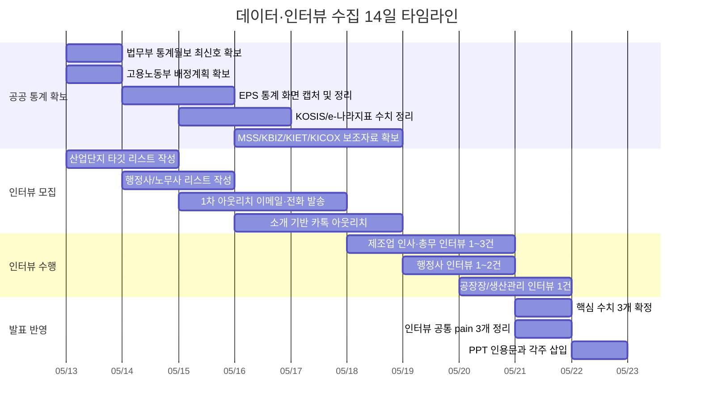

# 외고반장 시장·검증 근거 확보를 위한 국내 1차 자료 수집 설계

## 집행 요약

핵심 결론은 명확하다. 외고반장의 시장·검증 근거는 **매크로 규모를 보여주는 공공 1차 통계**와 **실제 운영 pain을 드러내는 현장 인터뷰/파일럿 로그**를 분리해서 쌓아야 한다. 우선순위가 가장 높은 기관은 entity["organization","법무부","korean ministry of justice"], entity["organization","한국산업인력공단","hrd korea"], entity["organization","고용노동부","korean labor ministry"], entity["organization","통계청","statistics korea"], entity["organization","중소벤처기업부","korean sme ministry"], entity["organization","중소기업중앙회","kbiz korea federation"], entity["organization","산업연구원","kiet policy institute"], entity["organization","한국산업단지공단","korea industrial complex"]이다. 이 8개 축으로 “E-9 규모, 제조업·지역 분포, 연간 도입/배정, 사업장 변경·재고용, 중소 제조업 인력난, 잠재 고객군”을 커버할 수 있다.

다만 공개자료만으로는 **체류만료 D-30 예정자 수**, **서류 누락 빈도**, **행정사 전달 핸드오프 시간**, **담당자 인수인계 손실** 같은 운영 레벨 지표를 직접 얻기 어렵다. 따라서 발표에서 공공 통계는 “왜 이 시장이 구조적으로 존재하는가”를 입증하는 데 쓰고, Daily Briefing/운영 OS의 직접 효용은 **제조업 인사·총무 3~5건 + 행정사 2건 + 공장장 1~2건**의 인터뷰와, 가능하면 내부 데모 로그로 보강하는 것이 맞다.

이번 문서는 **지금 당장은 브라우징 없이** 바로 수집에 들어갈 수 있도록 만든 **타깃 목록, 메뉴 경로, 검색어, 슬라이드 문구 템플릿**이다. 아래 URL은 검증된 PDF deep link가 아니라 **공식 진입 링크** 기준으로 제시한다. 제목이 연도별로 바뀌는 자료는 **정확 보고서명 대신 우선 검색 타깃명**과 **검색어**를 함께 넣었다.

## 증거 구조와 수집 원칙

발표 자료에서 필요한 증거는 한 종류가 아니다. 심사자가 보는 질문에 따라 자료의 역할이 달라진다.

| 증거 질문 | 가장 강한 소스 | 발표에서의 역할 | 외고반장과의 연결 |
|---|---|---|---|
| 시장이 충분히 큰가 | 법무부 월보, KOSIS, 중소벤처기업부 기본통계 | TAM/SAM의 공적 근거 | “E-9 및 제조 중소기업 운영 수요가 구조적으로 존재” |
| 왜 제조업 현장이 특히 아픈가 | 고용노동부 배정계획, KOSIS 인력부족률, KBIZ 조사 | 문제 강도 증명 | “채용보다 운영·유지·변경 관리가 병목” |
| 왜 단순 챗봇이 아니라 운영 OS인가 | EPS 통계, 고용허가제 업무편람, 인터뷰 | 이벤트 기반 운영 복잡성 증명 | “도입, 재입국, 재고용, 사업장 변경, 서류 요청이 반복됨” |
| 왜 Daily Briefing이 설득력 있는가 | 공공 통계 + 인터뷰 + 파일럿 로그 | 제품의 직접 효용 증명 | “오늘 챙길 일 자동 브리핑”의 필요성 확인 |
| 무엇이 공개통계로 안 보이는가 | 인터뷰, 파일럿 로그 | 제품 차별화 근거 | D-30 만료, 누락 서류, 메시지 초안, 승인 흐름, 증빙 로그 |

가장 주의할 점은 **공공 통계가 잡아주는 것과 잡아주지 못하는 것을 분리해서 말하는 것**이다.  
공공 통계가 잘 잡아주는 것은 다음이다.

- E-9 규모
- 지역·업종 분포
- 연도별 도입 및 배정
- 사업장 변경, 재입국, 재고용 등 제도 이벤트
- 제조업 인력부족과 중소기업 인력난

반대로 공공 통계가 직접 잡아주기 어려운 것은 다음이다.

- 개별 사업장 기준 체류만료 예정자 D-30
- 서류 누락률
- 행정사 전달 자료 준비 시간
- 다국어 카톡/문자 요청 빈도
- 담당자 교체 시 인수인계 손실

즉, 발표 구조는 **공공 1차 자료로 시장과 구조적 필요성을 증명하고**, **인터뷰로 운영 pain을 현실화하고**, **데모/로그로 제품 적합성을 보여주는 삼각형**으로 가져가는 것이 가장 안정적이다.

## 우선 수집 타깃과 슬라이드 인용 설계

아래 표는 **지금 당장 수집해야 할 우선 타깃**이다. “자료명”은 실제 보고서명 또는 그에 준하는 공식 데이터셋/메뉴명 기준으로 적었고, “정확도”는 브라우징 없이도 타이틀을 거의 확정할 수 있는 정도를 뜻한다.

| 우선순위 | 자료명 | 기관 | 최신성 | 타이틀 정확도 | 우선 확보할 지표 | 외고반장 관련성 | 공식 진입 링크 | 빠른 검색어·메뉴 힌트 | 슬라이드 문구 템플릿 |
|---|---|---|---|---|---|---|---|---|---|
| A | 출입국·외국인정책 통계월보 | 법무부 | 월간 최신호 | 높음 | 비전문취업(E-9) 체류자 수, 체류자격별 외국인, 국적별·시도별 분포, 등록외국인, 취업자격 체류외국인 | 시장 규모와 운영 모수의 최상위 근거. 지역·자격 분포를 통해 “어디서 누가 관리되는가”를 보여주기 좋음 | url법무부 공식 포털https://www.moj.go.kr | 사이트 검색에서 `출입국·외국인정책 통계월보` 입력. 가능하면 최신호 PDF와 직전 연말호 둘 다 확보 | “비전문취업(E-9) 체류외국인은 [YYYY.MM 기준 N명]으로, 외국인 고용은 예외적 케이스가 아니라 상시 운영 관리가 필요한 규모다. (법무부, 「출입국·외국인정책 통계월보」, YYYY.MM)” |
| A | 고용허가제 통계 메뉴 | 한국산업인력공단 / EPS | 상시 최신 화면 또는 월·연 단위 | 중간 | 업종별 외국인근로자 현황, 국가별 도입 인원, 재입국 취업자, 사업장 변경, 재고용 관련 현황 | 채용 후 운영이 왜 복잡한지 보여주는 핵심. “도입 후 유지·변경·재고용 관리”가 OS 문제라는 점을 입증 | urlEPS 포털https://www.eps.go.kr | EPS 검색창 또는 자료실/통계 메뉴에서 `업종별`, `사업장변경`, `재입국`, `재고용` 검색 | “외국인력 관리의 핵심은 채용 1회가 아니라 재입국·사업장 변경·재고용처럼 반복되는 운영 이벤트다. (EPS 통계, [화면명/기준일])” |
| A | 고용허가제 업무편람 | 한국산업인력공단 / 고용노동부 계열 자료 | 보통 연간 개정 | 높음 | 절차 흐름, 제출서류, 재고용·변경 기준, 사업장 의무 | Daily Briefing이 왜 일정·서류·승인 기반이어야 하는지를 제도 흐름으로 설명 가능 | url한국산업인력공단 공식 사이트https://www.hrdkorea.or.kr | 사이트 검색 `고용허가제 업무편람 PDF` 또는 EPS 검색 `업무편람` | “고용허가제는 단일 신청이 아니라 기한·서류·변경 조건이 얽힌 운영 절차다. 따라서 현장에는 ‘답변형 챗봇’보다 운영 브리핑이 필요하다. (「고용허가제 업무편람」, 최신판)” |
| A | [연도] 외국인력 도입규모 및 배정계획 | 고용노동부 | 연간 발표 또는 보도자료 | 중간 | 연간 E-9 도입규모, 업종별 배정, 정책 변경 포인트 | 정책 변화가 Daily Briefing의 중요한 입력값이라는 점을 입증. 시장이 제도 이벤트에 민감함을 보여줌 | url고용노동부 공식 사이트https://www.moel.go.kr | 보도자료/정책자료에서 `외국인력 도입규모`, `배정계획`, `E-9` 검색 | “정부의 [YYYY년] E-9 도입규모는 [N명], 이 중 제조업 배정은 [N명 또는 비중]으로 계획돼 제조업 현장의 외국인력 운영 수요가 구조적임을 보여준다. (고용노동부, 「[YYYY년 외국인력 도입규모 및 배정계획]」, YYYY.MM)” |
| A | 체류외국인 현황 | KOSIS | 최신 연·월 기준 반영 | 높음 | 체류외국인 규모, 체류자격별 외국인, 지역 분포, 시계열 | 법무부 월보의 인용 대체/보조. 슬라이드용 차트 제작이 쉬움 | urlKOSIShttps://kosis.kr | 검색창에 `체류외국인 현황`, `비전문취업`, `체류자격별` 입력. 기관별통계에서 법무부 계열 확인 | “체류외국인과 E-9 계층은 단년도 이슈가 아니라 누적·상시 운영 대상이다. (KOSIS, 「체류외국인 현황」, 기준연월)” |
| A | 중소기업 인력부족률 / 산업별 인력부족률 | KOSIS 또는 e-나라지표 | 연간·분기 또는 최신 지표 | 중간 | 제조업 인력부족률, 중소기업 인력부족률, 부족인원, 사업체 규모별 비교 | ‘왜 제조업이 외국인력 관리 pain이 강한가’에 가장 직접적 | urle-나라지표https://www.index.go.kr | KOSIS 검색 `산업별 인력부족률`, `사업체 규모별 부족인원`; e-나라지표 검색 `중소기업 인력부족률` | “중소 제조업의 인력부족은 채용 단발 문제가 아니라 상시 운영 리스크이며, 외국인력 관리는 그 리스크 대응의 핵심 축이다. (KOSIS/e-나라지표, [지표명], 기준연도)” |
| A | 중소기업 실태조사 / 중소기업 기본통계 | 중소벤처기업부 | 연간 최신판 | 높음 | 제조 중소기업 수, 규모별 기업 수, 종사자 수, 지역 분포 | TAM/SAM을 산정할 때 가장 안정적인 고객군 모수 | url중소벤처기업부 공식 사이트https://www.mss.go.kr | 사이트 검색 `중소기업 실태조사`, `중소기업 기본통계`, `제조업` | “외고반장의 초기 고객은 ‘제조업 중소기업’이며, 해당 세그먼트는 [기업 수/종사자 수] 기준으로 충분한 모수를 가진다. (중소벤처기업부, 「중소기업 실태조사」 또는 「중소기업 기본통계」, 최신판)” |
| A | 중소기업 인력실태조사 | 중소기업중앙회 | 연간 또는 정기 조사 | 높음 | 중소기업 부족인원, 채용 애로, 외국인력 활용, 현장 애로 응답 | 심사자가 좋아하는 “현장 목소리 기반”의 준1차 설문 근거. pain narrative 강화 | url중소기업중앙회 공식 사이트https://www.kbiz.or.kr | 조사·통계/조사보고서에서 `중소기업 인력실태조사`, `외국인력`, `제조업` 검색 | “중소기업의 인력 애로는 채용 공고 부족이 아니라 실제 운영 현장에서 해결 비용이 큰 문제로 나타난다. (중소기업중앙회, 「중소기업 인력실태조사」, 최신판)” |
| B | KIET 이슈페이퍼·산업경제 보고서 중 ‘중소제조업 인력난’·‘외국인력’ 키워드 포함 보고서 | 산업연구원 | 수시 발간 | 낮음~중간 | 노동력 부족의 구조 원인, 제조업·지역 편차, 정책 해석 | 발표의 “왜 지금 이 문제를 OS로 풀어야 하는가”를 해석적으로 보강 | url산업연구원 공식 사이트https://www.kiet.re.kr | 발간물 검색에서 `중소제조업 인력난`, `외국인력`, `지역 제조업`, `인구감소` 검색 | “제조업 인력난은 경기순환보다 구조적 요인이 강하므로, 외국인력 운영관리의 디지털화가 반복적으로 요구된다. (산업연구원, [정확 보고서명], 발간일)” |
| B | 전국산업단지현황통계 / 입주기업체 및 고용 현황 | 한국산업단지공단 | 정기 통계 | 중간 | 지역별 산업단지 수, 입주기업 수, 고용 규모, 제조업 집적도 | 어디에서 인터뷰를 구할지, 어디서 파일럿을 시작할지 정하는 타기팅 근거 | url한국산업단지공단 공식 사이트https://www.kicox.or.kr | 사이트 검색 `전국산업단지현황통계`, `입주기업 현황`, `고용 현황` | “초기 고객 확보는 산업단지 중심 제조업 군집을 따라가는 것이 가장 효율적이다. (한국산업단지공단, 「전국산업단지현황통계」, 최신판)” |

### 발표에서 바로 써야 할 해석 포인트

이 표를 그대로 챙기되, 발표에서는 다음 세 문장을 축으로 쓰는 것이 좋다.

- **시장 존재 증명:** “E-9와 제조 중소기업 모수는 충분히 크고, 정책·체류·고용 이벤트가 반복되므로 운영관리 수요가 구조적이다.”
- **문제 강도 증명:** “중소 제조업의 인력부족은 단순 채용 부족이 아니라, 외국인력 유지·서류·변경·재고용 운영 부담으로 이어진다.”
- **제품 적합성 증명:** “그래서 정답형 챗봇보다 오늘의 운영 이슈를 먼저 짚어주는 Daily Briefing형 OS가 필요하다.”

## 인터뷰 모집 채널과 접촉 템플릿

발표의 신뢰도를 끌어올리는 가장 빠른 방법은 **인터뷰 계획**이 아니라 **현재 인터뷰 진행 상태**를 1줄로 만드는 것이다. 현실적으로 가장 효율적인 채널은 세 가지다.

### 실무적으로 가장 잘 먹히는 모집 채널

| 채널 | 주요 타깃 | 왜 이 채널이 효율적인가 | 예상 응답률 가정 | 운영 포인트 |
|---|---|---|---|---|
| 산업단지 입주기업 리스트 기반 콜드 아웃리치 | 제조업 인사/총무, 관리팀장, 대표전화 경유 | 고객군 정합성이 높고, 제조업 타깃을 빠르게 많이 확보 가능 | 이메일 회신 2~5%, 전화 연결 후 인터뷰 전환 5~10% | 대표번호로 들어가 “인사·총무 또는 외국인근로자 담당” 연결 요청이 가장 현실적 |
| 외국인력 업무 경험이 있는 행정사·노무사 사무소 | 행정사, 노무사, 실무 담당자 | 여러 사업장의 반복 pain을 압축해서 들을 수 있음 | 이메일 회신 5~12%, 전화 후 인터뷰 전환 10~20% | 제품 판매가 아니라 “고객사의 반복 운영 pain 확인” 목적이라고 분명히 말해야 함 |
| 소개 기반 카카오톡/전화 섭외 | 공장장, 생산관리자, 인사총무 실무자 | 응답률이 가장 높고, 현장 언어를 얻기 좋음 | 카톡 응답 30~50%, 인터뷰 전환 20~40% | 소개자 이름을 첫 문장에 반드시 넣고, 15분·익명·영업 아님을 분명히 해야 함 |

위 응답률은 공식 수치가 아니라 **초기 고객개발용 실무 가정치**다. 발표 자료에는 숫자를 크게 쓰기보다 “산업단지 콜드 + 행정사 + 소개 기반의 3채널 접근” 정도로만 넣는 편이 안전하다.

### 이메일 템플릿

#### 제조업 인사·총무용

제목: 외국인 근로자 관리 업무 관련 15분 인터뷰 요청드립니다

안녕하세요, [회사명] [직함]님.  
저는 외국인 근로자의 체류·서류·행정사 전달 업무를 줄이는 운영 도구를 검증 중인 [이름]입니다.

지금 제품 판매 목적이 아니라, 제조업 현장에서 실제로 어떤 업무가 반복적으로 부담이 되는지 확인하기 위해 **15분 정도의 짧은 인터뷰**를 부탁드리고 있습니다.  
질문은 주로 아래 범위입니다.

- 체류만료일/계약종료일 관리 방식
- 서류 누락이나 재요청이 생기는 지점
- 행정사/노무사에 전달 자료를 정리하는 방식
- 담당자 변경 시 인수인계의 어려움

응답 내용은 익명으로만 정리하고 회사명은 외부에 공개하지 않겠습니다.  
가능하시다면 이번 주 또는 다음 주 중 가능한 시간 2개만 주시면 맞추겠습니다.

감사합니다.  
[이름 / 소속 / 연락처]

#### 행정사용

제목: 외국인 고용 고객사의 반복 실무 pain 인터뷰 요청

안녕하세요.  
외국인 고용 관리 운영툴을 검증 중인 [이름]입니다.

행정사님이 실제로 보시는 고객사 업무 중,  
체류기간 관리·서류 보완·재고용/변경 대응 과정에서 어떤 반복 애로가 가장 자주 발생하는지 15분 정도 여쭙고 싶어 연락드렸습니다.

영업 제안이 아니라 **실무 pain 검증 목적의 인터뷰**이며, 응답 내용은 익명으로 정리하겠습니다.  
가능하시면 편하신 시간 한 번 부탁드립니다.

### 전화 스크립트

안녕하세요.  
외국인 근로자 관리 업무 관련해서 짧은 인터뷰를 요청드리려고 연락드렸습니다.  
혹시 인사·총무나 외국인근로자 담당하시는 분 연결 가능하실까요?

저희가 확인하고 싶은 건 영업이 아니라,  
현장에서 **체류만료 관리**, **서류 누락 확인**, **행정사 전달 자료 준비** 같은 반복 업무가 실제로 얼마나 번거로운지입니다.  
10~15분 정도만 가능하실지 여쭙고 싶습니다.

공장장에게 연결될 경우에는 한 문장 더 바꾸는 게 좋다.

“서류 자체보다도, 외국인 인력 운영 때문에 생산 차질이나 관리 부담이 어디서 생기는지 듣고 싶습니다.”

### 카카오톡 템플릿

안녕하세요, [소개자명]님 소개로 연락드린 [이름]입니다.  
외국인 근로자 체류·서류·행정사 전달 업무를 줄이는 운영 도구를 검증하고 있어, 현장 인터뷰를 15분만 부탁드리고 싶습니다.

영업 목적이 아니라 실제 pain 확인 목적이고,  
내용은 익명으로만 정리하겠습니다.  
가능하시다면 이번 주 가능한 시간 두 개만 알려주시면 맞춰보겠습니다. 감사합니다.

## 한 장으로 끝내는 상위 8개 인용 후보

아래 표는 실제 PPT 한 장에 넣기 가장 좋은 **상위 8개 인용 후보**다. 목적은 “시장 존재”, “문제 강도”, “운영 복잡성”을 한 번에 보여주는 것이다.

| 우선 인용 자료 | 공식 링크 | 바로 인용할 지표 | 짧은 인용 문구 템플릿 |
|---|---|---|---|
| 출입국·외국인정책 통계월보 | url법무부 포털https://www.moj.go.kr | 비전문취업(E-9) 체류외국인 수 | “비전문취업(E-9) 체류외국인은 [N명]으로, 운영 관리 수요가 상시적이다.” |
| [연도] 외국인력 도입규모 및 배정계획 | url고용노동부 포털https://www.moel.go.kr | 연간 E-9 도입규모, 제조업 배정 | “정부의 [YYYY년] E-9 도입·배정 규모만 보더라도 제조업의 외국인력 의존은 구조적이다.” |
| EPS 업종별 외국인근로자 현황 | urlEPS 포털https://www.eps.go.kr | 업종별 E-9 분포 | “외국인력은 특정 업종·특히 제조업에 집중되어 운영 툴의 타깃이 명확하다.” |
| EPS 사업장변경 현황 | urlEPS 포털 통계 진입https://www.eps.go.kr | 사업장 변경 건수/사유 | “외국인력 관리는 채용 후 종료가 아니라 변경 이벤트 대응이 반복된다.” |
| EPS 재입국·재고용 관련 현황 | url한국산업인력공단 포털https://www.hrdkorea.or.kr | 재입국 취업자, 재고용 관련 수치 | “신규채용보다 기존 인력의 재입국·재고용 운영이 중요한 관리 축이다.” |
| KOSIS 체류외국인 현황 | urlKOSIS 통계포털https://kosis.kr | 시도별·체류자격별 외국인 | “지역별로 외국인력 운영 수요의 편차가 커, 비수도권 제조업이 초기 타깃으로 적합하다.” |
| e-나라지표 또는 KOSIS의 중소기업/제조업 인력부족률 | urle-나라지표 포털https://www.index.go.kr | 제조업 인력부족률, 중소기업 부족인원 | “중소 제조업의 인력문제는 충원 실패이자 운영 리스크 관리 문제다.” |
| 중소기업 인력실태조사 | url중소기업중앙회 포털https://www.kbiz.or.kr | 채용 애로·외국인력 활용 관련 응답 | “현장의 pain은 제도 이해 부족보다 반복 운영 부담에 가깝다.” |

이 표의 요령은 단순하다.  
**숫자 3개 + 운영 문장 1개**만 잡으면 된다.

- 숫자 1: E-9 또는 체류외국인 규모
- 숫자 2: 제조업 배정 또는 제조업 집중도
- 숫자 3: 제조업/중소기업 인력부족률
- 운영 문장 1: 사업장 변경·재고용 등 반복 이벤트가 존재

이렇게만 해도 외고반장이 “챗봇”이 아니라 “반복 운영 문제를 다루는 OS”라는 메시지가 선다.

## 수집 일정과 인터뷰 실행 타임라인

아래 타임라인은 2주 안에 발표용 근거를 최소 수준 이상으로 확보하기 위한 실행 순서다.

가장 현실적인 완료 기준은 이렇다.

- 공공 근거: 상위 8개 자료 중 최소 5개 확보
- 인터뷰: 제조업 2건, 행정사 1건 확보
- 발표용 숫자: “규모 1개 + 제조업 집중도 1개 + 인력부족 1개”
- 발표용 현장 근거: “공통 pain 3개”

이 기준만 넘어도 `인터뷰 0/5 예정`에서 `제조업 2/5, 행정사 1/2 진행`으로 바꿀 수 있고, 발표 신뢰도는 크게 달라진다.

## 부록

### 공식 링크와 바로 먹히는 검색어

아래는 **공식 진입 링크**와 **바로 사용할 검색어**다. PDF deep link를 검증하지 않은 상태이므로, 실제 수집 시에는 아래 순서대로 들어가서 제목과 발간일을 최종 확인하면 된다.

- 법무부 진입: url법무부 공식 포털https://www.moj.go.kr  
  추천 검색어: `출입국·외국인정책 통계월보`, `비전문취업 E-9`, `통계월보 PDF`

- EPS 진입: urlEPS 포털https://www.eps.go.kr  
  추천 검색어: `업종별 외국인근로자 현황`, `사업장변경 통계`, `재입국 취업자`, `재고용`, `고용허가제 통계`

- 한국산업인력공단 진입: url한국산업인력공단 공식 사이트https://www.hrdkorea.or.kr  
  추천 검색어: `고용허가제 업무편람`, `외국인력`, `EPS 자료실`

- 고용노동부 진입: url고용노동부 공식 사이트https://www.moel.go.kr  
  추천 검색어: `외국인력 도입규모`, `배정계획`, `E-9`, `고용허가제 보도자료`

- KOSIS 진입: urlKOSIS 통계포털https://kosis.kr  
  추천 검색어: `체류외국인 현황`, `체류자격별 외국인`, `비전문취업`, `산업별 인력부족률`, `사업체 규모별 부족인원`

- e-나라지표 진입: urle-나라지표 포털https://www.index.go.kr  
  추천 검색어: `중소기업 인력부족률`, `체류외국인 현황`, `외국인력`

- 중소벤처기업부 진입: url중소벤처기업부 공식 사이트https://www.mss.go.kr  
  추천 검색어: `중소기업 실태조사`, `중소기업 기본통계`, `제조업 규모별`

- 중소기업중앙회 진입: url중소기업중앙회 공식 사이트https://www.kbiz.or.kr  
  추천 검색어: `중소기업 인력실태조사`, `외국인력 활용`, `제조업 인력`

- 산업연구원 진입: url산업연구원 공식 사이트https://www.kiet.re.kr  
  추천 검색어: `중소제조업 인력난`, `외국인력`, `지역 제조업`, `이슈페이퍼`

- 한국산업단지공단 진입: url한국산업단지공단 공식 사이트https://www.kicox.or.kr  
  추천 검색어: `전국산업단지현황통계`, `입주기업 현황`, `산업단지 고용 현황`

### 사이트 내 메뉴 힌트

연도별로 사이트 IA가 조금 바뀌더라도, 보통 가장 빠른 동선은 아래와 같다.

| 사이트 | 가장 빠른 접근법 |
|---|---|
| 법무부 | 메인 검색창에서 `출입국·외국인정책 통계월보` 검색 |
| EPS | 메인 검색창에서 `사업장변경`, `재입국`, `업종별` 검색 |
| 고용노동부 | 보도자료 또는 정책자료 검색에서 `외국인력 도입규모`, `배정계획` 검색 |
| KOSIS | 상단 통합검색에 지표명 그대로 입력 |
| e-나라지표 | 지표검색에 `중소기업 인력부족률` 입력 |
| KBIZ | 조사·통계/조사보고서 또는 통합검색에서 `인력실태조사` 입력 |
| KIET | 발간물 검색에서 `중소제조업 인력난`, `외국인력` 입력 |
| KICOX | 통합검색 또는 통계 메뉴에서 `전국산업단지현황통계` 입력 |

### 슬라이드 복사용 문구 모음

아래 문구는 **수치만 채워 넣으면 바로 PPT에 들어갈 수 있는 형태**로 정리했다.

- 시장 규모용  
  “비전문취업(E-9) 체류외국인은 [N명]으로, 외국인 고용은 예외적 이슈가 아니라 지속적인 운영 관리 대상이다. (법무부, 「출입국·외국인정책 통계월보」, YYYY.MM)”

- 제조업 집중도용  
  “정부의 [YYYY년] 외국인력 배정 계획에서 제조업 비중은 [N명/비중]으로, 제조업 현장의 외국인력 운영 수요가 제도적으로도 크다. (고용노동부, 「[YYYY년 외국인력 도입규모 및 배정계획]」, YYYY.MM)”

- 운영 복잡성용  
  “외국인 인력관리는 채용 1회로 끝나지 않고 사업장 변경, 재입국, 재고용 같은 이벤트가 반복된다. (EPS 통계, [화면명], 기준일)”

- 인력난 강도용  
  “중소 제조업의 인력부족률은 [x.x%]로, 외국인력 관리는 채용 이슈이면서 동시에 운영 안정성 문제다. (KOSIS/e-나라지표, [지표명], 기준연도)”

- 고객군 모수용  
  “외고반장의 초기 고객은 제조업 중소기업이며, 해당 세그먼트는 [기업 수] 이상의 충분한 모수를 가진다. (중소벤처기업부, 「중소기업 실태조사」 또는 「중소기업 기본통계」, 최신판)”

### 마지막 정리

실제 수집 우선순위는 다음 순서가 가장 효율적이다.

1. 법무부 월보  
2. 고용노동부 연간 E-9 도입·배정 자료  
3. EPS 통계 2~3개 화면  
4. KOSIS 체류외국인 + 인력부족률  
5. KBIZ 인력실태조사  
6. 중소벤처기업부 기본통계  
7. KICOX로 산업단지 타깃 리스트 확보  
8. KIET로 해석 보강

이 순서대로 가면, 발표 자료의 Market/Validation 슬라이드는 **“공식 통계 5개 + 현장 인터뷰 3건 + 제품 로그 1개”** 구조로 가장 단단하게 만들 수 있다.