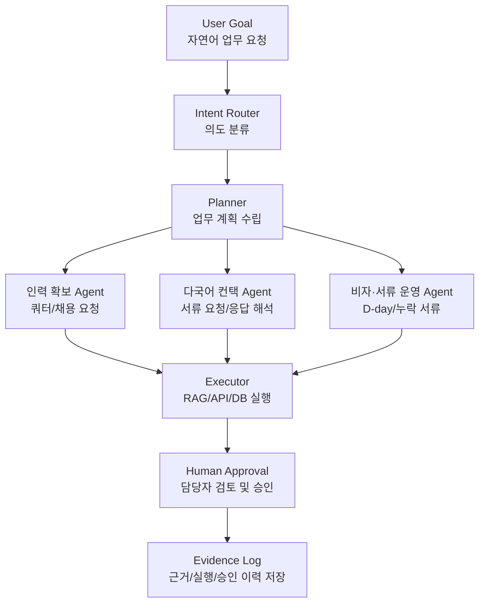

# 외고반장: 외국인 고용 관리 AI 반장 서비스(Agentic OS)

발표 장표

- [발표 자료 보러가기](https://drive.google.com/file/d/1ZR26LPQ45DSwjiPt4uPL8V_0BKuG0InR/view?usp=sharing)

## 📌 프로젝트 명: 외고반장

외국인 고용 업무에서 발생하는 채용, 쿼터 확인, 다국어 컨택, 비자 만료 관리, 서류 누락 확인, 행정사 전달 패키징 과정을 하나의 워크플로우로 통합하는 AI 기반 업무 운영 시스템.

---

## 1. 프로젝트 개요

- **서비스 소개**:
    
    외고반장은 외국인 근로자를 고용하는 사업장의 반복적이고 파편화된 행정 업무를 AI Agent 기반 워크플로우로 정리하는 서비스이다.
    
    사용자가 “베트남 E-9 근로자 3명 추가 채용 준비해줘. Nguyen 체류만료도 확인해줘.”처럼 자연어로 요청하면, 시스템이 의도를 분류하고 관련 정책·내부 인력 데이터·서류 상태를 확인한 뒤, 관리자 승인 전 단계까지 필요한 실행 계획과 문서 패키지를 생성한다.
    
    ### **기 서비스와의 차별점**
    
    | 비교 대상 | 주 역할 | 한계 | 외고반장의 차별점 |
    | --- | --- | --- | --- |
    | 정부시스템 | 신청·조회·법령 제공 | 사용자가 직접 들어가서 확인·입력해야 함 | 신청 전 만료일, 누락 서류, 처리 업무를 먼저 감지 |
    | 행정사 | 법적 자문·정부 포털 제출 | 사장님이 케이스를 인지하고 자료를 모아줘야 움직임 | 행정사 검토 전 단계의 자료 취합·정리·전달 패키지 생성 |
    | Workvisa류 서비스 | 외국인 구인구직 매칭·비자 자가진단 | 채용 이후의 체류관리·서류관리·다국어 소통은 약함 | 채용 이후 운영 리스크를 상시 관리 |
    | **외고반장** | **외국인 고용 운영 OS** | **법적 판단·최종 제출은 하지 않음** | **D-day 모니터링, 누락 탐지, 다국어 소통, 승인 기반 실행을 하나의 워크플로우로 통합** |
    - 외고반장은 정부시스템처럼 신청·조회만 제공하지 않고, 신청 전 단계의 만료일·누락 서류·다국어 소통을 먼저 챙긴다.
    - 행정사처럼 법적 판단이나 제출을 대체하지 않고, 행정사가 바로 검토할 수 있는 완결된 패키지를 준비한다.
    - Workvisa 같은 채용/매칭 서비스와 달리, 채용 이후의 체류관리·서류관리·직원 커뮤니케이션 운영을 담당한다.
    
    즉, 외고반장은 신청 도구도 매칭 플랫폼도 전문가 대체재도 아닌, 외국인 고용 현장의 상시 운영 OS다.
    
    ### 신뢰성 중심 Agentic OS 설계
    
    외고반장은 단순히 답변을 생성하는 챗봇이 아니라, 외국인 고용 업무에서 발생할 수 있는 개인정보 노출, 근거 없는 행정 안내, 자동 발송, 서류 누락, 법적 오해 가능성을 제어하는 Agentic OS로 설계했다.
    
    이를 위해 Agent 실행 전후에 Middleware Layer를 두고, RAG 검색 결과에는 Evidence Log를 적용하며, 모든 외부 발송은 Human Approval을 거치도록 설계했다. 또한 실행 과정은 Evidence Log와 Trace ID로 남겨 사후 감사와 재현이 가능하도록 했다.
    
    - **개발 기간**: `2026.04.22 ~ 2026.05.18 / 8주`
    - **참여 인원**: 3명
    - **현황(결과)**:
        - GitHub: [https://github.com/PotenupAI/oegobanjang](https://github.com/PotenupAI/oegobanjang)
        - 배포: `[배포 URL 입력]`
        - 결과물: 기획서, Agentic OS 아키텍처, 핵심 사용자 시나리오, RAG 설계, Evidence Log 설계, MVP 화면/프로토타입
    - **기술 스택**:
        
        
        | 항목 | Skill Set |
        | --- | --- |
        | Frontend | Streamlit |
        | Backend | FastAPI / Python |
        | Database | SQLite  |
        | Vector DB | Chroma |
        | Infra/DevOps | - |
        | AI Tools | OpenAI API, LangChain, LangGraph, RAG |
        | Data Source | EPS/HRD Korea 고용절차 자료, 정부24 체류관리 안내, 법령정보센터 서식, 내부 사업장/근로자 데이터 |
- **주요 기능**:
    
    Intent Router, 인력 확보 Agent, 다국어 컨택 Agent, 비자·서류 운영 Agent
    
    PII Middleware, Evidence Grade Gate, Output Quality Gate, Evidence Log / Audit Log, Embedding Cache / Chunk Versioning
    
    | 기능 | 설명 |
    | --- | --- |
    | 자연어 업무 요청 처리 | 사용자의 자연어 요청을 채용, 비자, 서류, 컨택 등 업무 의도로 분류 |
    | Intent Router | 사용자 발화의 목적을 분석하여 적절한 Agent로 라우팅 |
    | 인력 확보 Agent | E-9 근로자 추가 채용 요청을 분석하고 고용 쿼터, 구인 노력 기간, 신청 문서 초안을 준비 |
    | 다국어 컨택 Agent | 외국인 근로자에게 필요한 서류 요청 메시지를 다국어로 생성하고 응답을 요약 |
    | 비자·서류 운영 Agent | 체류 만료 D-day, 계약 종료일, 누락 서류를 탐지하고 행정사 전달 패키지 생성 |
    | RAG 기반 정책 검색 | 공식 정책, 체류 관리 안내, 법정 서식 등 근거 문서를 검색하여 답변과 체크리스트 생성 |
    | Human Approval | AI가 자동 발송/자동 제출하지 않고, 담당자 승인 후 실행되도록 통제 |
    | Evidence Log | 판단 근거, 참조 문서, 실행 계획, 승인 이력을 기록하여 감사 가능성 확보 |

---

## 2. 기획 목표 및 협업 방식

### 🔸기획의도 및 목표

### 1) 서비스 분석

외국인 고용 업무는 단순한 인사 관리가 아니라, 비자 제도, 고용 쿼터, 체류기간, 계약 상태, 필수 서류, 외국어 소통, 행정사 협업이 얽힌 복합 업무이다.

기존 방식에서는 담당자가 법령 사이트, 엑셀, 메신저, 이메일, 행정사 연락망을 각각 확인해야 하므로 업무가 파편화되고 실수 가능성이 높다.

특히 다음과 같은 문제가 발생한다.

- 비자 규정과 고용 쿼터가 복잡하고 수시로 변동됨
- 외국인 근로자와의 언어 장벽으로 서류 취합이 지연됨
- 만료일이나 누락 서류를 놓치면 불법 고용, 체류 문제, 행정 리스크로 이어질 수 있음
- 행정사에게 전달해야 할 자료가 정리되지 않아 검토 시간이 길어짐
- AI가 주관적으로 판단하거나 법률 자문처럼 답변할 경우 오히려 리스크가 커질 수 있음

따라서 이 프로젝트는 “AI가 대신 판단하는 시스템”이 아니라, **AI가 행정 업무의 경로를 정리하고, 근거를 붙이고, 사람이 승인할 수 있게 만드는 운영 시스템**을 목표로 한다.

### 2) 구현 목표

- 자연어 업무 요청을 구조화된 업무 태스크로 변환
- 채용, 다국어 컨택, 비자/서류 관리 업무를 각각 Agent로 분리
- RAG를 통해 공식 근거 기반의 안내 및 체크리스트 생성
- AI 판단 과정과 사용한 근거를 Evidence Log로 저장
- 관리자 승인 전에는 외부 발송이나 제출이 실행되지 않도록 Human-in-the-loop 구조 설계
- 행정사/노무사가 검토하기 쉬운 데이터 패키지 생성

### 3) 성장 목표

- 단순 챗봇이 아니라, 외국인 고용 업무의 반복 프로세스를 운영 체계로 전환하는 경험 확보
- RAG, Agent, Workflow, Approval, Audit Log가 결합된 Agentic OS 구조 이해
- 법적/행정적 리스크가 있는 도메인에서 AI의 역할과 한계를 설계하는 능력 강화
- 향후 B2B SaaS, 행정사/노무사 화이트라벨, 케이스 기반 과금 모델로 확장 가능한 구조 검토

---

### 🔸협업 방식

- **커뮤니케이션 방식**
    - Notion 또는 Google Docs를 활용해 기획 문서, 기능 정의, 데이터 소스, 회의 내용을 기록
    - Slack/Discord/KakaoTalk 등으로 이슈 공유
    - 주요 의사결정은 문서화하여 팀원 간 맥락 차이를 줄임
- **문서화 방식**
    - 프로젝트 문제 정의 문서
    - 사용자 시나리오 문서
    - Agent 역할 정의서
    - RAG 데이터 소스 정리 문서
    - Evidence Log 설계 문서
    - API/DB 스키마 문서
- **Git 전략**
    - MVP 단계에서는 기능 단위 브랜치 전략 사용
    - 예시:
        - `main`: 안정 버전
        - `dev`: 통합 개발 브랜치
        - `feature/intent-router`
        - `feature/rag-retrieval`
        - `feature/visa-agent`
        - `feature/evidence-log`
- **이슈 트래킹 방식**
    - 기능 단위로 이슈를 분리
    - 예시:
        - P0: 자연어 요청 → Intent Router → Agent 실행 흐름
        - P1: RAG 검색 및 근거 반환
        - P1: 비자 만료 D-day 계산
        - P2: 다국어 메시지 UI
        - P2: 행정사 전달 패키지 PDF 출력

---

## 3. 아키텍처 및 워크플로우

### 🔸아키텍처 특징 및 설계 의도

외고반장은 단일 챗봇이 아니라, 사용자의 목표를 받아 여러 업무 Agent가 협업하는 Agentic OS 구조로 설계했다.

핵심 구조는 다음과 같다.

### 🔸Middleware Layer 설계

외고반장은 외국인등록번호, 여권번호, 체류 정보, 행정 서류 등 민감한 데이터를 다루기 때문에 Agent 호출 전후에 검증·마스킹·승인·근거 확인을 수행하는 Middleware Layer를 설계했다.

Middleware는 Agent의 답변 품질을 높이는 보조 장치가 아니라, 개인정보 보호, 법적 리스크 제어, 근거 기반 응답, 사람 승인 흐름을 보장하는 핵심 안전장치이다.

| 위치 | Middleware | 역할 | 프로젝트 내 필요성 |
| --- | --- | --- | --- |
| Pre-router | `PIIMiddleware` | 외국인등록번호, 여권번호, 연락처 등 민감정보 마스킹 | LLM 호출 및 로그 저장 전에 개인정보 노출 방지 |
| Pre-router | Input Sanitization | 입력 길이 제한, 비정상 입력 필터링, 언어 감지 | 다국어 입력과 긴 문서 입력으로 인한 오류 방지 |
| Pre-RAG | Query Rewrite Middleware | 자연어 요청을 검색 가능한 키워드로 재작성 | 한국어 행정 문서 검색 정확도 향상 |
| Post-RAG | Evidence Grade Gate | 검색 근거의 신뢰 등급을 평가하고 낮은 등급 차단 | 근거 부족 답변 또는 잘못된 행정 안내 방지 |
| Pre-state-machine | Schema Validation | Router와 Agent 출력 형식을 Pydantic Schema로 검증 | 상태 전이 오류 및 예외 케이스 방지 |
| Pre-LLM | Prompt Injection Guard | 시스템 프롬프트 우회, 악성 명령, 무관 요청 차단 | Agent 제어권 탈취 및 비정상 응답 방지 |
| Post-LLM | Citation Validator | LLM이 인용한 chunk_id가 실제 검색 결과에 존재하는지 검증 | 허위 인용 및 근거 없는 답변 방지 |
| Pre-send | `HumanInTheLoopMiddleware` | 외부 메시지 발송 전 담당자 승인 필수화 | 자동 발송으로 인한 행정 사고 방지 |
| Runtime | `SummarizationMiddleware` | 긴 대화와 문서 컨텍스트 요약 관리 | 장기 케이스 처리 시 컨텍스트 초과 방지 |

---

## 3. 아키텍처 및 워크플로우

### 🔸아키텍처 특징 및 설계 의도

외고반장은 단일 챗봇이 아니라, 사용자의 목표를 받아 여러 업무 Agent가 협업하는 Agentic OS 구조로 설계했다. 

데이터 흐름

### 🔸사용자 워크플로우

사용자 흐름

1. 사용자가 자연어로 업무를 요청한다.
예: “베트남 E-9 근로자 3명 추가 채용 준비해줘. Nguyen 체류만료도 확인해줘.”
2. Intent Router가 요청을 분류한다.
    - 자연어 요청 분류(신규 채용 요청/ 기존 근로자 체류 만료 확인/ 서류 누락 확인/ 행정사 전달 패키지 필요 여부)
3. Planner가 실행 계획을 세운다.
    - 고용 쿼터 확인
    - 근로자 상태 조회
    - 필수 서류 체크
    - 다국어 안내문 생성
    - 행정사 검토 자료 생성
4. 각 Agent가 필요한 작업을 수행한다.
    - 인력 확보 Agent: 쿼터 계산 및 신청 문서 초안
    - 다국어 컨택 Agent: 베트남어 안내문 생성 및 응답 해석
    - 비자·서류 운영 Agent: D-day 탐지 및 누락 서류 체크
5. 시스템이 실행 결과를 관리자에게 보여준다.
6. 관리자가 최종 승인한다.
7. 승인 이력과 판단 근거가 Evidence Log에 저장된다.

### 🔸 확장성/안정성 관점 포인트

외고반장은 단일 기능 구현보다 운영 안정성, 재현성, 감사 가능성이 중요한 프로젝트이다. 따라서 특정 Phase에 종속되지 않는 공통 엔지니어링 원칙을 별도로 정의했다.

| 항목 | 설계 내용 | 필요한 이유 |
| --- | --- | --- |
| Embedding Cache | chunk text hash를 기준으로 embedding vector를 캐싱 | 매번 OpenAI API를 호출하지 않아 비용과 시간을 절감하고, 인덱싱 재현성 확보 |
| Idempotency | 동일 case_id가 중복 실행되어도 같은 결과가 나오도록 transition key 설계 | 중복 요청, 재시도, 네트워크 오류 상황에서 상태 꼬임 방지 |
| Audit Log as Event Source | 단순 로그가 아니라 상태 재구성이 가능한 이벤트 소스로 저장 | 행정사 전달, 사후 감사, 사고 대응 시 근거 재현 가능 |
| Chunk Version Pinning | chunk_id에 hash 또는 ingest_at을 포함 | 문서가 변경되어도 과거 행정사 패키지의 근거를 재현 가능 |
| Retry / Backoff | OpenAI API 호출 실패 시 exponential backoff 적용 | 외부 API 장애 시 안정적 재시도 |
| Schema Evolution | chunk_type, evidence_type 등이 변경될 때 마이그레이션 정책 정의 | 데이터 구조 변경으로 인한 기존 케이스 손상 방지 |
| Deterministic Seed | LLM 평가 단계에서 temperature=0, seed 고정 | 평가 결과 재현성 확보 |
| Cost / Rate Guard | API 호출 횟수 제한 및 circuit breaker 설계 | 무한 루프, 과금 폭주, 비정상 Agent 실행 방지 |

---

## 4. 주요 작업

### 🔸Intent Router 기반 업무 분류

- **기능 소개**
사용자의 자연어 요청을 분석하여 채용, 비자, 서류, 다국어 컨택, 행정사 전달 등 업무 유형으로 분류하는 기능이다.
- **작업 과정**
    - 사용자의 요청이 한 가지 업무만 포함하지 않고 복합 요청으로 들어온다는 점을 고려했다.
    - 예를 들어 “근로자 3명 추가 채용”과 “Nguyen 체류만료 확인”은 각각 다른 Agent가 처리해야 하는 업무이다.
    - 따라서 단순 키워드 매칭이 아니라, 사용자 요청을 복수 의도로 분해하는 구조가 필요했다.
- **주요 코드/모듈**
    - `intent_router.py`
    - `schemas/task_intent.py`
    - `prompts/intent_classification.md`
    - `graph/nodes/intent_router_node.py`
- **수정/고도화 사항**
    - 단일 의도 분류에서 복수 의도 분류로 확장
    - 업무 유형별 필수 입력값 정의
    - 의도 분류 결과를 Planner에 전달할 수 있는 JSON 구조 설계
- **테스트 결과**
    - 채용 요청, 비자 만료 확인, 서류 요청, 행정사 패키지 생성 요청 등 주요 시나리오에 대해 Agent 라우팅이 가능하도록 설계했다.
    - 향후 테스트에서는 의도 분류 정확도와 복합 요청 분해 성공률을 측정할 필요가 있다.

---

### 🔸인력 확보 Agent: 쿼터 판별 및 문서 준비

- **기능 소개**
사업주의 외국인 근로자 추가 채용 요청을 받아 현재 고용 가능 여부, 잔여 쿼터, 내국인 구인 노력 기간, 신청 문서 초안을 준비하는 Agent이다.
- **작업 과정**
    - 외국인 고용은 단순히 “몇 명 더 뽑고 싶다”는 요청만으로 끝나지 않는다.
    - 고용허용 인원, 업종, 기존 고용 인원, 구인 노력 기간, 필요 서류 등이 함께 확인되어야 한다.
    - 따라서 Agent는 최종 가능 여부를 단정하지 않고, “검토 가능한 상태”와 “전문가 확인 필요”를 구분하도록 설계했다.
- **주요 코드/모듈**
    - `agents/recruitment_agent.py`
    - `services/quota_service.py`
    - `schemas/recruitment_request.py`
    - `templates/employment_request_draft.md`
- **수정/고도화 사항**
    - 주관적 후보자 평가를 배제하고 객관적 요건 중심으로 설계
    - “좋은 사람 추천” 같은 가치 판단 요청은 제한
    - 쿼터 계산 결과와 근거 문서를 함께 제공하는 방식으로 개선
- **테스트 결과**
    - 예시 시나리오 기준으로 베트남 E-9 근로자 3명 추가 채용 요청에 대해 쿼터 확인, 신청 문서 초안, 내국인 구인 노력 기간 산정 흐름을 정의했다.
    - 실제 서비스 적용 전에는 공식 정책과 사업장 내부 데이터 기반 검증이 필요하다.

---

### 🔸다국어 컨택 Agent: 서류 요청 및 응답 해석

- **기능 소개**
외국인 근로자에게 필요한 서류를 모국어로 안내하고, 근로자의 외국어 응답을 요약하여 업무 상태에 반영하는 Agent이다.
- **작업 과정**
    - 단순 번역만으로는 행정 업무에 충분하지 않다고 판단했다.
    - 서류가 왜 필요한지, 언제까지 제출해야 하는지, 개인정보가 어디에 사용되는지, 담당자 승인 후 발송된다는 점이 함께 안내되어야 한다.
    - 따라서 메시지 생성 시 행정적 맥락과 안전 문구를 포함하도록 설계했다.
- **주요 코드/모듈**
    - `agents/multilingual_contact_agent.py`
    - `services/translation_service.py`
    - `schemas/contact_message.py`
    - `prompts/multilingual_notice_prompt.md`
- **수정/고도화 사항**
    - 단순 번역 프롬프트에서 행정 안내문 생성 프롬프트로 개선
    - 차별적 표현, 위협적 표현, 자동 발송을 금지하는 안전 규칙 추가
    - 근로자 응답을 “서류 제출 완료 / 추가 확인 필요 / 의미 불명확” 등 상태값으로 변환
- **테스트 결과**
    - 베트남어 응답 예시를 기반으로 “Zalo를 통해 여권 사진을 이미 전송함”이라는 핵심 의미를 추출하고, 업무 상태를 “서류 수신 완료 / 검토 대기”로 업데이트하는 흐름을 정의했다.

### 🔸다국어 행정 메시지 검증

- **기능 소개**
    
    외국인 근로자에게 발송되는 다국어 메시지가 단순 번역문이 아니라, 행정적으로 필요한 정보를 빠짐없이 포함하고 있는지 검증하는 품질 관리 Gate이다.
    
- **작업 과정**
    
    외국인 고용 업무에서 메시지는 단순 안내문이 아니라 서류 취합, 개인정보 제공, 제출 기한, 행정 절차와 연결된다.
    
    따라서 LLM이 생성한 메시지를 바로 발송하지 않고, 사전에 체크리스트 기반 검증을 통과하도록 설계했다.
    
- **검증 항목**
    - 필수 서류명을 빠뜨리지 않았는가
    - 제출 기한을 정확히 안내했는가
    - 왜 필요한 서류인지 설명했는가
    - 개인정보 사용 목적을 안내했는가
    - 담당자 승인 전 자동 발송하지 않았는가
    - 근로자 언어 수준에 맞게 쉬운 표현을 썼는가
    - 법적 판단처럼 보이는 표현을 피했는가

- **수정/고도화 사항**
    - 단순 번역 프롬프트에서 행정 안내문 생성 프롬프트로 개선
    - 발송 전 Human Approval 단계를 필수화
    - 메시지 생성 결과를 Evidence Log와 연결하여 사후 검토 가능하게 설계

---

### 🔸비자·서류 운영 Agent: D-day 및 누락 서류 탐지

`기여도: [본인 기여도 입력] / 난이도: 상`

- **기능 소개**
외국인 근로자의 체류 만료일, 계약 종료일, 필수 서류 누락 여부를 확인하고, 행정사/노무사 검토용 자료를 패키징하는 Agent이다.
- 기능
    - 만료 D-day 계산
    - 필수 서류 누락 탐지
    - 계약 종료일과 체류 만료일 충돌 가능성 탐지
    - 행정사 검토용 패키지 생성
- **주요 코드/모듈**
    - `agents/visa_document_agent.py`
    - `services/dday_service.py`
    - `services/document_check_service.py`
    - `templates/admin_handoff_package.md`
    - `schemas/evidence_package.py`
- **수정/고도화 사항**
    - 체류 만료일과 계약 종료일 충돌 가능성을 탐지하도록 설계
    - 누락 서류 체크리스트를 케이스별로 분리
    - 행정사 전달 패키지에 근로자 상태, 누락 서류, 검토 항목, 감사 로그를 포함
- **테스트 결과**
    - Nguyen 근로자의 E-9 비자 만료 시나리오를 기준으로 D-day 탐지, 필수 서류 확인, 행정사 전달 패키지 생성 흐름을 정의했다.
    - 실제 운영 단계에서는 서류 완결성 판단 정확도와 누락 탐지율을 검증해야 한다.

### 🔸행정사 전달 패키지 검증

- 원본 근거 문서가 포함되었는가
- 누락 서류 목록이 포함되었는가
- 근로자 상태, D-day, 계약 정보가 포함되었는가
- AI 실행 계획과 승인 이력이 Evidence Log로 연결되었는가

---

### 🔸RAG 기반 공식 근거 검색

`기여도: [본인 기여도 입력] / 난이도: 상`

- **기능 소개**
EPS/HRD Korea, 정부24, 법령정보센터 등 공식 자료를 기반으로 외국인 고용 절차, 체류기간 연장, 법정 서식, 고용변동 신고 관련 정보를 검색하는 기능이다.
- **작업 과정**
    - 공식 문서를 검색하여 외국인 고용 절차, 체류기간 연장, 법정 서식, 제출 서류 정보를 반환하는 기능이다.
    - RAG 구조를 통해 공식 문서에서 관련 근거를 검색하고, 답변에는 근거 문서 ID와 인용 정보를 함께 남기도록 설계했다.
- **주요 코드/모듈**
    - `rag/loader.py`
    - `rag/chunker.py`
    - `rag/retriever.py`
    - `rag/query_engine.py`
    - `data/policy_documents/`
    - `data/document_checklists/`
- **수정/고도화 사항**
    - 정책 안내 RAG와 서류 체크리스트 RAG를 분리
    - 단순 검색 결과가 아니라 업무 판단에 필요한 항목으로 재구성
    - 답변마다 근거 문서 ID를 Evidence Log에 연결
- **테스트 결과**
    - E-9 고용 절차, 체류기간 연장, 고용변동 신고, 필수 제출 서류 관련 질의에 대해 공식 근거 기반 답변을 생성하는 흐름을 설계했다.
    - 향후 평가지표로 Citation 정확도, 검색 Recall, 잘못된 근거 사용률을 측정할 필요가 있다.

---

### 🔸Evidence Log: 판단 근거 및 승인 이력 저장

`기여도: [본인 기여도 입력] / 난이도: 중상`

- **기능 소개**
AI가 어떤 정책 문서를 참고했고, 어떤 판단을 했으며, 누가 언제 승인했는지를 기록하는 감사 로그 기능이다.
- **작업 과정**
    - 행정 리스크가 있는 도메인에서는 “AI가 이렇게 말했음”만으로는 부족하다.
    - 왜 그렇게 판단했는지, 어떤 문서를 근거로 삼았는지, 담당자가 언제 승인했는지가 남아야 한다.
    - 따라서 모든 Agent 실행 결과에 Evidence Log를 연결하도록 설계했다.
- **주요 코드/모듈**
    - `services/evidence_log_service.py`
    - `schemas/evidence_log.py`
    - `db/evidence_logs`
    - `templates/audit_report.md`
- **수정/고도화 사항**
    - 판단 근거, 참조 문서, 실행 계획, 승인 이력을 분리 저장
    - 사후 감사나 사고 발생 시 제출 가능한 리포트 형태로 확장 가능하게 설계
    - AI의 독단적 판단이 아니라, 사람의 승인과 근거 기반 실행임을 증명할 수 있도록 구조화
- **테스트 결과**
    - 사용자 요청 → Agent 판단 → 근거 문서 → 관리자 승인 → 실행 결과까지 하나의 로그로 연결하는 구조를 정의했다.

### 🔸

---

## 5. 문제 해결 및 기술적 도전

### 🔸이슈 1. 개인정보가 LLM과 로그에 노출될 위험

- **문제 상황**
    
    외국인 고용 업무는 외국인등록번호, 여권번호, 연락처, 체류자격, 고용계약 정보 등 민감정보를 포함한다.
    
    이 정보가 그대로 LLM 호출이나 로그에 저장될 경우 개인정보 보호 리스크가 발생한다.
    
- **원인 분석**
    
    일반적인 RAG/Agent 구조에서는 사용자 입력이 Router, Retriever, LLM, Log 저장소를 연속적으로 통과한다.
    
    따라서 초기에 민감정보를 제거하지 않으면 이후 모든 단계에 개인정보가 전파될 수 있다.
    
- **해결 방법**
    
    Pre-router 단계에 `PIIMiddleware`를 두어 외국인등록번호, 여권번호, 연락처 등 민감정보를 마스킹한다.
    
    원본 정보는 별도 보안 저장소에서 관리하고, LLM과 로그에는 마스킹된 식별자만 전달한다.
    
- **해결 결과**
    
    개인정보가 Agent 실행 흐름 전체로 확산되는 것을 방지하고, 향후 감사 로그 저장 시에도 민감정보 노출 위험을 줄일 수 있다.
    

### 🔸이슈 2. 근거 부족 답변과 허위 인용 방지

- **문제 상황**
    
    외국인 고용과 비자 업무는 공식 근거가 중요하다.LLM이 검색되지 않은 문서를 인용하거나, 근거가 약한 내용을 확정적으로 안내하면 행정 리스크가 발생할 수 있다.
    
- RAG 검색 결과가 있어도 근거 품질이 낮거나 LLM이 존재하지 않는 chunk_id를 인용할 수 있다. 이를 막기 위해 Evidence Grade Gate와 Citation Validator를 설계했다.

### 🔸이슈 3. AI의 법적/행정적 오판 및 자동 실행 리스크 제어

- **문제 상황**
외국인 고용 업무는 채용, 쿼터, 비자, 서류, 외국어 소통, 행정사 전달이 각각 다른 시스템과 문서에서 관리된다.
이로 인해 담당자는 법령 사이트, 엑셀, 메신저, 이메일, 내부 파일을 반복적으로 오가야 하며, 만료일이나 누락 서류를 놓칠 위험이 있다.
- **원인 분석**
문제의 핵심은 개별 업무 자동화가 부족한 것이 아니라, 업무 간 연결 구조가 없다는 점이었다. 예를 들어 신규 채용 요청은 쿼터 확인, 구인 노력 기간 계산, 신청 서류 준비, 후보자 서류 요청, 행정사 전달까지 이어지지만 기존 방식에서는 이 흐름이 분리되어 있었다.
- **해결 방법**
단순 챗봇이 아니라 Intent Router → Planner → Agent → Human Approval → Evidence Log로 이어지는 Agentic Workflow를 설계했다.
각 업무는 별도 Agent가 처리하되, 최종 흐름은 하나의 사용자 목표를 중심으로 연결되도록 했다.
- **해결 과정**
    - 사용자 요청을 업무 의도로 분해
    - 업무별 Agent 역할 정의
    - RAG와 내부 DB 조회를 Executor 단계로 분리
    - 관리자 승인 단계를 별도 노드로 설계
    - 모든 실행 결과를 Evidence Log에 저장
- **해결 결과**
파편화된 업무를 “사용자 목표 기반 워크플로우”로 재정의할 수 있었다.
이를 통해 단순 기능 목록이 아니라, 실제 현장의 업무 흐름에 맞는 운영 시스템 구조를 만들었다.

---

### 🔸이슈 4. AI의 법적/행정적 오판 리스크 제어

- **도전 과제**
외국인 고용과 비자 업무는 법적 리스크가 큰 영역이다. (단정적 답변 차단)
- **적합성/효과성 검토**
워크플로우의 마지막 단계로 연결됨.
- **도입 실행**
    - AI의 독자적 법률 판단 금지
    - 외부 메시지 자동 발송 금지
    - 행정 서류 최종 제출 자동화 금지
    - 담당자 승인 없는 실행 금지
    - 모든 판단에 근거 문서 연결
    - 행정사/노무사 전달용 패키지 생성

---

### 🔸기술적 의사결정 기록

### 의사결정 1. 단일 챗봇이 아니라 Agentic OS 구조 선택

- **적용 기술**: LangGraph, Agent Workflow
- **대안 비교**
    - 대안 A: 단일 챗봇 방식
    - 대안 B: 업무별 Agent와 상태 기반 Workflow 방식
- **선택 이유**
외국인 고용 업무는 단일 질의응답이 아니라 여러 단계의 행정 흐름으로 구성되어 있다.
따라서 상태를 유지하고, 다음 작업을 계획하며, 담당자 승인을 거치는 Workflow 구조가 더 적합하다고 판단했다.
- **개선 아이디어**
향후 각 Agent의 상태값을 더 명확히 정의하고, 실패/보류/승인/전문가 검토 필요 상태를 세분화할 수 있다.

### 의사결정 2. LLM 일반 답변 대신 RAG 기반 근거 검색 사용

- **적용 기술**: RAG, Vector DB, 공식 문서 검색
- **대안 비교**
    - 대안 A: LLM에게 직접 질문
    - 대안 B: 공식 문서 기반 RAG 검색 후 답변 생성
- **선택 이유**
외국인 고용 업무는 최신성과 공식 근거가 중요하므로, 일반 LLM 답변보다 공식 문서 기반 검색 구조를 선택함.
- **개선 아이디어**
문서 업데이트 주기 관리, 문서 버전 관리, 근거 문서 유효기간 관리 기능을 추가할 수 있다.

### 🔸Agent 호출 전후에 Middleware Layer를 둔 이유

- **적용 기술**: LangChain Middleware, PII Masking, Human Approval, Citation Validation
- **대안 비교**
    - 대안 A: Agent가 입력을 직접 받아 처리
    - 대안 B: Agent 호출 전후에 검증·마스킹·승인 Middleware를 적용
- **선택 이유**
외국인 고용 업무는 민감정보, 법적 근거, 외부 발송 리스크가 동시에 존재한다.
따라서 Agent가 모든 것을 직접 처리하게 하면 오류 발생 시 통제하기 어렵다.
Middleware Layer를 두면 개인정보 보호, 근거 검증, 승인 통제, 프롬프트 인젝션 방어를 공통 레벨에서 처리할 수 있다.
- **개선 아이디어**
향후 미들웨어별 차단 사유를 로그로 남기고, 관리자 화면에서 확인할 수 있도록 확장한다.

### 🔸Audit Log를 단순 로그가 아니라 Event Source로 설계한 이유

- **적용 기술**: Evidence Log, Event Sourcing, Trace ID
- **대안 비교**
    - 대안 A: 최종 결과만 로그로 저장
    - 대안 B: 요청, 검색 근거, 판단, 승인, 실행 결과를 이벤트로 저장
- **선택 이유**
행정사 검토나 사후 감사 상황에서는 최종 결과뿐 아니라 “어떤 근거로, 누가, 언제, 무엇을 승인했는지”가 중요하다.
Event Source 구조를 사용하면 특정 케이스의 상태를 사후에 재구성할 수 있다.
- **개선 아이디어**
향후 케이스별 감사 리포트 PDF를 자동 생성하고, 행정사 전달 패키지와 연결한다.

### 🔸 Chunk Version Pinning을 적용한 이유

- **적용 기술**: chunk_id, text_hash, ingest_at, citation metadata
- **대안 비교**
    - 대안 A: 최신 chunk만 유지
    - 대안 B: chunk 버전과 생성 시점을 함께 저장
- **선택 이유**
정책 문서나 서식은 시간이 지나면 변경될 수 있다.
최신 문서만 유지하면 과거에 생성한 행정사 패키지의 근거를 재현하기 어렵다.
따라서 chunk_id에 hash 또는 ingest_at을 포함해 특정 시점의 근거를 고정한다.
- **개선 아이디어**
향후 정책 변경 감지 기능과 문서 버전 비교 기능을 추가한다.

### 의사결정 3. Human Approval 단계 필수화

- **적용 기술**: Approval Node, 상태 기반 실행 제어
- **대안 비교**
    - 대안 A: AI 자동 발송/자동 실행
    - 대안 B: 담당자 승인 후 실행
- **선택 이유**
법적/행정적 리스크가 큰 업무에서 AI의 자동 실행은 위험하다.
따라서 AI는 실행 전 단계까지 준비하고, 최종 실행은 사람이 승인하는 구조가 적합하다고 판단했다.
- **개선 아이디어**
승인자 권한 관리, 승인 이력 검색, 승인 전 체크리스트 기능을 추가할 수 있다.

### 의사결정 4. Evidence Log 설계

- **적용 기술**: Audit Log, Citation 저장, 실행 이력 저장
- **대안 비교**
    - 대안 A: 최종 결과만 저장
    - 대안 B: 근거, 판단, 승인, 실행 이력을 모두 저장
- **선택 이유**
행정 사고 발생 시 “왜 그렇게 판단했는가”를 설명할 수 있어야 한다.
따라서 결과뿐 아니라 판단 근거와 승인 이력을 함께 저장하는 구조가 필요했다.
- **개선 아이디어**
향후 PDF 감사 리포트 자동 생성, 행정사 전달 패키지와 로그 자동 연결 기능을 추가할 수 있다.

---

## 6. 결과 및 회고

### 🔸결과

> 목표 달성도, 정량적 성과, 강사/동료 피드백 등
> 

### 1) 목표 달성도

- 외국인 고용 업무의 핵심 문제를 “파편화된 행정 리스크”로 정의했다.
- 자연어 요청 기반의 Agentic OS 구조를 설계했다.
- 인력 확보, 다국어 컨택, 비자·서류 운영이라는 3개 핵심 Agent를 정의했다.
- RAG 기반 공식 근거 검색과 Evidence Log 구조를 설계했다.
- AI의 독단적 판단을 막기 위한 Human Approval 구조를 반영했다.
- 단순 자동화가 아니라, 외국인 고용 업무의 거버넌스 시스템으로 확장 가능한 방향을 도출했다.

### 2) 성과 지표

현재 단계에서 실제 운영 지표가 없다면 아래처럼 “측정 예정 지표”로 작성한다.

| 지표 | 설명 |
| --- | --- |
| Intent 분류 정확도 | 사용자 요청을 올바른 업무 Agent로 라우팅하는 비율 |
| RAG 근거 정확도 | 답변에 사용된 근거 문서가 실제 질문과 관련 있는 비율 |
| 서류 누락 탐지율 | 필수 서류 누락을 올바르게 탐지한 비율 |
| D-day 탐지 정확도 | 체류 만료일, 계약 종료일 등 날짜 기반 리스크 탐지 정확도 |
| 관리자 승인 통과율 | AI가 생성한 초안이 수정 없이 승인되는 비율 |
| 업무 처리 시간 | 기존 수작업 대비 서류 확인/메시지 생성/패키징에 걸리는 시간 |
| Evidence Log 완결성 | 판단 근거, 실행 이력, 승인 이력이 빠짐없이 저장된 비율 |

### 🔸Observability 지표

| 구분 | 지표 | 설명 |
| --- | --- | --- |
| 검색 품질 | Hit@3 | 사용자 질문에 대한 정답 근거가 검색 결과 상위 3개 안에 포함되는 비율 |
| 근거 신뢰도 | Evidence Grade Pass Rate | A/B/C 등급 근거를 사용한 답변 비율 |
| 안전성 | PII Masking Success Rate | 외국인등록번호, 여권번호 등 민감정보 마스킹 성공률 |
| 통제성 | Human Approval Rate | AI 생성 결과가 담당자 승인까지 통과한 비율 |
| 오류 분석 | Rejection Reason | 담당자가 거절한 이유의 유형 |
| 운영 안정성 | Retry Success Rate | API 호출 실패 후 재시도 성공률 |
| 비용 관리 | Cost per Case | 케이스 1건 처리에 들어간 평균 LLM/API 비용 |
| 감사 가능성 | Evidence Log Completeness | 판단 근거, 승인 이력, 실행 결과가 모두 저장된 케이스 비율 |

### 3) 임팩트 액션

- 외국인 고용 업무의 반복적인 확인 작업을 AI Agent가 사전 정리
- 담당자는 최종 판단과 승인에 집중
- 행정사/노무사는 정리된 기초 자료를 바탕으로 빠르게 검토
- 사업장은 비자 만료, 서류 누락, 외국어 소통 지연으로 인한 리스크를 줄일 수 있음

### 🔸회고

### 기술 측면

- **잘한 점**
    - 단순 챗봇이 아니라 Agentic Workflow로 문제를 재정의했다.
    - RAG, Agent, Human Approval, Evidence Log를 하나의 구조로 연결했다.
    - 법률/행정 리스크가 있는 도메인에서 AI가 어디까지 해야 하고 어디서 멈춰야 하는지를 설계했다.
- **배운 점**
    - AI Agent 서비스는 모델 성능보다 업무 상태, 승인 흐름, 근거 관리가 더 중요할 수 있다.
    - B2B 업무에서는 “자동화”보다 “통제 가능한 자동화”가 더 설득력 있다.
    - RAG는 답변 생성 도구가 아니라, 리스크 있는 의사결정의 근거 관리 장치로 활용될 수 있다.
- **아쉬운 점**
    - 실제 사업장 데이터와 케이스 데이터가 부족하면 정량 검증이 어렵다.
    - 공식 문서의 최신성 관리와 법령 변경 반영 방식이 추가로 필요하다.
    - 다국어 메시지의 품질 검증을 위해 실제 외국인 근로자 피드백이 필요하다.

### 협업 측면

- **잘한 점**
    - 문제 정의, 사용자 시나리오, Agent 역할을 문서화하여 팀원들이 전체 구조를 이해하기 쉽게 만들었다.
    - 기능 단위가 아니라 업무 흐름 단위로 역할을 나누어 협업 기준을 잡았다.
- **아쉬운 점**
    - 도메인 지식이 필요한 프로젝트이기 때문에 초기에 용어 정의와 업무 흐름 교육이 더 필요했다.
    - 개발자와 기획자 사이에서 “무엇을 자동화할지”와 “무엇을 승인 단계로 남길지”를 더 명확히 합의해야 했다.

### 다시 한다면 어떻게 설계할까?

- MVP 범위를 더 작게 잡아 “비자 만료 D-day + 누락 서류 탐지 + 행정사 패키지” 한 가지 흐름부터 완성할 것이다.
- RAG 문서 수집보다 먼저 체크리스트 스키마와 Evidence Log 스키마를 확정할 것이다.
- 실제 사용자 테스트를 위해 가상의 사업장 데이터와 합성 케이스를 먼저 만들 것이다.
- 초기 버전에서는 16개국어 전체 지원보다 베트남어, 태국어, 인도네시아어 등 우선순위 언어 2~3개부터 검증할 것이다.
- 기능 데모보다 “AI가 왜 이 판단을 했는지 추적 가능한가”를 더 강하게 보여줄 것이다.

---

## 시각자료

- 주요 기능 화면
    - 자연어 요청 입력 화면
    - 이번 달 처리 필요 업무 브리핑 화면
    - 서류 요청 메시지 생성 화면
    - 행정사 패키지 생성 화면
- 주요 로그 및 모니터링 화면
    - Evidence Log 저장 예시
    - RAG 검색 근거 문서 표시 화면
    - 관리자 승인 이력 화면
- 아키텍처 다이어그램
    - User Goal → Intent Router → Planner → Agent → Approval → Evidence Log 흐름도
- 문제 해결 프로세스 다이어그램
    - 기존 방식: 법령 사이트 / 엑셀 / 메신저 / 이메일 / 행정사 연락 분산
    - 외고반장 방식: 자연어 요청 → Agent 실행 → 관리자 승인 → 근거 저장
- 데이터 구조 다이어그램
    - External Data: 정책 공고, 비자 가이드라인, 법령 및 지침
    - Internal Data: 사업장 정보, 근로자 정보, 숙소 현황, 서류 상태
    - Evidence Data: 판단 근거, Citation, 실행 로그, 승인 이력